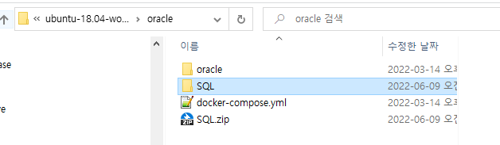
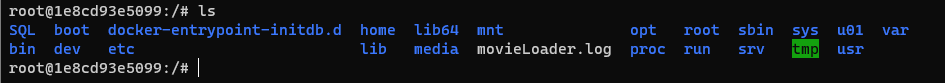

## 2022-06-09-sqlldr사용법

## 01.docker db접속

 [SQL.zip](\\wsl$\ubuntu-18.04-workspace1\oracle\SQL.zip) 

- 사용법

  ```sh
  docker exec -it 컨테이너 이름 bash
  ```

- 실제 사용 (컨테이너 이름 : demo_oracle)

  ```sql
  docker exec -it demo_oracle bash
  ```

## 02.컨테이너에 파일 복사



- 현재 위치에서 명령 프롬프트창 실행

- 사용법

  ```sh
  docker cp 파일이름 컨테이너이름:컨테이너 디렉토리
  ```

- 실제 사용법 

  - 파일이름: SQL
  - 컨테이너 이름: demo_oracle 
  - 컨테이너 디렉토리 . (.은 루트위치에 파일 복사)

  ```sh
  docker cp SQL demo_oracle:.
  ```

  

- 컨테이너로 들어가면 위와 같이 나오는것을 알 수 있음

## 03.sqlldr 명령어 사용

- 스키마가 없다면 아래 실행 후 

  ```sql
  -- [로컬-SYSTEM]에서 연결한 후 실행
  DROP USER sqlDB CASCADE; -- 기존 사용자 삭제
  CREATE USER sqlDB IDENTIFIED BY 1234 -- 사용자 이름: sqlDB, 비밀번호 : 1234
      DEFAULT TABLESPACE USERS
      TEMPORARY TABLESPACE TEMP;
  GRANT connect, resource, dba TO sqlDB; -- 권한 부여
  ```

- 테이블 미리 생성

  ```sql
  CREATE TABLE movieTBL 
    (movie_id        NUMBER(4),
     movie_title     NVARCHAR2(30),
     movie_director  NVARCHAR2(20),
     movie_star      NVARCHAR2(20),
     movie_script    CLOB,
     movie_film      BLOB
  );
  
  SELECT * FROM movieTBl;
  ```

- 명령어 실행

  - /SQL/Movies/ 디렉토리로 이동후 실행

  ```sql
  sqlldr  sqlDB/1234@XE  control=movieLoader.txt
  ```


