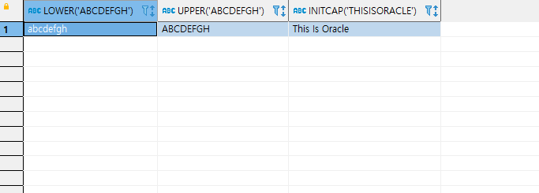
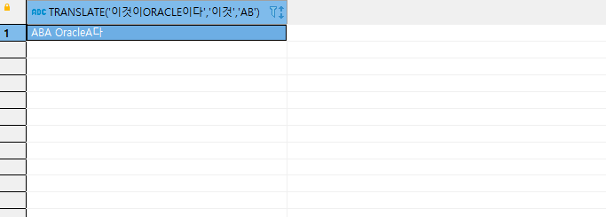
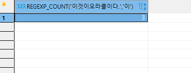
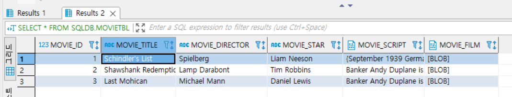

## 2022-06-09-내장함수,-순위분석-함수,-피벗,-CLOB/BLOB

## 목차

>01.문자열 함수
>
>>01.1 ACSII(영문자), CHR(숫자), ASCIISTR(한글), UNISTR('유니코드 값')
>>
>>01.2 LENGTH(문자열), LENGTHB(문자열)
>>
>>01.3 CONCAT(문자열1, 문자열2) 또는 ||
>>
>>01.4 INSTR(기준 문자열, 부분 문자열, 찾을 시작 위치), INSTRB(기준 문자열, 부분 문자열, 찾을 시작 위치)
>>
>>01.5  LOWER(문자열), UPPER(문자열), INITCAP(문자열)
>>
>>01.6 REPLACE(문자열, 원래 문자열, 바꿀 문자열)
>>
>>01.7 TRANSLATE(문자열, 원래 문자열, 바꿀 문자열)
>>
>>01.8 SUBSTR(문자열, 시작 위치, 길이)
>>
>>01.9 REVERSER(문자열)
>>
>>01.10 LPAD(문자열, 길이, 채울 문자열), RPAD(문자열, 길이, 채울 문자열)
>>
>>01.11 LTRIM(문자열, 제거할 문자열), RTRIM(문자열, 제거할 문자열)
>>
>>01.12 TRIM(제거할 방향 제거할 문자 FROM 문자열)
>>
>>01.13 REGEXP_COUNT(문자열, 문자)
>
>02.숫자 및 수학 함수
>
>>02.1 ABS(숫자)
>>
>>02.2 ACOS(숫자), ASIN(숫자), ATAN(숫자), ATAN2(숫자1, 숫자2), SIN(숫자), COS(숫자), TAN(숫자)
>>
>>02.3 CEL(숫자), FLOOR(숫자), ROUND(숫자)
>>
>>02.4 EXP(숫자), LN(숫자), LOG(밑수, 숫자)
>>
>>02.5 MOD(숫자1, 숫자2)
>>
>>02.6 POWER(숫자1, 숫자2), SQRT(숫자)
>>
>>02.7 SIGN(숫자)
>>
>>02.8 TRUNC(숫자, 정수)
>
>03.날짜 및 시간 함수
>
>>03.1 ADD_MONTHS(날짜, 개월) 와 +/=
>>
>>03.2 CURRENT_DATE, SYSDATE, CURRENT_TIMESTAMP
>>
>>03.3 EXTRACT(형식 FROM DATE '날짜')
>>
>>03.4 LAST_DAY(날짜)
>>
>>03.5 NEXT_DAY(날짜, 요일)
>>
>>03.6 MONTHS_BETWEEN(날짜1, 날짜2)
>
>04.형 변환 함수
>
>>04.1 BIN_TO_NUM(2진수)
>>
>>04.2 NUMTODSINTERVAL(숫자, '표현식')
>>
>>04.3 NUMTOYMINTERVAL(숫자, '표현식')
>>
>>04.4 기타 변환 함수
>
>05.분석 함수/ 순위 함수
>
>>05.1 순위 함수
>>
>>05.2 분석 함수
>>
>>05.3 피벗의 구현
>
>06.CLOB, BLOB 데이터 타입에 대용량 데이터 입력
>
>>06.1 docker db접속
>>
>>06.2 컨테이너에 파일 복사
>>
>>06.3 sqlldr 명령어 사용

## 01.문자열 함수

### 01.1 ACSII(영문자), CHR(숫자), ASCIISTR(한글), UNISTR('유니코드 값')

- ASCII(): 한문자의 아스키 코드값을 돌려줌
- CHR(): 숫자의 아스키 코드값에 해당하는 문자를 돌려줌
- ASCIISTR():은 유니코드(한글 등)를 입력하면 해당하는 유니코드 값을 16진수로 돌려줌

```sql
SELECT ASCII('A'), CHR(65), ASCIISTR('한'), UNISTR('\D55C') FROM DUAL;
```


### 01.2 LENGTH(문자열), LENGTHB(문자열)

- 문자열 길이를 반환
  - LENGTH는 문자열의 길이
  - LENGTHB는 문자열에 할당된 Byte수를
  - LENGTHC는 문자열의 크기를 반환

```sql
SELECT LENGTH('한글'), LENGTH('AB'), LENGTHB('한글'), LENGTHB('AB') FROM DUAL;
```


### 01.3 CONCAT(문자열1, 문자열2) 또는 ||

- 문자열을 이어줌
  -  CONCAT은 2개의 문자열만 이어줌
  - ||은 여러 개의 문자열을 잇고 싶다면 사용함

```sql
SELECT CONCAT('이것이',' ORACLE이다'), '이것이' || ' ' || 'ORACLE이다'  FROM DUAL;
```


### 01.4 INSTR(기준 문자열, 부분 문자열, 찾을 시작 위치), INSTRB(기준 문자열, 부분 문자열, 찾을 시작 위치)

- 기준 문자열에서 부분 문자열을 찾아서 문자열이 시작하는 위치 반환
  - 찾을 시작 위치를 생략하면 1을 써준 것과 동일
  - INSTRB는 Byte 단위로 세서 위치를 반환

```sql
SELECT INSTR('이것이 Oracle이다. 이것도 오라클이다', '이것') FROM DUAL;

SELECT INSTR('이것이 Oracle이다. 이것도 오라클이다', '이것', 2) FROM DUAL;

SELECT INSTRB('이것이 Oracle이다. 이것도 오라클이다', '이것', 2) FROM DUAL;
```


### 01.5  LOWER(문자열), UPPER(문자열), INITCAP(문자열)

- LOWER은 소문자를 대문자로
- UPPER은 대문자를 소문자로
- INITCAP은 첫 글자를 모두 대문자로 변환

```sql
SELECT LOWER('abcdEFGH'), UPPER('abcdEFGH'), INITCAP('this is oracle') FROM DUAL;
```



### 01.6 REPLACE(문자열, 원래 문자열, 바꿀 문자열)

- 문자열에서 원래 문자열을 찾아서 바꿀 문자열로 바꿔줌

```sql
SELECT REPLACE ('이것이 Oracle이다', '이것이' , 'This is') FROM DUAL;
```


### 01.7 TRANSLATE(문자열, 원래 문자열, 바꿀 문자열)

- REPLACE는 바꿀 문자열을 통째로 바꿔주지만
  - TRANSLATE는 한 글자씩 찾아서 바꿔줌

```sql
SELECT TRANSLATE('이것이 Oracle이다', '이것' , 'AB') FROM DUAL;
```



### 01.8 SUBSTR(문자열, 시작 위치, 길이)

- 시작 위치 부터 길이 만큼 문자를 반환
  - 길이가 생략되면 문자열의 끝까지 반환

- 대: 1
- 한: 2
- 민: 3
- 국: 4
- 만: 5
- 세: 6
  - 즉, 3번부터 포함 두글자 그래서 3,4번 단어 선택해서 `민국`임

```sql
SELECT SUBSTR('대한민국만세', 3, 2) FROM DUAL;
```


### 01.9 REVERSER(문자열)

- 문자열 순서를 거꾸로 만듦

```sql
SELECT REVERSE('Oracle') FROM DUAL;
```


### 01.10 LPAD(문자열, 길이, 채울 문자열), RPAD(문자열, 길이, 채울 문자열)

- 문자열을 길이 만클 늘린 후, 빈 곳을 채울 문자열로 채움
  - 길이는 Byte단위로 크기를 지정해야함

```sql
SELECT LPAD('이것이', 10, '##'), RPAD('이것이', 10, '##') FROM DUAL;
```


### 01.11 LTRIM(문자열, 제거할 문자열), RTRIM(문자열, 제거할 문자열)

- 문자열의 왼쪽/ 오른쪽의 제거할 문자를 제거
  - 중간의 문자열 제거 안됨
  - 제거할 문자를 생략하면 공백을 제거

```sql
SELECT LTRIM('   이것이'), RTRIM('이것이$$$', '$') FROM DUAL;
```


### 01.12 TRIM(제거할 방향 제거할 문자 FROM 문자열)

- TRIM만 사용시, 앞 뒤 공백 제거
  - 제거할 방향은 
    - LEADING(앞)
    - BOTH(양쪽)
    - TRALGING(뒤)

```sql
SELECT TRIM('   이것이   '), TRIM(BOTH 'ㅋ' FROM 'ㅋㅋㅋ재밌어요.ㅋㅋㅋ') FROM DUAL;
```


### 01.13 REGEXP_COUNT(문자열, 문자)

- 문자열에서 문자의 개수를 센다.

```sql
SELECT REGEXP_COUNT('이것이 오라클이다.', '이') FROM DUAL;
```



## 02.숫자 및 수학 함수

- 다양한 숫자 관련 및 수학 함수 제공

### 02.1 ABS(숫자)

- 숫자의 절대값 계산

```sql
SELECT ABS(-100) FROM DUAL;
```


### 02.2 ACOS(숫자), ASIN(숫자), ATAN(숫자), ATAN2(숫자1, 숫자2), SIN(숫자), COS(숫자), TAN(숫자)

- 삼각함수와 관련된 함수를 제공

### 02.3 CEL(숫자), FLOOR(숫자), ROUND(숫자)

- 올림, 내림, 반올림을 계산
  - CEIL: 올림
  - FLOOR: 내림
  - ROUND: 반올림

```sql
SELECT CEIL(4.7), FLOOR(4.7), ROUND(4.7) FROM DUAL;
```


### 02.4 EXP(숫자), LN(숫자), LOG(밑수, 숫자)

- 지수, 로그와 관련된 함수를 제공

### 02.5 MOD(숫자1, 숫자2)

- 숫자1을 숫자2로 나눈 나머지 값을 구함

```sql
SELECT MOD(157, 10) FROM DUAL;
```


### 02.6 POWER(숫자1, 숫자2), SQRT(숫자)

- 거듭제곱값 및 제곱근 구함

```sql
SELECT POWER(2,3), SQRT(9);
```


### 02.7 SIGN(숫자)

- 숫자가 양수: 1 반환
- 숫자가 0: 0 반환
- 숫자가 음수: -1 반환

```sql
SELECT SIGN(100), SIGN(0), SIGN(-100.123) FROM DUAL;
```


### 02.8 TRUNC(숫자, 정수)

- 숫자를 소수점을 기준으로 정수 위치까지 구하고 나머지는 버림
  - 소수점 기준으로 **양수이면** `오른쪽`으로 이동해서 나머지 버리는것
  - 소수점 기주능로 **음수이면** `왼쪽`으로 이동해서 나머지 버리는 것

```sql
SELECT TRUNC(12345.12345, 2), TRUNC(12345.12345, -2) FROM DUAL;
```


## 03.날짜 및 시간 함수

- 날짜 및 시간을 조작하는 다양한 함수를 사용할 수 있음

### 03.1 ADD_MONTHS(날짜, 개월) 와 +/=

- ADD_MONTHS는 날짜 기준으로 개월을 더하거나 뺸 결과를 구함
- 일자를 더하려면 +를 사용하면됨

```sql
SELECT ADD_MONTHS('2020-01-01', 5), ADD_MONTHS(SYSDATE, -5)  FROM DUAL;
SELECT TO_DATE('2020-01-01') + 5,  SYSDATE - 5  FROM DUAL;
```


### 03.2 CURRENT_DATE, SYSDATE, CURRENT_TIMESTAMP

- CURRENT_DATE와 SYSDATE는 연/월/일 형식으로 현재 날짜를 구함
- CURRENT_TIMESTAMP는 연/월/일 시:분:초 지역 형식으로 현재 날짜 구함

```sql
SELECT CURRENT_DATE, SYSDATE, CURRENT_TIMESTAMP FROM DUAL;
```


### 03.3 EXTRACT(형식 FROM DATE '날짜')

- 날짜에서 연, 월, 일, 시, 분, 초를 구함
  - 형식은 YEAR, MONTH, DAY, HOUR, MINUTE, SECOND등이 올 수 있음

```sql
SELECT EXTRACT(YEAR FROM DATE '2020-12-25'), EXTRACT(DAY FROM SYSDATE) FROM DUAL;
```


### 03.4 LAST_DAY(날짜)

- 주어진 날짜의 마지막 날짜를 구함
  - 주로 그 달이 몇 일까지 있는지 확인할 때 사용

```sql
SELECT LAST_DAY('2020-02-01') FROM DUAL;
```


### 03.5 NEXT_DAY(날짜, 요일)

- 주어진 날짜의 다음에 오는 요일의 날짜를 구함

```sql
SELECT NEXT_DAY('2020-02-01', '월요일'), NEXT_DAY(SYSDATE, '일요일')  FROM DUAL;
```


### 03.6 MONTHS_BETWEEN(날짜1, 날짜2)

- 두 날짜 사이의 개월 수를 계산해서 소수점 단위까지 반환
  - 날짜2 - 날짜1을 계산함

```sql
SELECT MONTHS_BETWEEN (SYSDATE, '1988-09-17') FROM DUAL;
```


## 04.형 변환 함수

### 04.1 BIN_TO_NUM(2진수)

- 주어진 2진수를 10진수로 변경
  - 2진수 숫자는 콤마로 구분해서 입력

```sql
SELECT BIN_TO_NUM(1,0), BIN_TO_NUM(1,1,1,1)  FROM DUAL;
```


### 04.2 NUMTODSINTERVAL(숫자, '표현식')

- 숫자가 몇 일에 해당하는지 반환
  - 표현식은 DAY, HOUR, MINUTE, SECOND등이 올 수 있음

```sql
SELECT NUMTODSINTERVAL(48, 'HOUR'), NUMTODSINTERVAL(360000, 'SECOND') FROM DUAL;
```


### 04.3 NUMTOYMINTERVAL(숫자, '표현식')

- 숫자가 몇 년 몇 개월에 해당하는지 반환
  - 표현식은 MONTH, YEAR등이 올 수 있음

```sql
SELECT NUMTOYMINTERVAL(37, 'MONTH'), NUMTOYMINTERVAL(1.5, 'YEAR') FROM DUAL;
```


### 04.4 기타 변환 함수

- TO_CHAR(), TO_DATE(), TO_CLOB(), TO_NCLOB(), TO_NUMBER()등이 있음

## 05.분석 함수/ 순위 함수

- 분석/순위 함수로는
  - CORR(), COVAR_POP(), COVAR_SAMP(), CUME_DIST()
  - DENSE_RANK(), FIRST_VALUE(), LAG(), LAST_VALUE(), LEAD(), LISTAGG()
  - NTH_VALUE(), RANK(), STDDEV(), VAR_POP(), VAR_SAMP(), VARIANCE()등 제공

### 05.1 순위 함수

- 형식

  ```sql
  <순위 함수 이름>() OVER( [PARTITION BY <partition by list>] ORDER BY <order by list> )
  ```

- 사용법

- ROW_NUMBER( )

  ```sql
  -- 키큰 순으로 순위구할때 ROW_NUMBER()
  SELECT ROW_NUMBER( ) OVER(ORDER BY height DESC) "키큰순위", userName, addr, height
     FROM userTBL ;
  ```

  

  ```sql
  -- 키가 동일하다면 이름순 순위
  SELECT ROW_NUMBER( ) OVER(ORDER BY height DESC, userName ASC) "키큰순위", userName, addr, height
     FROM userTbl ;
  ```

  

  ```sql
  -- 지역별 순위
  SELECT addr, ROW_NUMBER( ) OVER(PARTITION BY addr ORDER BY height DESC, userName ASC) "지역별키큰순위", userName, height
     FROM userTbl ;
  ```

  

- DENSE_RANK( )

  ```sql
  -- 같은 순위의 경우 같은 등수 1 2 2 3 으로 순위
  SELECT DENSE_RANK( ) OVER(ORDER BY height DESC)"키큰순위", userName, addr, height
     FROM userTbl ;
  ```

  

- RANK( )

  ```sql
  -- 1 2 2 4 등으로 순위
  SELECT RANK( ) OVER(ORDER BY height DESC)"키큰순위", userName, addr, height
     FROM userTbl ;
  ```

  

- 몇개의 그룹으로 분할 시 사용 NTILE(숫자)

  ```sql
  SELECT NTILE(2) OVER(ORDER BY height DESC) "반번호", userName, addr, height
     FROM userTbl;
  
  SELECT NTILE(4) OVER(ORDER BY height DESC) "반번호", userName, addr, height
     FROM userTbl;
  ```

  

  

### 05.2 분석 함수

- LEAD() | 다음사람과의 키차이

  ```sql
  SELECT  userName, addr, height AS "키",
         height - (LEAD(height, 1, 0) OVER (ORDER BY height DESC)) AS "다음 사람과 키 차이"
     FROM userTbl ;
  ```

  

- FIRST_VALUE() | 가장 큰 사람과의 차이

  ```sql
  SELECT addr, userName, height AS "키",
         height - ( FIRST_VALUE(height) OVER (PARTITION BY addr ORDER BY height DESC) ) 
               AS "지역별 최대키와 차이"
     FROM userTbl ; 
  ```

  

- CUME_DIST() | 현 지역에서 자신보다 키가 같거나 큰 인원에 대한 백분율

  ```sql
  SELECT  addr, userName, height AS "키",
        (CUME_DIST() OVER (PARTITION BY addr ORDER BY height DESC)) * 100 AS "누적인원 백분율%"
     FROM userTbl ; 
  ```

  

- PERCENTILE_CONT() 각 지역별 키의 중앙값 계산

  -  인자의 경우 0.0 ~ 1.0 사이 로 사용 
    - 중앙값인 경우 0.5로 설정한 것

  ```sql
  SELECT  DISTINCT addr,
  	PERCENTILE_CONT(0.5) WITHIN GROUP (ORDER BY height) OVER (PARTITION BY addr AS "지역별 키의 중앙값"
     FROM userTbl ; 
  ```

  

### 05.3 피벗의 구현

- 피벗은 한 열에 포함된 여러 값을 출력
  - 이를 여러 열로 변환하여 테이블 반환 식을 회전하고 집계까지 수행하는 것

```sql
CREATE TABLE pivotTest
   (  uName NCHAR(3),
      season NCHAR(2),
      amount NUMBER(3));

INSERT  INTO  pivotTest VALUES ('김범수' , '겨울',  10) ;
INSERT  INTO  pivotTest VALUES ('윤종신' , '여름',  15) ;
INSERT  INTO  pivotTest VALUES ('김범수' , '가을',  25) ;
INSERT  INTO  pivotTest VALUES ('김범수' , '봄',    3) ;
INSERT  INTO  pivotTest VALUES ('김범수' , '봄',    37) ;
INSERT  INTO  pivotTest VALUES ('윤종신' , '겨울',  40) ;
INSERT  INTO  pivotTest VALUES ('김범수' , '여름',  14) ;
INSERT  INTO  pivotTest VALUES ('김범수' , '겨울',  22) ;
INSERT  INTO  pivotTest VALUES ('윤종신' , '여름',  64) ;
SELECT * FROM pivotTest;

SELECT * FROM pivotTest
   PIVOT ( SUM(amount) 
           FOR season 
           IN ('봄','여름','가을','겨울') )   ; 
```


## 06.CLOB, BLOB 데이터 타입에 대용량 데이터 입력

### 06.1 docker db접속

 [SQL.zip](\\wsl$\ubuntu-18.04-workspace1\oracle\SQL.zip) 

- 사용법

  ```sh
  docker exec -it 컨테이너 이름 bash
  ```

- 실제 사용 (컨테이너 이름 : demo_oracle)

  ```sql
  docker exec -it demo_oracle bash
  ```

### 06.2 컨테이너에 파일 복사


- 현재 위치에서 명령 프롬프트창 실행

- 사용법

  ```sh
  docker cp 파일이름 컨테이너이름:컨테이너 디렉토리
  ```

- 실제 사용법 

  - 파일이름: SQL
  - 컨테이너 이름: demo_oracle 
  - 컨테이너 디렉토리 . (.은 루트위치에 파일 복사)

  ```sh
  docker cp SQL demo_oracle:.
  ```

  

- 컨테이너로 들어가면 위와 같이 나오는것을 알 수 있음

### 06.3 sqlldr 명령어 사용

- 스키마가 없다면 아래 실행 후 

  ```sql
  -- [로컬-SYSTEM]에서 연결한 후 실행
  DROP USER sqlDB CASCADE; -- 기존 사용자 삭제
  CREATE USER sqlDB IDENTIFIED BY 1234 -- 사용자 이름: sqlDB, 비밀번호 : 1234
      DEFAULT TABLESPACE USERS
      TEMPORARY TABLESPACE TEMP;
  GRANT connect, resource, dba TO sqlDB; -- 권한 부여
  ```

- 테이블 미리 생성

  ```sql
  CREATE TABLE movieTBL 
    (movie_id        NUMBER(4),
     movie_title     NVARCHAR2(30),
     movie_director  NVARCHAR2(20),
     movie_star      NVARCHAR2(20),
     movie_script    CLOB,
     movie_film      BLOB
  );
  
  SELECT * FROM movieTBl;
  ```

- 명령어 실행

  - /SQL/Movies/ 디렉토리로 이동후 실행

  ```sql
  sqlldr  sqlDB/1234@XE  control=movieLoader.txt
  ```



- 이렇게 하면 영화대본이라던지 영상을 저장할 수 있음