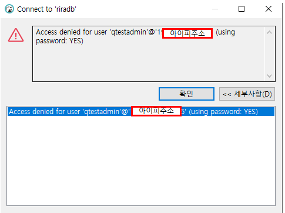
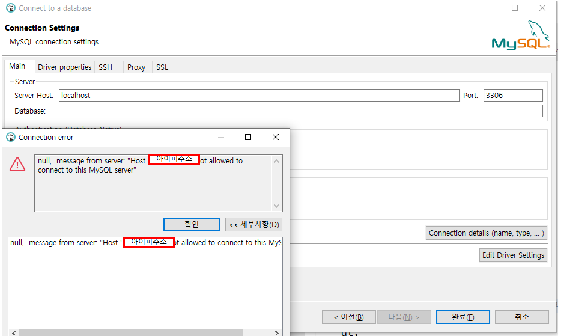
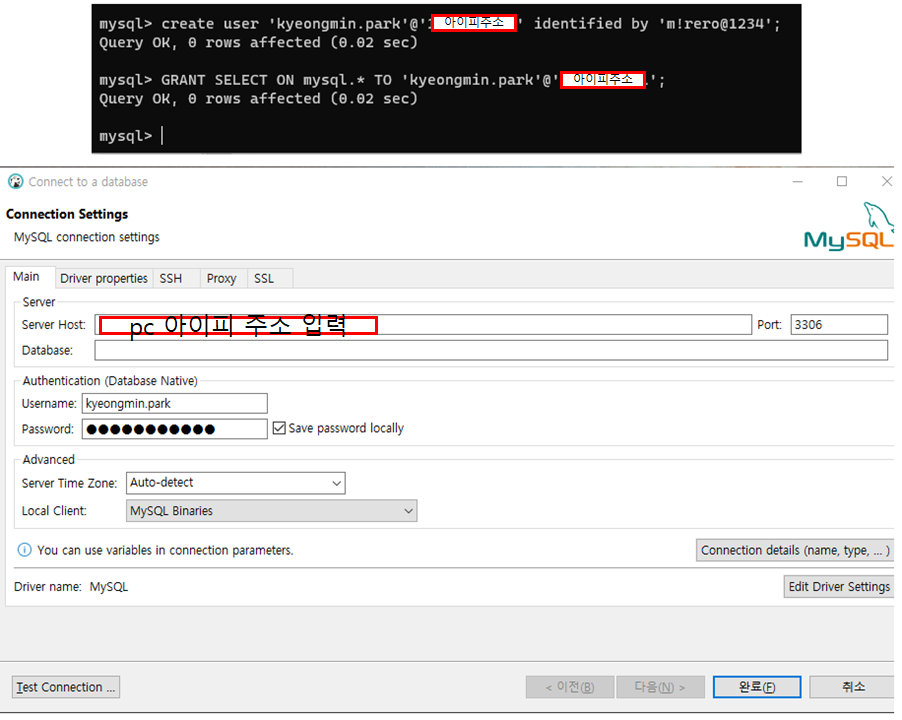
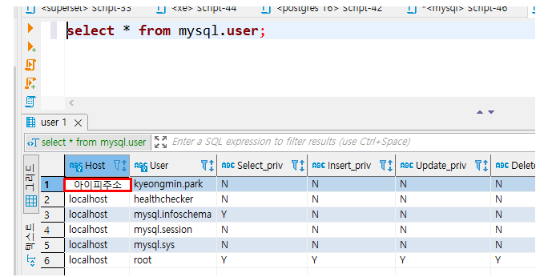

## 2022-07-06-MySql-DB외부-접속테스트

## 목차

> 01.현재 문제점
>
> > 01.1 계정확인
>
> 02.도커로 mysql올려서 테스트
>
> 03.계정 추가 및 권한 설정
>
> 04.계정생성 및 권한 설정

## 01.현재 문제점



- 외부에서 접속하는 경우 저렇게 접속이 안됨

- 문제에 대한 것의 해결책: [click](https://changun516.tistory.com/55)

### 01.1 계정확인


## 02.도커로 mysql올려서 테스트

```sh
docker run -d -p 3306:3306 -e MYSQL_ROOT_PASSWORD=example --name mysql -v /exthdd/dockerData/mysql:/var/lib/mysql mysql/mysql-server:latest --character-set-server=utf8mb4 --collation-server=utf8mb4_unicode_ci
```

## 03.계정 추가 및 권한 설정

```sh
docker exec -it mysql bash

mysql -u root -p
-- 위를 입력하면 비번 입력하는 것이 나오고 아래에 비번 입력하고 mysql이 나오면 연결된것
Enter password:

Welcome to the MySQL monitor.  Commands end with ; or \g.
Your MySQL connection id is 8
Server version: 8.0.29 MySQL Community Server - GPL

Copyright (c) 2000, 2022, Oracle and/or its affiliates.

Oracle is a registered trademark of Oracle Corporation and/or its
affiliates. Other names may be trademarks of their respective
owners.

Type 'help;' or '\h' for help. Type '\c' to clear the current input statement.

mysql>
```

- 디비 외부 툴로 접근

  

  - 위에 처럼 현재 ip 자체가 허용이 안되어 있어서 안됨

## 04.계정생성 및 권한 설정

```sql
-- 계정 조회
select * from mysql.user;

-- 계정 삭제
drop user 'kyeongmin.park'@'172.56.5.1';

-- 계정 생성
create user 'kyeongmin.park'@'172.56.5.1' identified by 'qwe123';

-- 권한 관련 부분
-- select 권한
GRANT SELECT ON mysql.* TO 'kyeongmin.park'@'172.56.5.1';
-- 다중 권한 선택
GRANT SELECT,INSERT,UPDATE,DROP,DELETE ON mysql.* TO 'kyeongmin.park'@'192.168.0.1';
-- 전체 권한 선택
GRANT ALL PRIVILEGES ON mysql.* TO 'kyeongmin.park'@'172.56.5.1';
```



- HOST의 경우 pc 아이피 주소 또는 로컬 상태에서는 host로 가능함
  - 적절히 권한을 주고 나서 진행



- 현재는 조회하는 권한만 부여된 상황임
  - 조건이나 상황에 맞게 기능을 부여하면 좋음