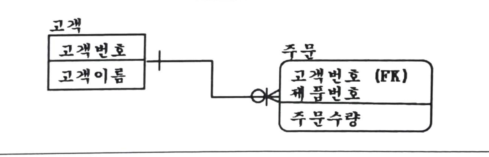

## 2022-08-20-SQLD-데이터-모델링의-이해

## 목차

>01.모델링
>
>02.데이터 모델링
>
>>  02.1 데이터 모델링 주의 사항
>>
>>  02.2 데이터 모델링의 관계
>>
>>  02.2 데이터 모델링 종류
>
>03.스키마 구조
>
>04.엔터티
>
>>   04.1 엔터티 특징
>>
>>   04.2 기본 엔터티(키엔터티)
>>
>>   04.3 엔터티 명명
>
>05.ERD
>
>06.속성
>
>>  06.1 속성 특징
>>
>>  06.2 속성의 특성에 따른 분류
>>
>>  06.3 속성의 명칭
>
>07.도메인
>
>08.관계
>
>>  08.1 관계 표기법
>>
>>  08.2 엔터티 사이에 정의한 관계 체크 사항
>
>09.식별자
>
>>  09.1 식별자의 종류
>>
>>  09.2 주식별자의 특징
>>
>>  09.3 식별자관계와 비식별자 관계
>

## 01.모델링

- 단지 시스템 구현만을 위해 수행 아님
  - 시스템 구현, 업무분석 및 업무형상화를 하는 목적

## 02.데이터 모델링

- 통합관점의 뷰를 가지고 있는 개념 스키마를 만들어가는 과정

- 1.업무 내용을 정확하게 분석하는것 
- 2.데이터베이스 생성, 개발, 데이터 관리에 사용
  - 데이터베이스 구축 용도만이 아님
  - 업무를 설명하고 분석하는 부분에서도 중요한 의미가짐

### 02.1 데이터 모델링 주의 사항

- 중복성, 비유연성, 비일관성
  - 중복
    - 여러 장소에 같은 정보 저장하지 않게
  - 비유연성
    - 업무 변화에 데이터 모델 변경되어 우지 보수 어려울때
      - 데이터 정의를 데이터의 사용프로세스와 분리하는 것
      - 변화를 일으킬 수 있는 가능성 줄임
  - 비일관성
    - 중복 없어도 발생
    - 데이터와 데이터 간의 상호 연관 관계에 대해서 명확히 정의해야함
    - 연계성을 높이면 업무 변경에 대해 취약하게 만드는 단점에 해당

### 02.2 데이터 모델링의 관계

- 관계를 존재에 의한 관계와 행위에 의해 관계로 구분될 수 있음

  - ERD에서는 관계를 연결할 때 존재, 행위 구분 안함, **단일화된 표기법 사용**

  - 존재적 관계와 행위에 의한 관계를 구분하는 표기법 없음

- UML는 연관 관계와 의존 관계에 대해 다른 표기법 가지고 표현되어 있음
  - 즉, ERD 단일화된 표기법
  - UML 구분되는 표기법

### 02.2 데이터 모델링 종류

- 개념적
  - 추상화 수준 높음
  - 업무중심적이고 포괄적인 수준의 모델링 진행
  - 전사적 데이터 모델링 EA수립시 많이 이용  
- 논리적
  - 시스템으로 구축하고자하는 업무에대해
    - Key, 속성, 관계등 정확하게 표현, 재사용성이 높음
- 물리적
  - 실제 DB에 이식 할 수 있게 성능, 저장 등 물리적 성격을 고려하여 설계

## 03.스키마 구조

- 3단계로 구분
- 개념 스키마
  - 통합관점의 스키마 구조를 표현한 것
- 외부 스키마
- 내부 스키마

## 04.엔터티

- 엔터티는 2개 이상의 속성과 2개이상의 인스턴스를 가져 소위 면적으로 표현될 수 있어야
  - 기본적인 엔터티의 자격을 갖췄다 할 수 있음
  - 즉, 여러명의 복수 인스턴스와 이름, 주소등의 복수 속성을 가진 환자 같은것이 엔터티로 적절

- 부모 엔터티에 데이터 입력 될때
  - 자식 엔터티에 해당 값이 존재하는지 여부와 상관없이 입력될 수 있는 구조
- 예를 들어 병원은 S병원 1개라면 엔터티로 성립 안됨
  - 이름, 주소는 엔터티의 속성으로 인식될 수 있음

###  04.1 엔터티 특징

- 1.반드시 필요하고 관리하고자 하는 정보 (예) 환자, 토익의 응시횟수)
- 2.유일한 식별자에 의해 식별 가능
- 3.영속적으로 존재하는 (두 개 이상의) 인스턴스의 집합 (한개가 아님, 두개 이상임)
- 4.엔터티는 업무 프로세스에 의해 이용되어야함
- 5.엔터티는 반드시 속성이 있음
- 6.다른 엔터티와 최소 한 개 이상의 관계가 있어야함
  - 그러나, 공통 코드, 통계성 엔터티의 경우 관계 생략 가능

### 04.2 기본 엔터티(키엔터티)

- 그 업무에 존재하는 정보
  - 다른 엔터티와의 관계에 의해 생성되지 않고 독립적으로 생성 가능함
  - 자신은 타 엔터티의 부모의 역할
    - 다른 엔터티로 부터 **주식별자를 상속 받지 않고, 자신의 고유한 주 식별자를 가지게됨**
      - 예를 들어 사원, 부서, 고객, 상품, 자재 등이 기본 엔티티가 될 수 있음

### 04.3 엔터티 명명

- 1.가능하면 현업업무에서 사용하는 용어 사용
- 2.가능하면 약어 사용 금지
- 3.단수명사 사용
- 4.모든 엔터티를 통틀어 유일하게 이름이 부여되어야함
- 5.엔터티 생성의미대로 이름 부여

## 05.ERD

- 엔터티 어디 배치하는가 필수는 아니지만
  - 데이터 모델의 가독성 측면에서는 중요
  - 왼쪽에서 오른쪽, 위쪽에서 아래순으로 
    - 가장 중요한 엔터티 왼쪽 상단에 배치하면 좋음
  - 해당 업무에서 가장 중요한 엔터티는 왼쪽 상단에서 조금 아래쪽 중앙에 배치하면 효과적 배치 가능

## 06.속성

- 업무에서 필요로 하는 인스턴스에서 관리하고자 하는 의미상 더 이상 분리되지 않는 최소의 데이터 단위

### 06.1 속성 특징

- 엔터티에 대한 자세하고 구체적인 정보 나타냄
- 하나의 엔터티는 두개 이상의 속성을 가짐
- 속성도 집합
- 하나의 인스턴스에서 각각의 속성은 한 개의 속성값을 가져야함

### 06.2 속성의 특성에 따른 분류

- 기본 속성
  - 이자율 같은 원래 가지고 있어야 하는 속성
- 설계 속성
- 파생 속성
  - 데이터를 조회할 때 빠른 성능을 할 수 있도록 하기 위해 원래 속성의 값을 계산한 속성
  - 이자와 같은 계산된 값의 경우 해당

### 06.3 속성의 명칭

- 명칭의 경우 애매모호 하지 않게, 복합 명사 사용
  - 구체적 명명함으로써 전체 데이터 모델에서 유일성을 확보하는것이 **반정규화, 통합 등의 작업 시 혼란 방지 **

## 07.도메인

- 각 엔터티(테이블)의 속성에 대해서 어떤 유형의 값이 들어가는지 정의하는 개념

## 08.관계

- 관계는 존재적 관계와 행위에 의한 관계로 나눠볼 수 있음
  - 부서와 사원 엔터티 간의 `소속` 관계는 존재적 관계의 사례
  - 주문과 배송 엔터티 간의 `배송`관계는 행위에 의한 관계의 사례

### 08.1 관계 표기법

- 관계명
  - 관계의 이름
- 관계차수
  - 관계의 기수성을 나타내는 개념
  - 1:1, 1:M, M:N
- 선택성 (관계 선택 사양)
  - 필수관계, 선택 관계

### 08.2 엔터티 사이에 정의한 관계 체크 사항

- 두 개의 엔터티 사이에 관심 있는 연관 규칙이 존재하는가?
- 두 개의 엔터티 사이에 정보의 조합이 발생되는가?
- 업무기술서, 장표에 관계연결에 대한 규칙이 서술되어 있는가?

- 업무기술서, 장표에 관계연결을 가능하게 하는 동사가 있는가? 가 적절
  - 동사는 관계를 서술하는 업무기술서의 가장 중요한 사항

## 09.식별자

### 09.1 식별자의 종류

- 주식별자/ 보조식별자
  - 대표성을 가지는가에 따라서
  - 주식별자
    - 주식별자에 의해 엔터티내에 모든 인스턴스들이 유일하게 구분되어야함
    - 주식별자를 구성하는 속성의 수는 유일성을 만족하는 최소의 수가 되어야함
    - 지정된 주식별자의 값은 자주 변하지 않는 것
    - 주식별자가 지정이 되면 반드시 값이 들어와야함
      - 명칭, 내역등과 같이 이름으로 기술되는 것은 주식별자로 적절치 않음
        - 특히 사람의 이름은 동명이인이 있을 수 있어서 더 부적절
- 내부식별자/ 외부식별자
  - 스스로 생성되었는지 여부에 따라서

- 단일식별자/ 복합식별자
  - 단일 속성으로 식별되는 가에 따라서
- 본질식별자/ 인조식별자
  - 원래 업무적으로 의미가 있던 식별자 속성을 대체하여
  - 일련번호와 같이 새롭게 만든 식별자를 구분하기 위해서

### 09.2 주식별자의 특징

- 유일성

  - 유일하게 구분 되는 것

- 최소성

  - 속성의 수는 유일성을 만족하는 최소의 수가 되어야함

- 불변성

  - 한번 특정 엔터티에 지정되면 그 식별자의 값이 변하지 않아야함

- 존재성

  - 반드시 데이터 값이 존재 (Null 안됨)

  

- 주식별자 도출 기준

  - 해당 업무에서 자주 이용되는 속성 주식별자로 지정

  - 명칭, 내역 등과 같이 이름으로 기술되는 것들은 주식별자로 지정하지 않음

  - 복합으로 주식별자로 구성할 경우 너무 많은 속성이 포함되지 않게함
    - 자주 수정되는 속성이 주식별자가 되면?
      - 자식 엔터티에 대한 연쇄 수정이 필요하여 시스템 상에 부하의 원인이 될 수 있기 때문에 적합하지 않음

### 09.3 식별자관계와 비식별자 관계

- 식별자관계
  - 부모엔터티의 주식별자를 자식엔터티에서 받아 손자엔터티까지 계속 흘려 보내기 위해서는 
    - 식별관계를 고려해야함
- 비식별자관계
  - 관계의 강약을 분석하여 상호간에 연관성이 약한 경우
  - 자식테이블에서 독립적인 Primary Key의 구조를 가지기 원할 때
  - 복잡성 증가되는 것 방지하기 위해
  - 엔터티별로 데이터의 생명주기를 다르게 관리할 경우

- `표 삽입하기`

