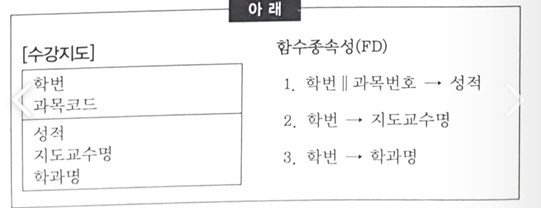
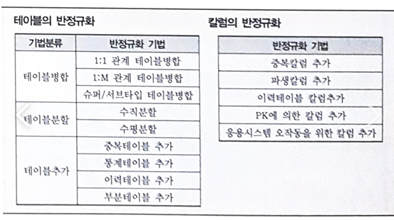

## 2022-08-21-SQLD-데이터-모델과-성능

## 목차

>01.성능 데이터 모델링
>
>>  01.1 성능모니터링 수행 절차
>>
>>  01.2 성능 데이터 모델링시 고려사항
>
>02.원자성을 위배한 경우
>
>03.반정규화 고려사항
>
>>  03.1 반정규화의 기법
>
>05.칼럼수가 많은 테이블
>
>06.파티셔닝
>
>07.슈퍼-서브타입 데이터 모델
>
>08.인덱스 엑세스 범위 좁히는 방법
>
>09.데이터 모델에 표현된 FK(Foreign Key)
>
>10.Global Single Instance(GSI)

## 01.성능 데이터 모델링

- 데이터의 증가가 빠를수록 성능저하에 따른 성능개선비용은 증가
- 데이터모델은 성능을 튜닝하면서 변경이 될 수 있는 특징이 있음
- 분석/설계 단계에서 성능 데이터 모델링시 성능 저하에 따른 Rework 비용을 최소화 기회 가짐

### 01.1 성능모니터링 수행 절차

- 1.데이터모델링을 할 때 정규화를 정확하게 수행
- 2.데이터베이스 용량산정을 수행
- 3.데이터베이스에 발생되는 트랜잭션의 유형을 파악
- 4.용량과 트랜잭션의 유형에 따라 반정규화 수행
- 5.이력모델의 조정, PK/ FK조정, 슈퍼타입/ 서브타입 조정 등을 수행
- 6.성능관점에서 데이터모델을 검증
  - `정규화 -> 용량산정 -> 트랜잭션 유형 파악  -> 반정규화 -> PK/ FK , 슈퍼/ 서브 -> 데이터 모델 검증`

### 01.2 성능 데이터 모델링시 고려사항

- 정규화가 항상 조회 성능을 저하시키는것은 잘못된것
- 기본적으로 중복된 데이터를 제거함으로써 조회성능을 향상시킬 수 있음을 알기

## 02.원자성을 위배한 경우

- 칼럼에 의한 반복적인 속성값을 갖는 형태는 
  - 속성의 원자성을 위배한 제1차 정규화 대상이 됨
  - 반복적인 속성 나열 형태는 각 속성에 대해서 or 연산자로 연결됨
    - 이 경우 어느 하나라도 인덱스로 정의되어 있지 않으면 전체 데이터 스캔해야해서 성능저하 야기
    - 반복 속성에 인덱스 생성하면 검색속도는 좋아지나 변경되는 경우 성능 저하 문제
      - 그냥 1차정규화를 통해 자연스럽게 처리하는것이 좋음

 

- PK에 대해 반복되는 그룹이 존재하지 않아 1차정규형
  - 부분 함수 종속의 규칙을 가지고 있으므로 2차정규형이라고 할 수 없음
  - 즉, 2차정규화의 대상이 되는 엔터티임

## 03.반정규화 고려사항

- 반정규화 정보에 대한 재현의 적시성으로 판단
  - 예를 들어 빌링의 잔액은 다수 테이블에 대한 다량의 조인이 불가피하므로
    - 데이터 제공의 적시성 확보를 위한 필수 반정규화 대상 정보임
- 하나의 결과셋을 추출하기 위해 다량의 데이터를 탐색하는 처리가 반복적으로 빈번하게 발생하는 경우

### 03.1 반정규화의 기법

- 테이블, 속성, 관계에 대해서 적용

  - 하나의 테이블의 전체 칼럼 중 자주 이용하는 집중화된 칼럼들이 있을 때
  - 디스크 I/O를 줄이기 위해 해당 칼럼들을 별도로 모아놓은 반 정규화 기법
    - `테이블 추가 반정규화 기법중`
      - 부분 테이블 추가에 해당

  

## 05.칼럼수가 많은 테이블

-  로우체이닝이 발생할 정도로 한 테이블에 많은 칼럼이 존재할 경우 조회 성능 저하 발생
  - 트랜젝션이 접근하는 칼럼유형을 분석하여 1:1로 테이블을 분리하면 디스크 I/O가 줄어서 조회 성능을 향상 시킬 수 있음

## 06.파티셔닝

- 하나의 테이블에 많은 양의 데이터가 저장되면 인덱스를 추가하고 테이블을 몇개로 쪼개도 성능저하되는 경우 있음
  - 이때 논리적으로 하나의 테이블이지만 물리적으로 여러 개의 테이블로 분리하여 데이터 액세스 성능도 향상시키고, 데이터 관리방법도 개선할 수 있도록 테이블에 적용하는 기법

## 07.슈퍼-서브타입 데이터 모델

- 트랜잭션은 
  - 항상 전체를 통합하여 분석처리하는데
    - 슈퍼-서브타입이 하나의 테이블로 통합되어 있으면 하나의 테이블에 집적된 데이터만 읽어 처리할 수 있기 때문에 다른 형식에 비해 더 성능이 우수(조인 감소)
  - 항상 전체를 대상으로 일괄 처리하는데
    - 테이블은 서브타입별로 개별 유지하는 것으로 변환하면 Union연산에 의해 성능이 저하될 수 있음
  - 항상 서브타입 개별로 처리하는데
    - 테이블은 하나로 통합하여 변환하면 불필요하게 많은 양의 데이터가 집적되어 있어 성능이 저하될 수 있음
  - 항상 슈퍼+서브 타입을 함께 처리하는데
    - 개별로 유지하면 조인에 의해 성능이 저하 될 수 있음

## 08.인덱스 엑세스 범위 좁히는 방법

- 인덱스 값의 범위에 따라 일정하게 정렬이 되어 있으므로 상수값으로 EQUAL 조건으로 조회되는 칼럼이 가장 앞으로 나오고 범위조회 하는 유형의 칼럼이 그 다음에 오도록 하는 것

## 09.데이터 모델에 표현된 FK(Foreign Key)

- 데이터 모델 상에 표현된 논리적 관계에 따라 관련 인스턴스 간에 일관성을 보장하기 위해 설계된 제약조건을 구현할 수 있도록 DBMS가 제공해주는 하나의 지원기능으로 이해될 수 있음

## 10.Global Single Instance(GSI)

- 통합된 한 개의 인스턴스 
  - 즉, 통합 데이터베이스 구조를 의미하므로 분산데이터 베이스와 대치되는 개념
- 공통코드, 기준정보 등과 같은 마스터 데이터를 한 곳에 두고 운영하는 경우 
  - 원격지에서의 접근이 빈번할수록 실시간 업무처리에 대해 좋은 성능을 얻기 어려울 수 있기 때문에 분산 환경에 복제분산을 하는 방법으로 분산데이터베이스를 구성할 수 있음
  - 또한, 백업사이트 구성에 대해서도 분산 환경으로 구성하여 적용할 수 있음