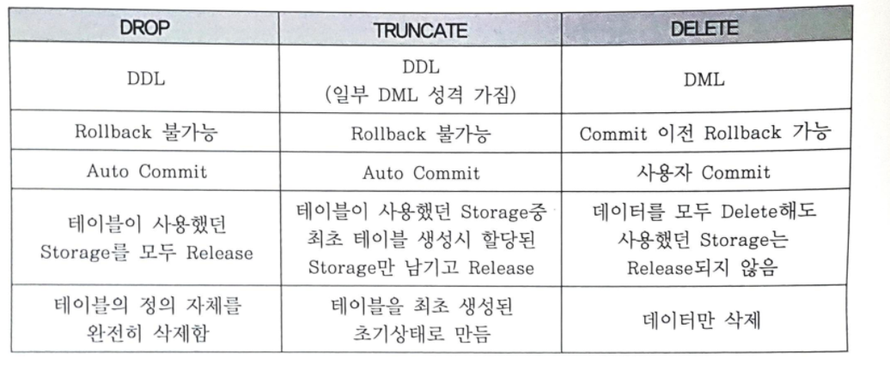
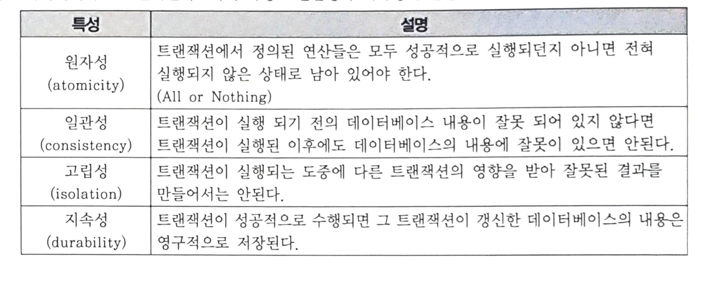

## 2022-08-25-SQLD-SQL기본

## 목차

>01.DML, DDL, DCL, TCL
>
>02.As-Is, To-Be
>
>03.ALTER
>
>04.NULL
>
>05.제약조건
>
>06.테이블 불필요한 컬럼 삭제
>
>07.참조 무결성 규정
>
>08.테이블 이름 변경
>
>09.삭제 명령어
>
>10.데이터베이스 트랜잭션 4가지 특성
>
>11.트랜잭션에 대한 격리성이 낮은 경우 발생하는 문제점
>
>12.트랜잭션의 목표

## 01.DML, DDL, DCL, TCL

- DML 
  - 데이터 조작어
    - SELECT, INSERT, UPDATE, DELETE
- DDL
  - 데이터 정의어
    - CREATE, ALTER, DROP, RENAME
- DCL
  - 데이터 제어어
    - GRANT, REVOKE
- TCL
  - 트랜잭션 제어어
    - COMMIT, ROLLBACK

## 02.As-Is, To-Be

- As-Is
  - 비절차적 데이터 조작어 (DML)는 사용자가 무엇(What) 데이터를 원하는 지만을 명세
- To-Be
  - 비절차적 데이터 조작어 (DML)는 사용자가 **무엇(What)** 데이터를 원하는 지만을 명세하지만,
  - 절차적 데이터 조작어는 **어떻게 (How)** 데이터를 접근해야 하는지 명세
    - 절차적 데이터 조작어로는 PL/SQL(오라클),T-SQL(SQL Server) 등이 있음

## 03.ALTER

- SQL Server에서는 여러개의 컬럼을 동시에 수정하는 구문 없음 () 괄호 사용 안함

## 04.NULL

- 모르는 값을 의미
- 값의 부재를 의미
- NULL과의 모든 비교 (IS NULL 제외)는 알 수 없음(Unkown)을 반환
- 공백문자 혹은 숫자 0을 의미하는것은 아님

## 05.제약조건

- UNIQUE
  - 테이블 내에서 중복되는 값이 없지만 NULL입력이  가능
- FK
  - 외래키로 테이블당 여러 개 생성 가능
  - 테이블 생성시 설정 할 수 있음
  - 널값을 가질 수 있음
  - 참조 무결성 제약을 받을 수 있음
  - 테이블간의 관계를 정의하기 위해 기본키를 다른 테이블의 외래키가 참조하도록 생성함
- NOT NULL
  - 명시적으로 NULL 입력을 방지
- PK
  - UNIQUE & NOT NULL 특징
  - 반드시 테이블 당 하나의 제약만을 정의 할 수 있음
- Check 제약조건(Constraint)
  - 데이터베이스에서 데이터 무결성을 유지하기 위해서 테이블의 특정 컬럼에 설정하는 제약

## 06.테이블 불필요한 컬럼 삭제

```sql
ALTER TABLE
테이블명
DROP COLUMN
삭제할 컬럼명;
```

## 07.참조 무결성 규정

- Delete(/Modify) Action

  - Cascade 
    - Master 삭제 시 Child 같이 삭제

  - Set Null
    - Master 삭제 시 Child 해당 필드 Null

  - Set Default
    - Master 삭제 시 Child 해당 필드 Default 값으로 설정

  - Restrict
    - Child 테이블에 PK값이 없는 경우만 Master 삭제 허용

  - No Action 
    - 참조무결성을 위반하는 삭제/ 수정 액션을 취하지 않음

- Insert Action

  - Automatic
    - Master 테이블에 PK가 없는 경우 Master PK를 생성 후 Child 입력
  - Set Null
    - Master 테이블에 PK가 없는 경우 Child 외부키를 Null값으로 처리
  - Set Default
    - Master 테이블에 PK가 없는 경우 Child 외부키를 지정된 기본값으로 입력
  - Dependent
    - Master 테이블에 PK가 존재할 때만 Child 입력 허용
  - No Action
    - 참조무결성을 위반하는 입력 액션을 취하지 않음

## 08.테이블 이름 변경

- RENAME 기존테이블이름 TO 바꿀테이블이름

## 09.삭제 명령어

- TRUNCATE TABLE, DROP TABLE
  - 위의 경우는 로그를 남기지 않음
- TRUNCATE TABLE
  - 특정 테이블의 모든 데이터 삭제
  - 디스크 사용량을 초기화 할때 사용
- DROP TABLE
  - 테이블의 데이터를 모두 삭제
  - 디스크 사용량도 없액(초기화) 할 수 있지만,
    - 테이블 스키마 정의도 삭제
- DELETE TABLE
  - 테이블의 데이터를 모두 삭제
  - 디스크 사용량은 초기화 하지 않음



## 10.데이터베이스 트랜잭션 4가지 특성



## 11.트랜잭션에 대한 격리성이 낮은 경우 발생하는 문제점

- 문제점

  - Non-Repeatable Read
    - 한 트랜잭션 내에서 같은 쿼리를 두 번 수행했는데
    - 그 사이에 다른 트랜잭션이 값을 수정 또는 삭제하는 바람에 두쿼리결과가 다르게 나타내는 현상

  - Phantom Read
    - 한 트랜잭션 내에서 같은 쿼리를 두 번 수행했는데,
    - 첫번째 쿼리에서 없던 유령 레코드가 두번째 쿼리에서 나타나는 현상

  - Dirty Read
    - 다른 트랜잭션에 의해 수정되었지만 아직 커밋되지 않은 데이터를 읽는 것

## 12.트랜잭션의 목표

- 목표 
  - isolation
    - 트랙잭션이 실행되는 도중에 다른 트랜잭션의 영향을 받아 잘못된 결과를 만들어서는 안된다
    - 데이터 베이스 트랜잭션의 4가지 특성으로 문제점이 아니고 목표임