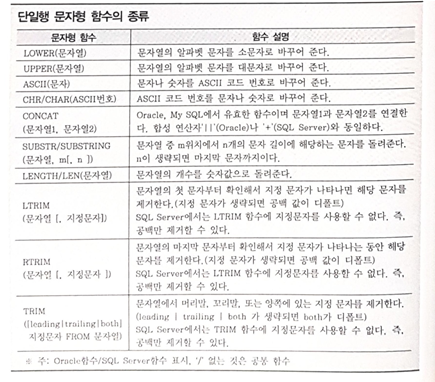

## 2022-08-26-SQLD-SQL기본2

##  목차

>01.SQL 수행시 동작
>
>02.기본 개념
>
>03.BEGIN TRNANSACTION
>
>05.논리연산자 우선순위
>
>06.NULL값이 포함된 값의 계산
>
>07.부정 비교 연산자
>
>08.내장함수에 대한 설명
>
>09.SQL수행 결과로 알아보는 문법
>
>10.단일행 함수의 종류
>
>11.날짜 연산
>
>12.SEARCHED_CASE_EXPRESSION -> SIMPLE_CASE_EXPRESSION
>
>13.단일행 NULL관련 함수의 종류
>
>14.COALESCE
>
>15.집계함수 종류
>
>16.ORDER BY
>
>17.SELECT 문장 실행 순서
>
>18.TOP
>
>19.JOIN
>
>20.Like 연산자를 이용한 조인

## 01.SQL 수행시 동작

- Oracle
  - DDL 문장 수행 후 자동으로 COMMIT을 수행
  - DDL 문장의 수행은 내부적으로 트랜잭션을 종료 시킴
- SQL Server
  - DDL 문장 수행 후 자동으로 COMMIT을 수행하지 않음
  - CREATE TABLE 문장도 TRANSACTION의 범주에 포함됨
  - NULL값을 조회하는 경우 IS NULL로 하면 조회되지 않음
    - 조회를 하려면 = 으로 조회해야함

## 02.기본 개념

- 트랜잭션 | Transactioin
  - 데이터베이스의 논리적 연산단위로서
    - 밀접히 관련되어 분리될 수 없는 한 개 이상의 데이터베이스 조작을 가리킴

- 커밋 | Commit
  - 트랜잭션의 종료를 위한 대표적 명령어로서
    - 데이터에 대한 변경사항을 데이터베이스에 영구적으로 반영하는 것
- 롤백 | Rollback
  - 데이터에 대한 변경사항을 모두 폐기하고 변경전의 상태로 되돌리는 것
  - Commit되지 않은 상위의 모든 Transaction을 모두 Rollback함

## 03.BEGIN TRNANSACTION

- BEGIN TRAN구문도 가능
- 트랜잭션을 시작하고
  -  COMMIT TRANSACTION 또는 ROLLBACK TRANSACTION으로 트랜잭션 종료
    - 위의 구문은 TRANSACTION은 생략가능함
- ROLLBACK 구문을 만난경우
  - 최초 BEGIN TRANSACTION시점까지 모두 ROLLBACK이 수행됨

## 05.논리연산자 우선순위

- NOT > AND > OR 순으로로 됨

## 06.NULL값이 포함된 값의 계산

- NULL이 붙는 경우 더하면 NULL이됨

## 07.부정 비교 연산자

- 같지 않다.
  - !=
  - ^=
  - <>
    - ISO표준, 모든 운영체제에서 사용 가능
- ~와 같지 않다.
  - NOT 칼럼명 =
- ~보다 크지 않다.
  - NOT 칼럼명 >

- NULL값을 조건절에서 사용하는 경우 
  - IS NULL, IS NOT NULL이라는 키워드 사용해야함

## 08.내장함수에 대한 설명

- 함수의 입력 행수에 따라 단일행 함수와 다중행 함수로 구분 할 수 있음
- 단일행 함수는 SELECT, WHERE, ORDER BY, UPDATE, SET절에 사용 가능
- 1:M 관계의 두테이블 조인하더라도 M쪽에 출력된 행이 하나씩 단일행 함수의 입력값으로 사용되므로 단일행 함수 사용할 수 있음
- 다중행 함수도 단일행 함수와 동일하게 단일 값만을 반환함

## 09.SQL수행 결과로 알아보는 문법

- LENGTH
  - 문자열의 길이 반환하는 함수
- CHR
  - 주어진 ASCII코드에 대한 문자를 반환하는 함수 
- REPLACE
  - 문자열을 치환하는 함수 

```sql
--TAB1
--ROWNUM C1
--1       A
--        A
--2       B
--        B
--        B

--SQL
SELECT SUM(CC)
FROM (
	SELECT (LENGTH(C1) - LENGTH(REPLACE(C1, CHR(10)))+1) CC
    FROM TAB1
)

--결과
5
```


## 10.단일행 함수의 종류




## 11.날짜 연산

- 오라클에서 날짜의 연산은 숫자 연산과 같음
  - 특정날짜에 하루를 더한 결과와 같으므로 
  - 1/24/60 = 1분을 의미
  - 1/24/(60/10) = 10분을 의미

## 12.SEARCHED_CASE_EXPRESSION -> SIMPLE_CASE_EXPRESSION

```sql
--SEARCHED_CASE_EXPRESSION
SELECT LOC,
	CASE WHEN LOC = 'NEW YORK' THEN 'EAST'
		ELSE 'ETC'
	END as AREA
FROM DEPT;

--SIMPLE_CASE_EXPRESSION
SELECT LOC,
	CASE LOC WHEN 'NEW YORK' THEN 'EAST'
		ELSE 'ETC'
	END	as AREA
FROM DEPT;
```

## 13.단일행 NULL관련 함수의 종류


## 14.COALESCE

- 첫번째 NULL이 아닌 값을 반환

## 15.집계함수 종류


## 16.ORDER BY

- 컬럼명 대신 Alias명이나 컬럼 순서를 나타내는 정수를 혼용하여 사용할 수 있음ㄴ

## 17.SELECT 문장 실행 순서

- FROM - WHERE - GROUP BY - HAVING - SELECT - ORDER

## 18.TOP

- SQL Server의 TOP N 질의문에서 N에 해당 하는 값이 동일한 경우 출력하려면
  - WITH TIES옵션을 ORDER BY 절과 함께 사용해야함

## 19.JOIN

- 일반적으로 Join은 PK와 FK값의 연관성에 의해 성립
- DBMS옵티마이져는 FROM 절에 나열된 테이블을 임의로 2 씩 묶어서 Join처리
- EQUI Join은 Join에 관여하는 테이블 간의 컬럼 값들이 정확하게 일치하는 경우에 사용되는 방법
- EQUI Join은 = 연산자에 의해서만 수행되며,
  - 그 이외의 비교 연산자를 사용하는 경우에는 Non EQUI Join임
- 대부분 Non EQUI Join을 수행할 수 있지만,
  - 때로는 설계상의 이유로 수행이 불가능한 경우도 있음

## 20.Like 연산자를 이용한 조인

- 조건


- 결과


