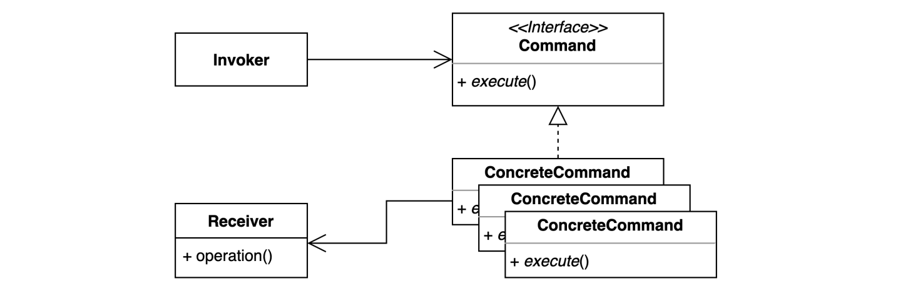

## 2022-05-11-커맨드패턴-1부-패턴소개

## 01.커맨드패턴

### 01.1 Button.java

```java
public class Button{
    private Light light;
    
    public Button(Light light){
        this.light = light;
    }
    
    public void press(){
        light.on();
    }
    
    public static void main(String[] args){
        Button button = new Button(new Light());
        button.press();
        button.press();
        button.press();   
    }
}
```

### 01.2 Light.java

```java
public class Light{
    
    private booleam isOn;
    public void on(){
        System.out.println("불을 켭니다.");
        this.isOn = true;
    }
    
    public void off(){
        System.out.prinln("불을 끕니다.");
        this.isOn = false;
    }
    
    public booleam isOn(){ return this.isOn; }
}
```

- 위와 같이 해버리면 너무 변경이 자주 일어나고 너무 연관성이 깊어 수정이 너무 번거롭다.

## 02. 그래서? 커맨드 패턴이 뭔가요?

- 요청을 캡슐화 하여 호출자(invoker)와 수신자(receiver)를 분리하는 패턴
- 요청을 처리하는 방법이 바뀌더라도, 호출자의 코드는 변경되지 않는다.

