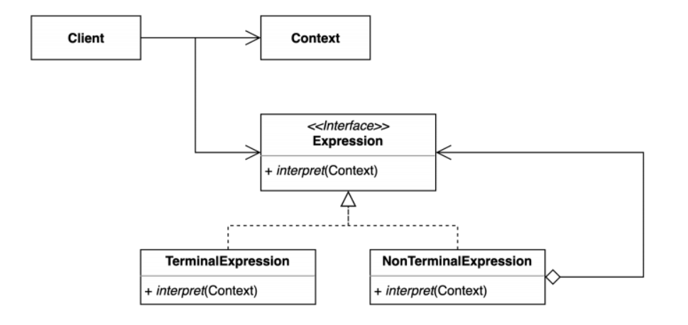

## 2022-05-12-인터프리터패턴-1부-패턴소개

## 목차

> 01.인터프리터패턴
>
> 02.개념

## 01.인터프리터패턴

- 정규 표현식 같은 것도 일종의 인터프리터
  - 문서에서 어떤 문자를 찾는것 같은 , 키워드, 특정단어 ? 이런것

```java
import java.util.Stack;

public class PostfixNotation {

    private final String expression;

    public PostfixNotation(String expression) {
        this.expression = expression;
    }

    public static void main(String[] args) {
        PostfixNotation postfixNotation = new PostfixNotation("123+-");
        postfixNotation.calculate();
    }

    private void calculate() {
        Stack<Integer> numbers = new Stack<>();

        for (char c : this.expression.toCharArray()) {
            switch (c) {
                case '+':
                    numbers.push(numbers.pop() + numbers.pop());
                    break;
                case '-':
                    int right = numbers.pop();
                    int left = numbers.pop();
                    numbers.push(left - right);
                    break;
                default:
                    numbers.push(Integer.parseInt(c + ""));
            }
        }

        System.out.println(numbers.pop());
    }
}
```

- DSL 이라는 언어
  - 도메인에 특화된 언어를 구현하는데 유용함

## 02.개념

- 자주 등장하는 문제를 간단한 언어로 정의하고 재사용하는 패턴

- 반복되는 패턴을 언어 또는 문법으로 정의하고 확장할 수 있다.

