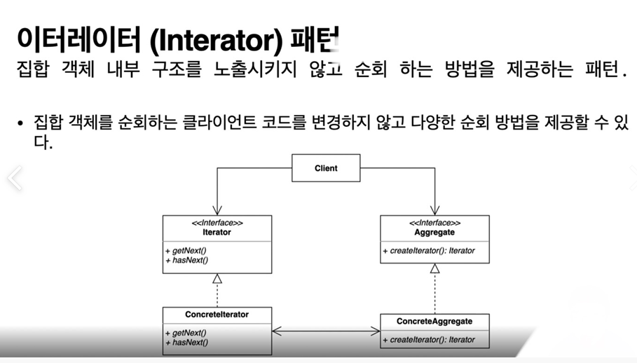

## 2022-07-07-이터레이터패턴-1부-패턴

## 목차

>
>01.이터레이터 패턴이란?
>
>02.코드로 알아보는 패턴
>
>>  02.1 Client.java
>>
>>  02.2  Board.java
>>
>>  02.3 Post.java
>
> 03.문제

## 01.이터레이터 패턴이란?

- 어떤 집합 객체를 순회하는 패턴
- 집합 객체의 내부 구조를 노출하지 않고 순회하는 방법을 제공하는 방법
- 패턴을 구성하는 것중의 하나가 이터레이터임

## 02.코드로 알아보는 패턴

### 02.1 Client.java

```java
package me.whiteship.designpatterns._03_behavioral_patterns._16_iterator._01_before;

import java.util.Collections;
import java.util.Iterator;
import java.util.List;

public class Client {

    public static void main(String[] args) {
        Board board = new Board();
        board.addPost("디자인 패턴 게임");
        board.addPost("선생님, 저랑 디자인 패턴 하나 학습하시겠습니까?");
        board.addPost("지금 이 자리에 계신 여러분들은 모두 디자인 패턴을 학습하고 계신 분들입니다.");

        // TODO 들어간 순서대로 순회하기
        List<Post> posts = board.getPosts();
        for (int i = 0 ; i < posts.size() ; i++) {
            Post post = posts.get(i);
            System.out.println(post.getTitle());
        }

        // TODO 가장 최신 글 먼저 순회하기
        Collections.sort(posts, (p1, p2) -> p2.getCreatedDateTime().compareTo(p1.getCreatedDateTime()));
        for (int i = 0 ; i < posts.size() ; i++) {
            Post post = posts.get(i);
            System.out.println(post.getTitle());
        }
    }

}
```

 ### 02.2  Board.java

```java
package me.whiteship.designpatterns._03_behavioral_patterns._16_iterator._01_before;

import java.util.ArrayList;
import java.util.List;
import java.util.Set;

public class Board {

    List<Post> posts = new ArrayList<>();

    public List<Post> getPosts() {
        return posts;
    }

    public void setPosts(List<Post> posts) {
        this.posts = posts;
    }

    public void addPost(String content) {
        this.posts.add(new Post(content));
    }
}
```

### 02.3 Post.java

```java
package me.whiteship.designpatterns._03_behavioral_patterns._16_iterator._01_before;

import java.time.LocalDateTime;

public class Post {

    private String title;

    private LocalDateTime createdDateTime;

    public Post(String title) {
        this.title = title;
        this.createdDateTime = LocalDateTime.now();
    }

    public String getTitle() {
        return title;
    }

    public void setTitle(String title) {
        this.title = title;
    }

    public LocalDateTime getCreatedDateTime() {
        return createdDateTime;
    }

    public void setCreatedDateTime(LocalDateTime createdDateTime) {
        this.createdDateTime = createdDateTime;
    }
}
```

- 요구항에 따라서 최신글부터 보는 경우 순서대로 보는 경우를 지정할 수 있음

## 03.문제

- 코드의 문제는 보드에 들어있는 post를 순회 할때 뭐가 쓰이는지 알 수 있음
- 나중에 리스트를 배열이나 다른것으로 바꾸게 되면 클라이언트 소스자체도 바뀌게되어 비효율 적이다.

