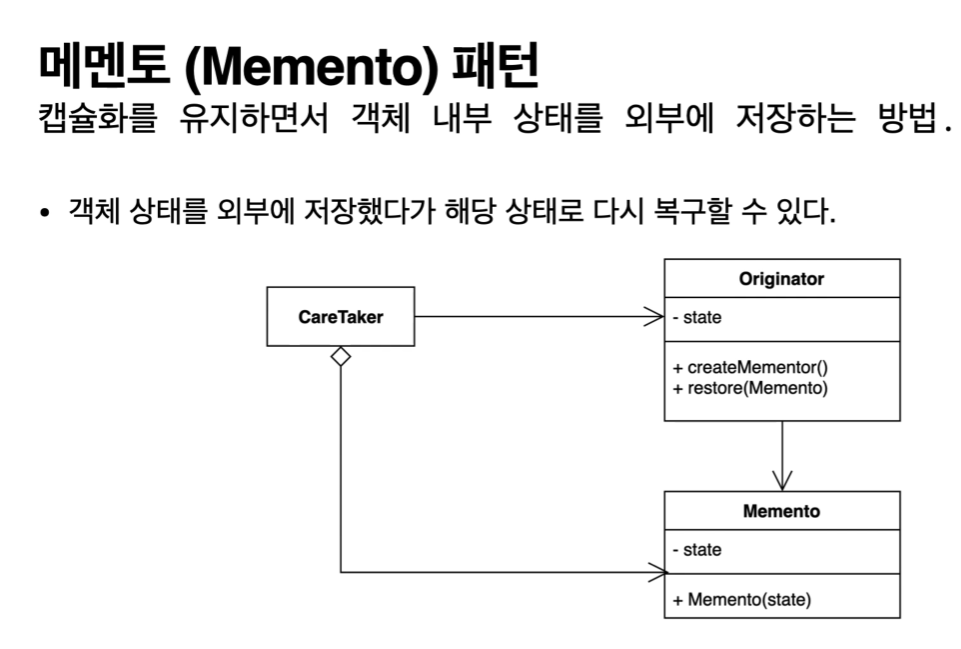

## 2022-07-10-메멘토패턴-1부-패턴소개

## 목차

>01.메멘토패턴
>
>02.코드로 알아보기
>
>>  02.1 Client.java
>>
>>  02.2 Game.java
>

## 01.메멘토패턴

- 객체내부의 상태를 외부에 저장하고 
- 그 저장소의 정보를 보관하고 싶을때 사용하는 패턴
- 객체내부의 상태 외부에 저장하려면 그 것이 외부에 온전히 노출되어야하는데 캡슐레이션을 지키면서 공개안하면서 외부에 저장하고 그대로 복원하는 방법임

- 대개 IDE는 Undo, 게임 시 일시정지후 다시 진행할 수 있는 것이 있는데 그것을 토대로 설명할것임

## 02.코드로 알아보기

### 02.1 Client.java

```java
public class Client {

    public static void main(String[] args) {
        Game game = new Game();
        game.setRedTeamScore(10);
        game.setBlueTeamScore(20);

        int blueTeamScore = game.getBlueTeamScore();
        int redTeamScore = game.getRedTeamScore();

        Game restoredGame = new Game();
        restoredGame.setBlueTeamScore(blueTeamScore);
        restoredGame.setRedTeamScore(redTeamScore);
    }
}
```

###  02.2 Game.java

```java
import java.io.Serializable;

public class Game implements Serializable {

    private int redTeamScore;

    private int blueTeamScore;

    public int getRedTeamScore() {
        return redTeamScore;
    }

    public void setRedTeamScore(int redTeamScore) {
        this.redTeamScore = redTeamScore;
    }

    public int getBlueTeamScore() {
        return blueTeamScore;
    }

    public void setBlueTeamScore(int blueTeamScore) {
        this.blueTeamScore = blueTeamScore;
    }
}
```

- 이런값들을 저장해놓고 다시 게임을 저장한다고 했을때
  - 따로 꺼내서 저장하고 다시 그 값을 세팅해서 넣으면 되지 않나 할 수 있지만
  - 인캡슐레이션이 깨짐, 일일이 위의 정보를 다 알고 있어야하기때문에 문제가 있음
  - 게임에서 내부정보를 변경하게 된다면 게임 정보가 바뀌면 클라이언트가 바뀔 수 있어서 내부 연결성을 좀 끊어야함



- Originator는 상태를 저장하고 복원하고 싶어하는 원래의 클래스 즉, 객체에 해당
- Memento와 careTaker는 우리가 못본것
  - careTaker는 기존 데이터의 내부 정보를 careTaker가 가져와서 저장
  - 이 가져온 정보를 복원할 수 있는 클래스, 여기에 저장된다고 생각하면 되고 이것을 통해 또 복원됨
- memento는 이를 추상화해서 사용을 함
  - 그래서 originateor 두가지를 가지고 있어야함 createMemenrtor와 자신 정보 복원할 수 있는 restore필요
  - Memento는 immute한것으로 변하지 않은 것을 써야함
