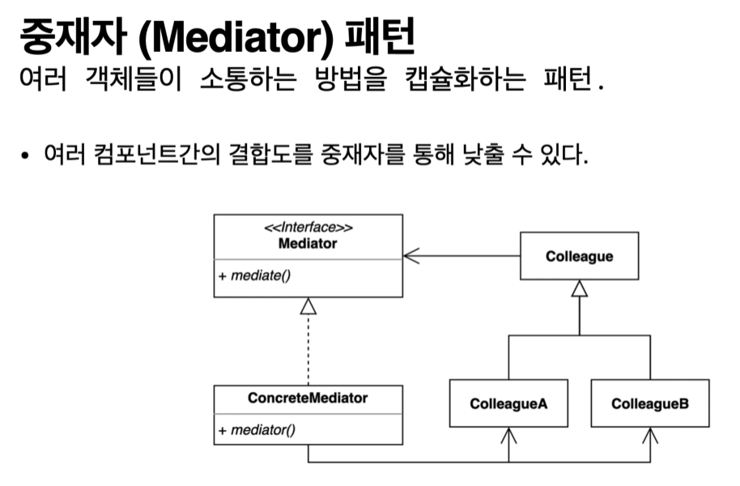

## 2022-07-11-중재자패턴-1부-패턴소개

## 목차

>01.중재자 패턴
>
>02.코드로 알아보는 중재자 패턴
>
>>  02.1 Hotel
>>
>>  02.2 CleaningService
>>
>>  02.3 Guest
>>
>>  02.4 Gym
>>
>>  02.5 Restaurant
>
>03.패턴 구조

## 01.중재자 패턴

- 여러 객체들간에 의사소통하는것 추상화해서 의존성을 낮추는 패턴
- 각각의 객체들이 타이트하게 결합되어 있는데 이때 , 코드 구현 변경, 테스트하기 어렵고 재사용하기 어려움
- 그래서 이를 적용한것을 예로 들면 층간소음, 공동으로 사는 사람과의 의사소통 등 
  - 개인 집을 방문하면서 방문하는것이아니고 관리 사무소에 연락하고 일을 진행하는것 같은것 이 중재자 패턴이 적용된 실생활 예시
- 관재탑에서 이륙, 착륙할때 공간 만들어줘야해서 의사 소통 필요한데 관재탑이라는 중재자를 통해 연락하는것 같은것이 가장 가까이 있는 예시

## 02.코드로 알아보는 중재자 패턴

### 02.1 Hotel

```java
public class Hotel {

    public static void main(String[] args) {
        Guest guest = new Guest();
        guest.getTower(3);
        guest.dinner();

        Restaurant restaurant = new Restaurant();
        restaurant.clean();
    }
}
```

### 02.2 CleaningService

```java
public class CleaningService {
    public void clean(Gym gym) {
        System.out.println("clean " + gym);
    }

    public void getTower(Guest guest, int numberOfTower) {
        System.out.println(numberOfTower + " towers to " + guest);
    }

    public void clean(Restaurant restaurant) {
        System.out.println("clean " + restaurant);
    }
}
```

### 02.3 Guest

```java
public class Guest {

    private Restaurant restaurant = new Restaurant();

    private CleaningService cleaningService = new CleaningService();

    public void dinner() {
        restaurant.dinner(this);
    }

    public void getTower(int numberOfTower) {
        cleaningService.getTower(this, numberOfTower);
    }

}
```

### 02.4 Gym

```java
public class Gym {

    private CleaningService cleaningService;

    public void clean() {
        cleaningService.clean(this);
    }
}
```

### 02.5 Restaurant

```java
public class Restaurant {

    private CleaningService cleaningService = new CleaningService();
    public void dinner(Guest guest) {
        System.out.println("dinner " + guest);
    }

    public void clean() {
        cleaningService.clean(this);
    }
}
```

- 서로 관계를 가지고 있다는것이 포인트
- 이코드를 구현하고 새로운 서비스를 만드는 경우
- 의존성을 고려해서 만들어야하는데 무튼 수정같은것을 하면 테스트나 재사용 수정하는것이 어려움

## 03.패턴 구조



- 중재자 패턴의 하나의 모양이라고 생각하면 좋음
- 모든 Coleague는 Mediator를 참조하는것이고
- ConcreteMediator가 Colleage들을 참조하고 있는것이 포인트