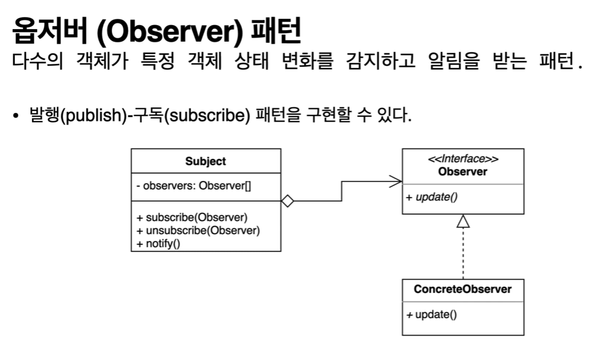

## 2022-07-18-옵저버패턴-1부-패턴소개

## 목차

>01.옵저버패턴
>
>02.코드로 보는 디자인패턴 적용전
>
>>  02.1 Client.java
>>
>>  02.2 ChatServer.java
>>
>>  02.3 User.java
>

## 01.옵저버패턴

- 감지하고 상태의 변경을 지켜보는 패턴
- 여러개의 객체들이 보통 어떤 상태를 감지하고 반응할때 사용
  - 퍼블리시 서브스크라이브 패턴을 쉽게 적용할 수 있음

## 02.코드로 보는 디자인패턴 적용전

### 02.1 Client.java

```java
public class Client {

    public static void main(String[] args) {
        ChatServer chatServer = new ChatServer();

        User user1 = new User(chatServer);
        user1.sendMessage("디자인패턴", "이번엔 옵저버 패턴입니다.");
        user1.sendMessage("롤드컵2021", "LCK 화이팅!");

        User user2 = new User(chatServer);
        System.out.println(user2.getMessage("디자인패턴"));

        user1.sendMessage("디자인패턴", "예제 코드 보는 중..");
        System.out.println(user2.getMessage("디자인패턴"));
    }
}
```

### 02.2 ChatServer.java

```java
import java.util.ArrayList;
import java.util.HashMap;
import java.util.List;
import java.util.Map;

public class ChatServer {

    private Map<String, List<String>> messages;

    public ChatServer() {
        this.messages = new HashMap<>();
    }


    public void add(String subject, String message) {
        if (messages.containsKey(subject)) {
            messages.get(subject).add(message);
        } else {
            List<String> messageList = new ArrayList<>();
            messageList.add(message);
            messages.put(subject, messageList);
        }
    }

    public List<String> getMessage(String subject) {
        return messages.get(subject);
    }
}
```

### 02.3 User.java

```java
import java.util.List;

public class User {

    private ChatServer chatServer;

    public User(ChatServer chatServer) {
        this.chatServer = chatServer;
    }


    public void sendMessage(String subject, String message) {
        chatServer.add(subject, message);
    }

    public List<String> getMessage(String subject) {
        return chatServer.getMessage(subject);
    }
}
```

- 주기적으로 가져오는데 있어서 유용하나? 
  - 주기별로 가져오는데 메시지 변경되지 않은 경우 가져올 필요없는데
  - 이런 폴링을 한다라고 하는데 위에서는 요구를 만족하지 않음



- 서브젝트의 주요기능은 여러옵저버 등록, 해지하는 기능 제공
- 서브젝트가 제공하는 특정한 메소드로 서브젝트 상태 변경할것
  - 상태가 변경이되면 등록되어 있는 옵저버 순회하면서 옵저버가 제공하는 특정한 메소드를 모두 호출
- 옵저버역활 공통된 인터페이스 제공해서
  - 옵저버에 호출해야하는 메소드 , 이벤트 정보, 이벤트 자체를 전달하는 메소드 필요
  - 사실 인터페이스를 안써도 되지만, 쓰는것이 사실 좋음
    - 안쓰는 법은 서브젝트가 옵저버자체를 가지고 있으면되는거라서 상관은 없지만
    - 리플랙션 api를 이용해도 되는거라서 상관은 없음