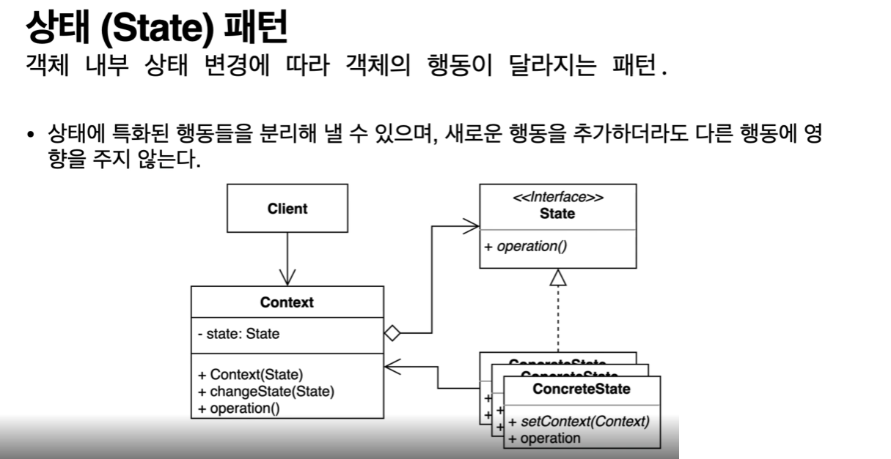

## 2022-07-28-상태패턴-1부-패턴소개

## 목차

>01.상태패턴
>
>02.코드로 확인해보기
>
>>  02.1 Client.java
>
>>  02.2 OnlineCourse.java
>
>>  02.3 Student.java

## 01.상태패턴

- 스테이트라는걸 암시하듯 특별한 상태에따라 형태가 달라지는것
  - 예를 들면 리모컨 같은것
    - 볼륨이나, 채널을 조절하는데 티비의 상태에 따라 그 버튼의 동작이 달라지는 것
    - 티비가 켜져있을때, 꺼져있을때 다르게 동작하는 것을 말함
- 블로그에 글을 쓰는데 아직 쓰는중이랑 밖에서 볼 수 없고, 댓글 달 수 없지만 공개가 되면 다른 사람들이 볼 수 있고 댓글 달 수 있는 것들
  - 즉, 상태에 따라 특정한 오브젝트의 성질? 상태가 바뀌는 것

## 02.코드로 확인해보기

### 02.1 Client.java

```java
package me.whiteship.designpatterns._03_behavioral_patterns._20_state._01_before;

public class Client {

    public static void main(String[] args) {
        Student student = new Student("whiteship");
        OnlineCourse onlineCourse = new OnlineCourse();

        Student keesun = new Student("keesun");
        keesun.addPrivateCourse(onlineCourse);

        onlineCourse.addStudent(student);
        onlineCourse.changeState(OnlineCourse.State.PRIVATE);

        onlineCourse.addStudent(keesun);

        onlineCourse.addReview("hello", student);

        System.out.println(onlineCourse.getState());
        System.out.println(onlineCourse.getStudents());
        System.out.println(onlineCourse.getReviews());
    }
}
```

### 02.2 OnlineCourse.java

```java
package me.whiteship.designpatterns._03_behavioral_patterns._20_state._01_before;

import java.util.ArrayList;
import java.util.List;

public class OnlineCourse {

    public enum State {
        DRAFT, PUBLISHED, PRIVATE
    }

    private State state = State.DRAFT;

    private List<String> reviews = new ArrayList<>();

    private List<Student> students = new ArrayList<>();

    public void addReview(String review, Student student) {
        if (this.state == State.PUBLISHED) {
            this.reviews.add(review);
        } else if (this.state == State.PRIVATE && this.students.contains(student)) {
            this.reviews.add(review);
        } else {
            throw new UnsupportedOperationException("리뷰를 작성할 수 없습니다.");
        }
    }

    public void addStudent(Student student) {
        if (this.state == State.DRAFT || this.state == State.PUBLISHED) {
            this.students.add(student);
        } else if (this.state == State.PRIVATE && availableTo(student)) {
            this.students.add(student);
        } else {
            throw new UnsupportedOperationException("학생을 해당 수업에 추가할 수 없습니다.");
        }

        if (this.students.size() > 1) {// 두명이상인 경우 private 상태가 된다고 가정
            this.state = State.PRIVATE;
        }
    }

    public void changeState(State newState) {
        this.state = newState;
    }

    public State getState() {
        return state;
    }

    public List<String> getReviews() {
        return reviews;
    }

    public List<Student> getStudents() {
        return students;
    }

    private boolean availableTo(Student student) {
        return student.isEnabledForPrivateClass(this);
    }

}
```

### 02.3 Student.java

```java
package me.whiteship.designpatterns._03_behavioral_patterns._20_state._01_before;

import java.util.ArrayList;
import java.util.List;

public class Student {

    private String name;

    public Student(String name) {
        this.name = name;
    }

    private List<OnlineCourse> privateCourses = new ArrayList<>();

    public boolean isEnabledForPrivateClass(OnlineCourse onlineCourse) {
        return privateCourses.contains(onlineCourse);
    }

    public void addPrivateCourse(OnlineCourse onlineCourse) {
        this.privateCourses.add(onlineCourse);
    }

    @Override
    public String toString() {
        return "Student{" +
                "name='" + name + '\'' +
                '}';
    }
}

```

- 위에 처럼 코드가 길어지기 때문에 상태 패턴이 필요함
  - 특정 상태마다 뭘쓴지 기억도 안나고 뭔지 알기쉽게함



- 위에처럼 생김
- 가장 중요한것 context, state가 있는데
  - state는 context가 여러 변경에 따른 공통된 인터페이스임
  - 물론 추상 클래스로도 가능하지만 무조건 이런것 하나 있어야함
- context는 상태에 따라 달라는지 행위를 가지고 있던것 state로 뺀것
  - 여기에는 상태 변경을 위한 메소드가 존재 
  - 상태변경 말고 고유한 정보를 가지고 있는 클래스임
  - 행동에 따라 달라지는 패턴을 state로 위임 (델리게이트할것)
    - 이를 concreate state로 구현할 것임