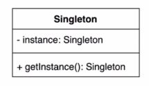
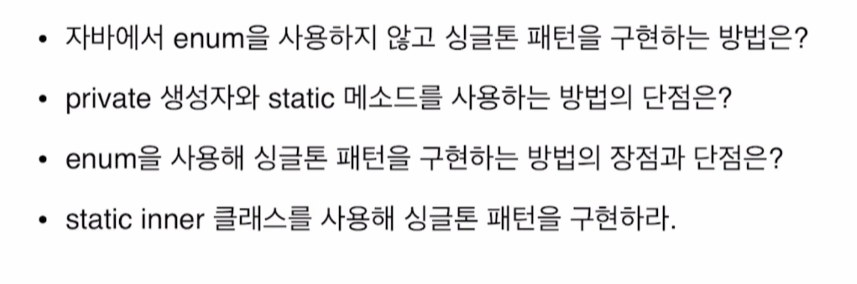

## 2022-11-08-싱글톤-패턴

## 목차

## 01.개념

- 싱글톤패턴
  - 인스턴스를 오직 한개만 제공하는 클래스
- 시스템 런타임, 환경 세팅에 대한 정보 등,
  - 인스턴스가 여러개 일 때 문제가 생길 수 있는 경우가 있음
  - 인스터스를 오직 한개만 만들어서 제공하는 클래스가 필요함



- 이런 경우가 생기는 이유
  - 게임으로 따지면 설정하면이 한개 만 있어야하는데 두개 있으면 안되는 것 처럼 한개가 필요한 경우 사용

## 02.싱글톤 패턴을 가장 단순히 구현하는 방법

```java
public class App {
    public static void main(String[] args) throws Exception {
        Settings settings = new Settings();
        Settings settings1 = new Settings();
        System.out.println(settings != settings1);
    }
}


public class Settings{
    public Settings(){
        
    }
}
```

- 이렇게 하면 안된다는 것
  - new를 못쓰게 하면되는 것으로 해석 되는데

```java
public class App {
    public static void main(String[] args) throws Exception {
        Settings settings = new Settings();
        Settings settings1 = new Settings();
        System.out.println(settings != settings1);
    }
}


public class Settings{
    private Settings(){
        
    }
}
```

- 생성자를 private를 하면되는가?
  - 그럼 new를 사용을 못하는데 객체를 못해서 private안에서 글로벌하게 인스턴스를 생성해줘야함

```java
public class Settings{
    private Settings(){}

    public static Settings getInstance(){
        return new Settings();
    }
}


public class App {
    public static void main(String[] args) throws Exception {
        Settings settings = Settings.getInstance();
        Settings settings1 = Settings.getInstance();
        System.out.println(settings == settings1);
    }
}
```

- 현재 우리는 이 두개의 객체가 같기를 바라는 것인데 결과를 보면 false가 나옴

```java
public class Settings{

    private static Settings instance;

    private Settings(){}

    public static Settings getInstance(){
        if(instance ==null){
            instance = new Settings();
        }
        return instance;
    }
}


public class App {
    public static void main(String[] args) throws Exception {
        Settings settings = Settings.getInstance();
        Settings settings1 = Settings.getInstance();
        System.out.println(settings == settings1);
        System.out.println(settings==Settings.getInstance());
    }
}
```

- 위와 같이 하면 같은 객체를 받아오게 됨
- 가장 나이브하게 구현하는 방법
  - 위의 경우 심각한 문제가 있긴함
  - 대개 웹은 멀티 스레드를 사용하게 되는데
  - 멀티 스레드 환경에서 위의 코드가 안전한지 말하자면 안전하지 않음

## 03.멀티 쓰레드 환경에서 안전하게 구현하는 방법

```java
package singleTone2MultiThread;
public class Settings{

    private static Settings instance;

    private Settings(){}

    public static  synchronized Settings getInstance(){
        if(instance ==null){
            instance = new Settings();
        }
        return instance;
    }
}

package singleTone2MultiThread;

public class App {
    public static void main(String[] args) throws Exception {
        Settings settings = Settings.getInstance();
        Settings settings1 = Settings.getInstance();
        System.out.println(settings == settings1);
        System.out.println(settings==Settings.getInstance());
    }
}
```

- synchronized를 이용하면 멀티스레드에도 조금은 안전하게 사용가능

### 03.1 이른초기화 방법

- 혹시 미리 만들어도 되거나, 비용이 저렴하다면 적용가능함

- 이른초기화는 안전하다.
- 쓰레드 세이프함
- 쓰지 않는 객체를 미리 만드는 것이기 때문에 단점도 있음

```java
package singleTone3EagerIntization;

public class Settings{

    private static final Settings INSTANCE = new Settings();

    private Settings(){}

    public static Settings getInstance(){
        return INSTANCE;
    }
}

package singleTone3EagerIntization;

public class App {
    public static void main(String[] args) throws Exception {
        Settings settings = Settings.getInstance();
        Settings settings1 = Settings.getInstance();
        System.out.println(settings == settings1);
        System.out.println(settings==Settings.getInstance());
    }
}
```

### 03.2 Double checked locking

```java
package singleTone4DoubleCheckedLocking;
public class Settings{

    private static volatile Settings instance;

    private Settings(){}

    public static  synchronized Settings getInstance(){
        if(instance ==null){
            synchronized (Settings.class){
                if(instance == null){
                    instance = new Settings();
                }
            }
        }
        return instance;
    }
}

package singleTone4DoubleCheckedLocking;

public class App {
    public static void main(String[] args) throws Exception {
        Settings settings = Settings.getInstance();
        Settings settings1 = Settings.getInstance();
        System.out.println(settings == settings1);
        System.out.println(settings==Settings.getInstance());
    }
}
```

- 이전에 소스들 보다 더 효율적인 코드가 되는것이냐면
  - 인스턴스를 생성할때마다 synchronized를 하지 않음
    - 동기화 매커니즘사용 안함
- 인스턴스를 필요한 시점에 만들 수 있다는 장점도 있음
  - 사실 volatile를 쓰는 이유를 알아야하는데 그것까지 들어가면 복잡함
  - 1.5부터 동작함

### 03.3 static inner 클래스 사용하기

```java
package singleTone5StaticInner;
public class Settings{

    private Settings(){}

    private static class SettingsHolder{
        private static final Settings INSTANCE = new Settings();
    }

    public static  synchronized Settings getInstance(){
        return SettingsHolder.INSTANCE;
    }
}

package singleTone5StaticInner;

public class App {
    public static void main(String[] args) throws Exception {
        Settings settings = Settings.getInstance();
        Settings settings1 = Settings.getInstance();
        System.out.println(settings == settings1);
        System.out.println(settings==Settings.getInstance());
    }
}
```

- 이렇게 하면 멀티쓰레드환경에서 안전
  - getInstance가 실행될때 만들어지고
  - 레이지 로깅도 가능해짐
- 더블처럼 코드가 많아지지 않고 괜찮은 방법임
  - 하지만 위의 모든 방법을 깨뜨릴 수있는 방법이 있긴함

## 04.싱글톤 패턴 구현 방법을 깨트리는 방법

- 추후에 해보기

## 05.안전하고 단순하게 구현하는 방법

```java
package singleTone6Safe;

public enum Settings{
    INSTANCE;

    Settings(){

    }
    
    private Integer number;

    private Integer getNumber(){
        return number;
    }

    public void setNumber (Integer number){
        this.number = number;
    }
}

package singleTone6Safe;

public class App {
    public static void main(String[] args) throws Exception {
        Settings settings = Settings.INSTANCE;
        Settings settings1 = Settings.INSTANCE;
        System.out.println(settings == settings1);
        System.out.println(settings==Settings.INSTANCE);
    }
}
```

- 리플렉션으로도 뚫을 수 없는 코드가 됨

## 06.싱글톤 패턴 복습



