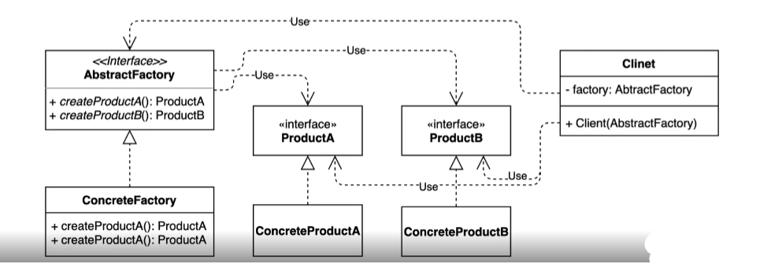

## 2022-11-16-추상팩토리-패턴

## 목차

## 01.추상 팩토리 패턴

- 서로 관련있는 여러 객체를 만들어 주는 인터페이스



- 팩토리를 추상으로 만듦
  - 팩토리 패턴과 유사하지만 클라이언트쪽에서 맞춰서 바라보면 팩토리 지만 
    - 추상팩토리 패턴은 클라이언트에서 팩토리에서 인터페이스 기반으로 만들어서 쓸 수 있게함
  - 하지만 팩토리를 사용하는 곳까지 같이 봐야함
  - 사실상 팩토리 매소드 패턴과 유사한것임

- 다른 추가적인 것이 나오면 다른것을 만들어서 쓰므로 코드가 바뀌는데 바뀌지 않게 함

## 02.추상 팩토리 패턴 적용하기

```cs
public interface ShipPartsFactory{
    Anchor createAnchor();
    Wheel createWheel();
}
```

- 사실 여러개가 있으니 단일책임원칙 위반한것 아니냐 하지만? 관점에 따라 다름
- 오픈 클로스 원칙을 지키고 있음

## 03.추상 팩토리 패턴 장단점

- 디자인 패턴이 비슷비슷함

  - 산을 봤을때 어디서 봤을때 다를 수 있다는 것과 비슷

- 추상 팩토리와 패토리 매소드 는?

  - 모양 효과 비슷
    - 둘다 객체 생성 과정을 추상화함
  - 관점이 다름
    - 팩토리 패턴 팩토리 구현하는 방법에 초첨 (inheritance)
    - 추상 팩토리 패턴 팩토리를 사용하는 방법에 초점 (composition)
  - 목적이 다름
    - 팩토리 매소드 패턴은 구체적인 객체 생성 과정을 하위또는 구체적인 클래스로 옮기는 것 이 목적
    - 추상 팩토리 패턴은 관련있는 여러 객체를 구체적인 클래스에 의존하지 않고 만들 수 있게 해주는 것이 목적

  