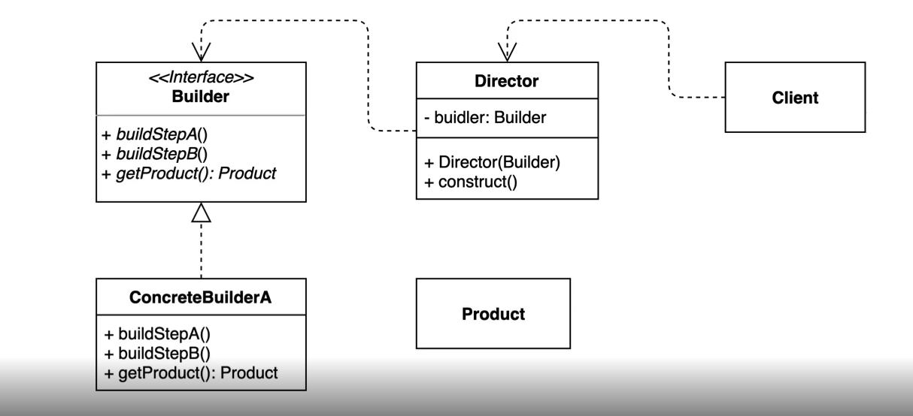

## 2022-11-17-빌더-패턴

## 목차

## 01.빌더 패턴 소개

- 긴여행이 아닌 짧은 여행인 경우 구성자체가 다를 수 있음

  - 공통점은 있지만
  - 일관된 프로세스가 없을때?
  - 또는 연관된 부분이 있는 경우, 하나를 선언했으면 다른 것도 선언해야하는 경우

-  동일한 프로세스를 거쳐 다양한 구성의 인스턴스를 만드는 방법

  - 복잡한 객체를 만드는 프로세스를 독립적으로 분리 할 수 있음

  

## 02.패턴적용하기

```
```

## 03.장단점

- 구체적인 과정을 숨길 수 있음
- 불안전한 객체 생성 못하게함

- 단점
  - 클라이언트에서 다른것을 미리만들고 해야하는 점이 있음
  - 구조가 상당히 복잡해질 수 있음