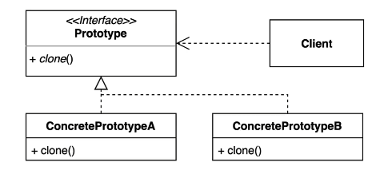

## 2022-11-21-프로토타입-패턴

## 목차

> 01.프로토타입 소개
>
> 02.패턴적용하기
>
> 03.장단점

## 01.프로토타입 소개

- 기존 인스턴스를 복제하여 새로운 인스턴스를 만드는 방법
  - 복제기능을 갖추고 있는 기존 인스턴스를 프로토타입으로 사용해 새인스턴스를 만들 수 있다.



- 기존 객체응용해서 새로운 인스턴스 만들때 활용 할 수 있음
  - 데이터 베이스에서 읽어와서 생성해야한다 던가
  - 네트워크 기반으로 해서 만들어야한다는 등등 
    - 그런 인스턴스를 만들때마다 오래 걸리고 리소스 많이씀
    - 그래서 그냥 그 모든 데이터 복사해서 새로운 인스턴스 만들고, 필요한것만 쓴다면 유용하게 쓸 수 있지 않을까함

```cs
GithubIssue clone = githubIssue.clone();
//TODO clone != githubIssue
//TODO clone.equals(githubIssue) => 레퍼런스동일이 아닌 내용 비교라서 true가 되어야함
```

## 02.패턴적용하기

- 자바에서 clone을 사용할 수 있는 방법?

  - Object안에 들어있음

- 명시적으로 해주기 위해서 implements cloneable를 해주고

  - clone()이라는것을 오버라이드해주면됨

    ```java
    protected Object clone() throws CloneNotSupportedException{
        return super.clone();
    }
    // equals도 구현해야함
    ```

```java
GithubIssue clone = (GithubIssue) githubIsse.clone();
System.out.println(clone.getUrl());

clone != githubIssue;
clone.equals(githubIssue);
clone.getClass() == githubIssue.getClass();

// 이거 세개 다 같아야함

```

- 장점 동일한 작업을 또할 필요 없음
  - 복잡한 작업을 다시 하지 않아도 되서 이득을 볼 수 있음
- 클론이라는 기능을 shallow copy, deep copy인데
  - 여기서는 shallow copy를 지원함
- 얇은 복사란?
  - 깃헙이슈로 인스턴스 만들었을때? 어떻게 했을까?
    - 새로 만들었을까? 아니면 참조를 할까?
  - 대개 클론이 가리키고 있는 리파지토리와 깃헙이슈와 리파지토리는 같은 것임

- 깊은 복사하는 법
  - 이전에 했던것을 clone쪽에서 구현하면됨
  - 그렇게 하면 딥카피가 됨

## 03.장단점

- 장점

  - 기존에 있는 인스턴스 프로토 타입으로 해서 새로운 인스턴스 만드는 것
  - 자바를 사용하고 있다면 object가 제공하는 clone을 사용하면됨

  - 복잡한 객체를 만드는 과정을 숨길 수 있음
    - 기존 객체를 복제하는 과정이 새 인스턴스를 만드는 것보다 비용 적인 면에서 효율적
    - 추상적인 타입을 리턴할 수 있음

- 단점
  - 복잡한 객체를 만드는 과정 자체가 복잡할 수 있다.
    - 특히 순환 참조가 있는경우