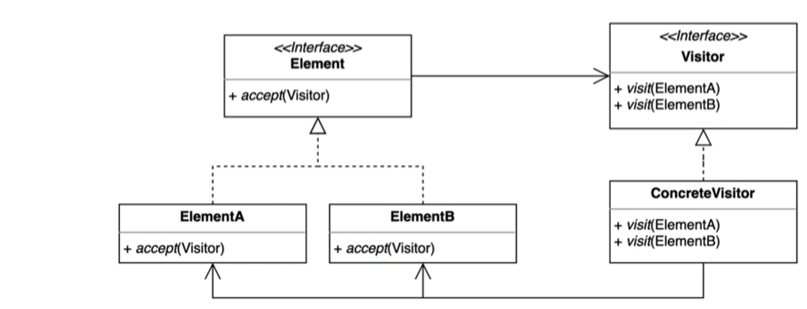

## 22-04-11-비지터패턴-1부-패턴소개

## 목차

> 01.사용되는 상황
>
> 02.코드로 확인해보기
>
> > 02.1 여러디바이스에 추가하고 싶은 경우
>
> 03.방문자 패턴이란?

## 01.사용되는 상황

- 기존 코드를 건드리지 않고 새로운 기능 추가하는 것
- 기능을 구현할 때 기존 클래스에 코드를 추가하는데 그럴수 없는 경우가 있고 원치 않는 경우가  있을 수 있음

- [단일 책임 원칙 (Single responsibility principle)](https://ko.wikipedia.org/wiki/단일_책임_원칙)을 지키고 싶고, 책임을 증가시키고 싶지 않는 경우
- 버그가 생길 수 있어서 그곳에 넣지 않고 분리하고 싶은 경우
- 그 코드가 가진 특성상 여러 곳에서 사용해야하는 경우나 한곳에 모으고 싶은 경우

## 02.코드로 확인해보기

### 02.1 여러디바이스에 추가하고 싶은 경우

- 기기 마다 달라진다는 가정으로 구현된 디자인 패턴이 적용되지 않은 경우

```java
public interface Device{
}
```

```java
public Phone implements Device{
}
```

```java
public Watch implements Device{
}
```

```java
public class Client{
    public static void main(String[] args)
    {
        Shape rectangle = new Rectangle();
        rectangle.printTo(new Phone());
	}
}
```

```java
public interface Shape {
    void printTo(Device device);
}// 모든 디바이스에 쓰기 위함
```

```java
public class Rectangle implements Shape{
	@Override
    public void printTo(Device device){
        if(device instanceof Phone){
            System.out.println("print Rectangle to Phone");
        }else if(device instanceof Watch){
            System.out.println("print Rectangle to Watch");
        }
    }
}
```

```java
public class Triangle implements Shape{
	@Override
    public void printTo(Device device){
        if(device instanceof Phone){
            System.out.println("print Triangle to Phone");
        }else if(device instanceof Watch){
            System.out.println("print Triangle to Watch");
        }
    }
}
```

- [개방-폐쇄 원칙 (Open/closed principle)](https://ko.wikipedia.org/wiki/개방-폐쇄_원칙)이 법칙이 깨진 경우

- [단일 책임 원칙 (Single responsibility principle)](https://ko.wikipedia.org/wiki/단일_책임_원칙)도 깨짐
- 그리고 기기가 추가되는 상황에서 위의 if else 문이 각각의 모양 마다 추가가 된다.

## 03.방문자 패턴이란?

- 기존 코드를 변경하기 않고 새로운 기능을 추가하는 방법
  - 더블 디스패치(Double Dispatch)를 활용할 수 있음
    - Dispatch는 어떤  다형성이나 분배, 배치
      - 어떤 요청이 들어오면 그것을 처리할 구체적인 클래스 메소드를 찾아서 배치하는 것
      - 요청 처리를 위임하는 것을 말함


