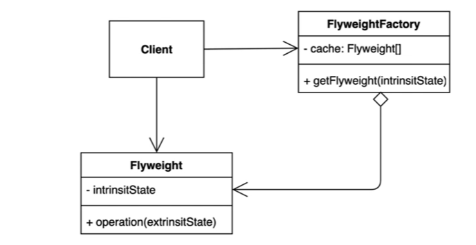

## 22-04-12-플라이웨이트패턴-1부-패턴소개

## 목차

> 01.플라이웨이트를 들어가면서..
>
> > 01.1 코드로 알아보는 디자인패턴
>
> 02.플라이웨이트 패턴이란?

## 01.플라이웨이트를 들어가면서..

- 가벼움이라는 의미
- 복싱체급에 플라이웨이트라는 체급이있는데 무튼 가벼운 축에 속한 것
- 애플리케이션에서 많은 인스턴스를 만드는 것에서 사용되는 패턴
  - 많은 인스턴스를 만들면 메모리 사용을 많이하게 되어 out of memory생김
  - 이를 적용해 공통된 부분 따로 모아서 사용함
  - 자주변하고, 변하지 않는 부분 분리해서 변하지 않는 부분을 활용함

## 01.1 코드로 알아보는 디자인패턴

```java
public class Client {

    public static void main(String[] args) {
        Character c1 = new Character('h', "white", "Nanum", 12);
        Character c2 = new Character('e', "white", "Nanum", 12);
        Character c3 = new Character('l', "white", "Nanum", 12);
        Character c4 = new Character('l', "white", "Nanum", 12);
        Character c5 = new Character('o', "white", "Nanum", 12);
    }
}
```

```java
public class Character {

    private char value;

    private String color;

    private String fontFamily;

    private int fontSize;

    public Character(char value, String color, String fontFamily, int fontSize) {
        this.value = value;
        this.color = color;
        this.fontFamily = fontFamily;
        this.fontSize = fontSize;
    }
}
```

- 편집기에 글을 많이 쓸수록 성능자체가 문제가 될 수 있음
-  위와 같은 상황에서 이러면 겹치는 부분이 있음
- 위에 패턴을 적용하기 전 아래 개념을 알아보자

## 02.플라이웨이트 패턴 이란?

- 객체를 가볍게 만들어 메모리 사용을 줄이는 패턴
  - 자주 변하는 속성 (또는 외적인 속성, extrinsit)과 
  - 변하지 않는 속성 (또는 내적인 속성, intrinsit)을 분리하고 재사용하여 메모리 사용을 줄일 수 있음



