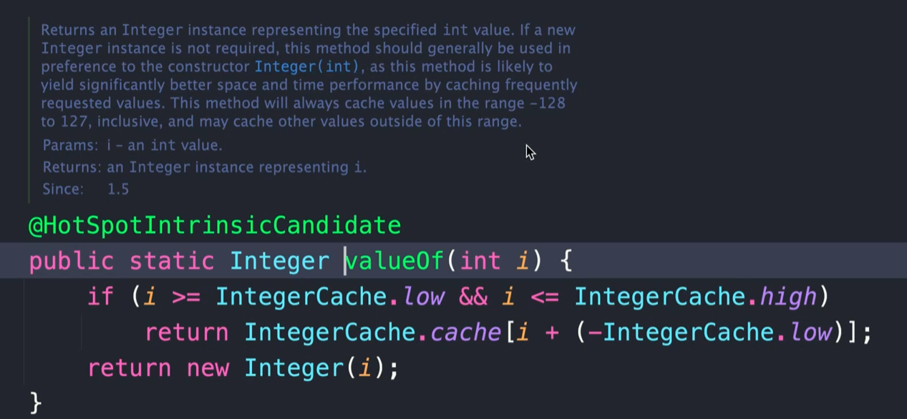

## 22-04-12-플라이웨이트패턴-4부-자바와스프링에서찾아보는패턴

## 목차

> 01.자바의 플라이웨이트 패턴
>
> 02.스프링의 플라이웨이트 패턴

## 01.자바의 플라이웨이트 패턴

```java
package me.whiteship.designpatterns._02_structural_patterns._11_flyweight._03_java;

public class FlyweightInJava {

    public static void main(String[] args) {
        Integer i1 = Integer.valueOf(10);
        Integer i2 = Integer.valueOf(10);
        System.out.println(i1.equals(i2);
        //System.out.println(i1 == i2);// 이렇게 쓰는것은 좋지 않음
    }
}
```



- 값들을 캐싱하는 것을 알 수 있음
  - 즉, 자주사용하는것에 대해서만

## 02.스프링의 플라이웨이트 패턴

- 찾기가 어려움 ㅜㅜ