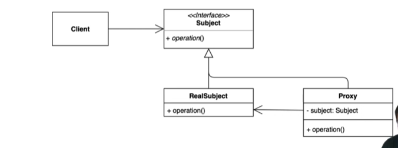

## 22-04-17-프록시패턴-1부-패턴소개

## 목차

> 01.프록시패턴
>
> 02.코드로 보는 프록시 패턴
>
> > 02.1 Client.java
> >
> > 02.2 GameService.java
>
> 03.UML

## 01.프록시패턴

- 스프링을 한번쯤 공부했던 사람이라면 들어본 패턴 중 하나
  - 특정한 객체의 오퍼레이션들을 접근하기 전에 프록시 객체를 지나서 접근하는 패턴
  - 프록시 
    - 대리, 대리인의 의미를 가진
    - 클라이언트가 직접 객체를 쓰지 않고 대리인을 거쳐서 사용하는 것
      - 그 클래스 직접안쓰고 프록시를 거쳐서 사용 
      - 요청자체를 프록시가 무조건 받음

- 좋은 이유
  - 해당 객체에 대한 접근 제어, 권한이 있어야 접근할 수 있도록
  - 그 객체가 생성하는 데 많은 리소르를 필요로하는 인스턴스라면
    -  최초로 쓰일때 초기화를 지연할 수 도 있음
  - 로깅, 캐싱을 적용할 수 있음
    - 이를 통해 성능적 장점을 가져옴

 

## 02.코드로 보는 프록시 패턴

### 02.1 Client.java

```java
public class Client{
    public static void main(String[] args){
		GameService gameService = new GameService();
        gameService.startGame();
    }
}
```

### 02.2 GameService.java

```java
public class GameService{
    public void startGame(){
        System.out.println("이 자리에 오신 여러분을 진심으로 환영합니다.");
    }
}
```

- 이 게임을 시작하고 끝낼때 시간이 얼마나 걸리는지 측정하고 싶고 
- 위의 코드를 변경하지 않고, 이 오퍼레이션이 얼마나 걸리는지
- 또는 클라이언트에서도 코드 수정없이 하는 것을 할 수 있음

## 03.UML

- 특정 객체에 대한 접근을 제어하거나 기능을 추가할 수 있는 패턴
  - 초기화 지연, 접근제어, 로깅, 캐싱 등 다양하게 응용해 사용할 수 있음

