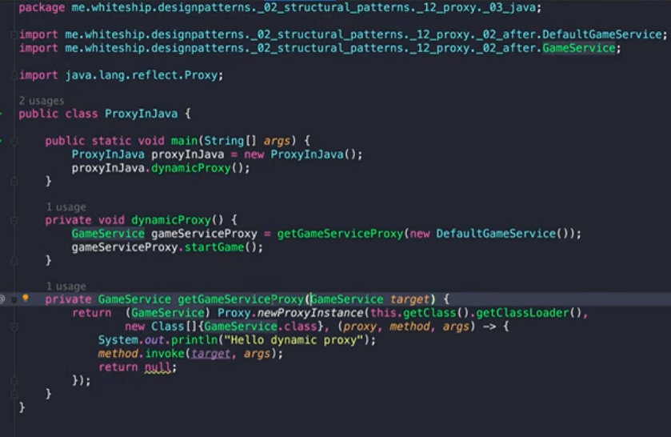
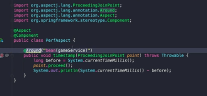
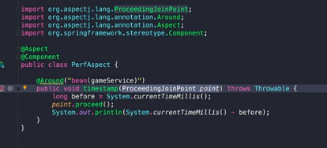

## 22-04-17-프록시패턴-4부-자바와스프링에서찾아보는패턴

## 목차

> 01.자바코드
>
> > 01.1 다이나믹 프록시
>
> 02.스프링

## 01.자바코드

- 다이나믹 프록시, java.lang.reflect.Proxy

### 01.1 다이나믹 프록시

- 런타임에서 프록시를 제공하는 것
- 애플리케이션이 실행중에 인스턴스를 동적으로 만들수 있는 방법

## 02.스프링

- 스프링 AOP
- 여러코드에 흩어질 수있는것을 모아서 코딩해줄 수 있는 기법
  - 퍼포먼스 측정을 다른곳에서 해야하는 경우
  - 성능 측정하는것만 따로 모아놓는것

