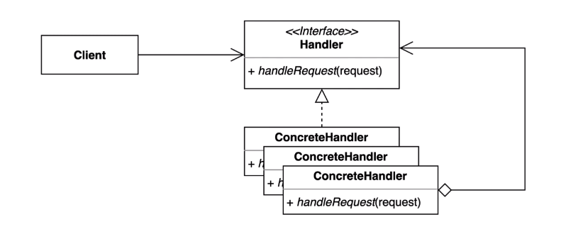

## 22-04-17-책임연쇄패턴-1부-패턴소개

## 목차

> 01.책임연쇄패턴
>
> 02.소스로 알아보는 패턴
>
> > 02.1 Client
> >
> > 02.2 RequestHandler
>
> 03.그래서? 책임 연쇄 패턴은 뭐니?

## 01.책임연쇄패턴

- 책임들의 연쇄적으로 연결되어 있는 패턴
- 각각의 책임들이 연결되어 있는것
  - 단일 책임 원칙의 책임이랑 같다
    - 어떤 클래스가 변경되어야하는 이유는 한가지 이유여만 하는것

- 이 패턴은 요청을 보내는 쪽과 처리하는 쪽을 분리하는 패턴
  - 요청을 보내는 쪽에서 요청을 처리하는 핸들러가 어떤 구체적인 타입인지 상관없이 디커플링된 상태에서 요청을 처리하게 해주는 패턴임

## 02.소스로 알아보는 패턴

### 02.1 Client

```java
public class Client{
    public static void main(String[] args){
        Request request = new Request("무궁화 꽃이 피었습니다.");
        RequestHandler requestHandler = new RequestHandler();
        requestHander.handler(request);
    }
}
```

### 02.2 RequestHandler

```java
public class RequestHandler{
    public handler(Request request){
        System.out.println(request.getBody());
    }
}
```

- 인증, 처리를 해야한다면?

  - 그냥 코드를 수정해서 인증되는지 아닌지 확인을 하는법

    - 이렇게 하면 단일 책임원칙에 위배함

  - AuthRequestHandler 생성

    ```java
    public class AuthRequestHandler extends RequestHandler{
        public void handler(Request request){
          System.out.println("인증이 되었나?");
          System.out.println("이 핸들러를 사용할 수 있는 유저인가?");
          super.handler(request);
        }
    }
    ```

    - Client는 

      ```java
      public class Client{
          public static void main(String[] args){
              Request request = new Request("무궁화 꽃이 피었습니다.");
              RequestHandler requestHandler = new AuthRequestHandler();
              requestHander.handler(request);
          }
      }
      ```

      - AuthRequestHandler 이를 통해 인증을 처리

    - 문제는 단일책일원칙은 지킬 수 있음

    - 단, 클라이언트가 선택을 해야함, 클라이언트가 바뀜

      - 책임이 추가되는 경우 로그와 관련된것이 추가가된다.
      - 계속 추가되면 복잡해지고 클라이언트가 그 사용해야하는 것을 알아야하는것이 문제임

## 03.그래서? 책임 연쇄 패턴은 뭐니?



- 요청을 보내는 쪽(sender)과 요청을 처리하는 쪽(receiver)의 분리하는 패턴
  - 핸들러 체인을 사용해서 요청을 처리

