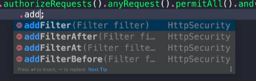

## 22-04-18-책임연쇄패턴-4부-장점과단점

## 목차

> 01.자바
>
> 02.스프링

## 01.자바

- 자바에서는 Servel Filter

### CoRInJava

```java
import javax.servlet.*;
import java.io.IOException;

public class CoRInJava {

    public static void main(String[] args) {
        Filter filter = new Filter() {
            @Override
            public void doFilter(ServletRequest request, ServletResponse response, FilterChain chain) throws IOException, ServletException {
                // TODO 전처리
                chain.doFilter(request, response);
                // TODO 후처리
            }
        };
    }
}
```

### MyFilter

```java
import javax.servlet.*;
import javax.servlet.annotation.WebFilter;
import java.io.IOException;

@WebFilter(urlPatterns = "/hello")
public class MyFilter implements Filter {

    @Override
    public void doFilter(ServletRequest request, ServletResponse response, FilterChain chain) throws IOException, ServletException {
        System.out.println("게임에 참하신 여러분 모두 진심으로 환영합니다.");
        chain.doFilter(request, response);
        System.out.println("꽝!");
    }
}
```

### App

```java
import org.springframework.boot.SpringApplication;
import org.springframework.boot.autoconfigure.SpringBootApplication;
import org.springframework.boot.web.servlet.ServletComponentScan;

@ServletComponentScan
@SpringBootApplication
public class App {

    public static void main(String[] args) {
        SpringApplication.run(App.class, args);
    }
}
```

### HelloController

```java
package me.whiteship.designpatterns._03_behavioral_patterns._13_chain_of_responsibilities._03_java;

import org.springframework.web.bind.annotation.GetMapping;
import org.springframework.web.bind.annotation.RestController;

@RestController
public class HelloController {

    @GetMapping("/hello")
    public String hello() {
        return "hello";
    }
}
```

## 02.스프링

```java
import org.springframework.context.annotation.Configuration;
import org.springframework.security.config.annotation.web.builders.HttpSecurity;
import org.springframework.security.config.annotation.web.configuration.WebSecurityConfigurerAdapter;

@Configuration
public class SecurityConfig extends WebSecurityConfigurerAdapter {

    @Override
    protected void configure(HttpSecurity http) throws Exception {
        http.authorizeRequests().anyRequest().permitAll().and();
    }
}
```



- 저렇게 추가가 되는게 있음