## 2022-04-26-Grafana-dashboard-유지-및-에러-문제-해결 

## 목차

> 00.글을 쓰는 이유
>
> 01.grafana 및 postgres docker-compose 파일 생성
>
> 02.현재 위의 도커파일 자체의 대시보드등을 그대로 가져오기
>
> > 02.1 에러 : 권한 문제 
>
> 03.대시보드 확인
>
> 04.컨테이너 ip 변경
>
> > 04.1 컨테이너 네트워크 ip확인 및 연결

## 00.글을쓰는 이유

- 현재 대시보드를 그대로 다른 환경의 컴퓨터에서도 적용하고 싶음
- 그러는 과정에서 생기는 문제를 해결하고 유지보수하기 위함

## 01.grafana 및 postgres docker-compose 파일 생성

```yml
version: '3.1'

services:
  grafana:
    image: grafana/grafana:8.4.1-ubuntu
    restart: always
    container_name: grafana
    ports:
      - 3000:3000
    volumes:
      - ./data-grafana:/var/lib/grafana
    user: "472"
  postgres:
    image: postgres:13
    container_name: postgres
    environment:
      POSTGRES_USER: postgres     # define credentials
      POSTGRES_PASSWORD: postgres # define credentials
      POSTGRES_DB: postgres       # define database
    ports:
      - 5432:5432                 # Postgres port
    volumes:
      - ./DockerVolume/postgres/data:/var/lib/postgresql/data:rw
      - ./postgres/sql/createdb.sql:/docker-entrypoint-initdb.d/createdb.sql:rw
```

- 위와 같이 구성된 상태에서 올리게 되면 createdb.sql을 미리 만들어놓는다면
  - db에 자동으로 쿼리문이 들어가게되어서 데이터베이스 테이블이 자동 생성된다.
- 그리고 grafana에서 볼륨 매핑을 그냥하면 문제가 발생하는데 
  - 유저 권한을 줘야 제대로 동작을 했음
  - user : 472를 설정하면 무리없이 볼륨이 매핑이 된다.

## 02.현재 위의 도커파일 자체의 대시보드등을 그대로 가져오기

- 대시보드를 다른 컴퓨터에서 다른 작업 없이 docker-compose up 으로 하고 싶다.
  - 그러기 위해서 이미 볼륨 매핑을 해놨기때문에 그냥 가져다 쓰면된다. 
  - 정말 쉽다고 생각이 들 수 있지만 그 순간 에러가 발생한다.

## 02.1 에러 : 권한 문제 

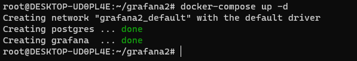

- 다른 장소에서 파일을 업로드하고 docker-compose up -d를 해준다.

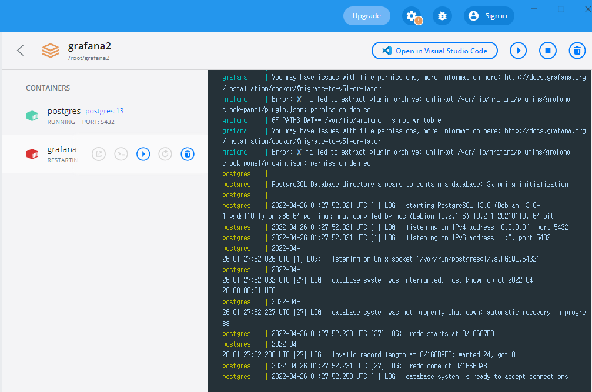

- 올라간 컨테이너를 확인해보면 위와 같이 grafana가 죽는걸 볼 수 있다.
- 로컬에 볼륨 매핑되어 있는 폴더가 권한이 낮기 때문이다.
  - 그래서 그 위치의 폴더의 권한을 높여주자.

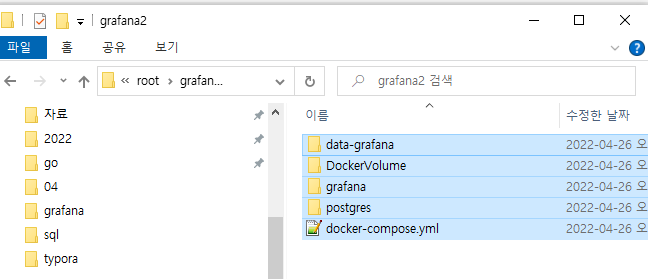

- 현재 grafana의 볼륨이 있는 위치에서 아래와 같은 명령어를 입력

  ```ls
  ls -al
  ```

  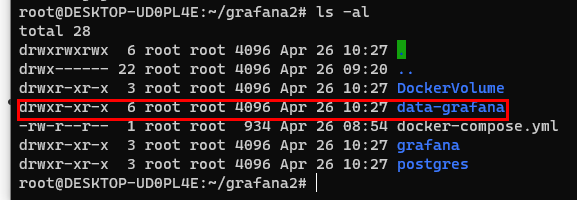

  ```sh
  chmod -R 777 .
  
  ls -al
  ```

  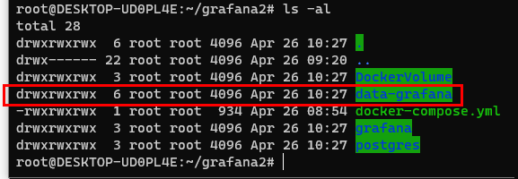

- 사실 모든 권한을부여할 필요는 없지만 편의상 모든 권한을 주고 확인해봄

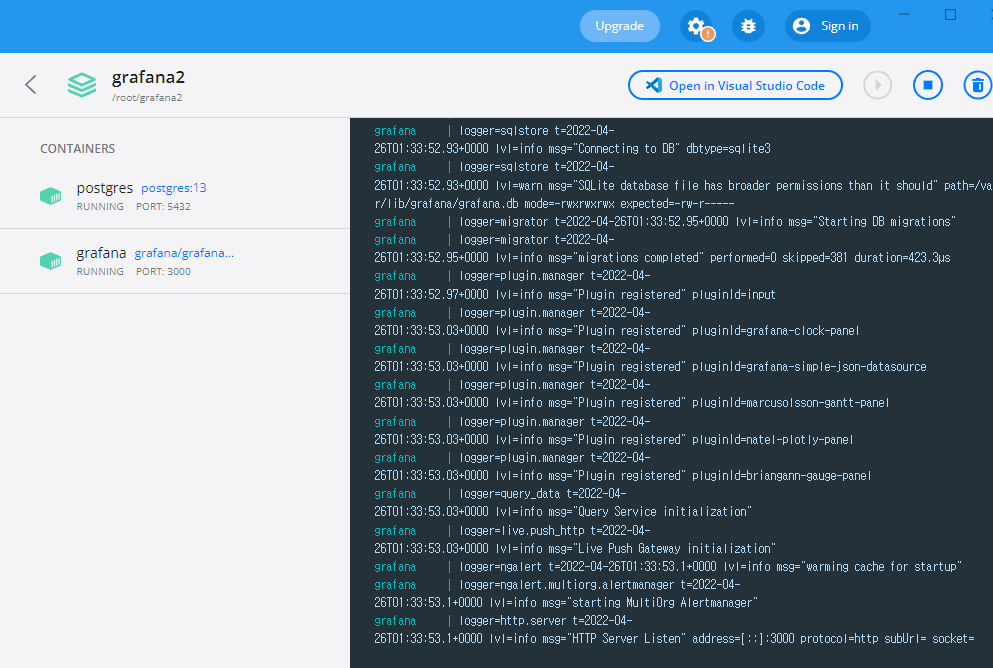

- 위와 같이 정상적으로 컨테이너가 실행이됨

## 03.대시보드 확인

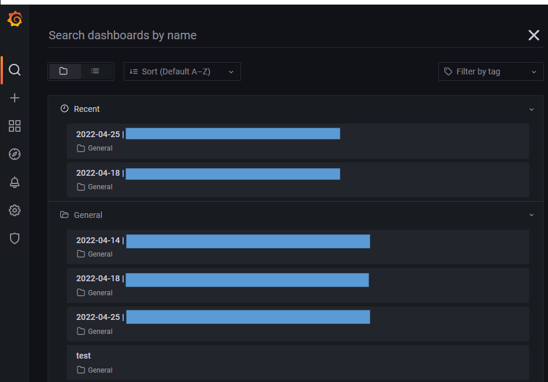

- 위와 같이 제대로 올라온것을 확인 할 수 있음

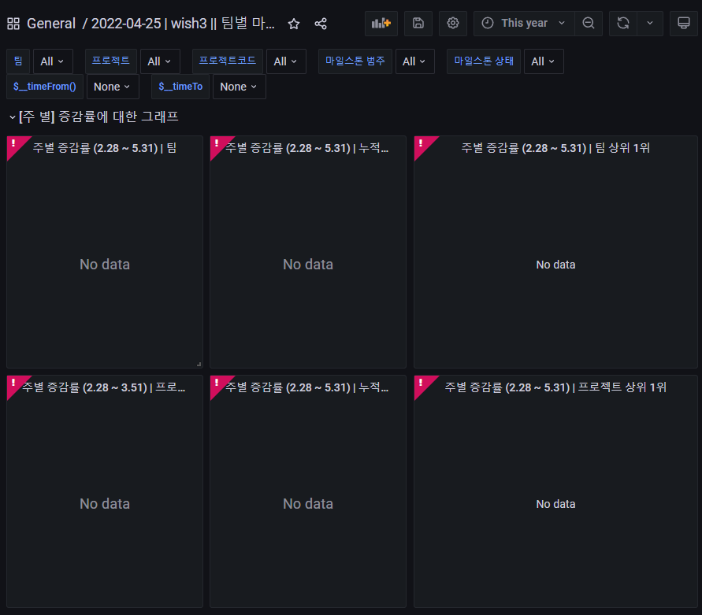

- 위를 보면 대시보드가 안나오는데 이유는 Data sources의 postgres ip를 localhost:5432로 한것이 아니고 컨테이너에 부여된 네트워크 아이디로 했기때문에 
- 다른 컴퓨터에서 컨테이너를 올린 경우 그 컨테이너의 네트워크 아이피가 바뀌어 그것을 변경해주면됨

## 04.컨테이너 ip 변경

- 그냥 localhost로 하지 않고 컨테이너 ip로 한 이유

  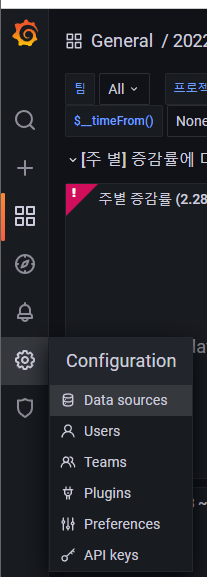

  - 위 처럼 Configuration 클릭 후 Data sources를 들어가게 되면

    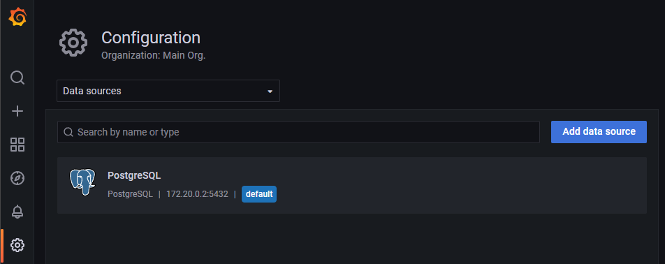

    - 위에 이전에 설정된 디비가 있음

  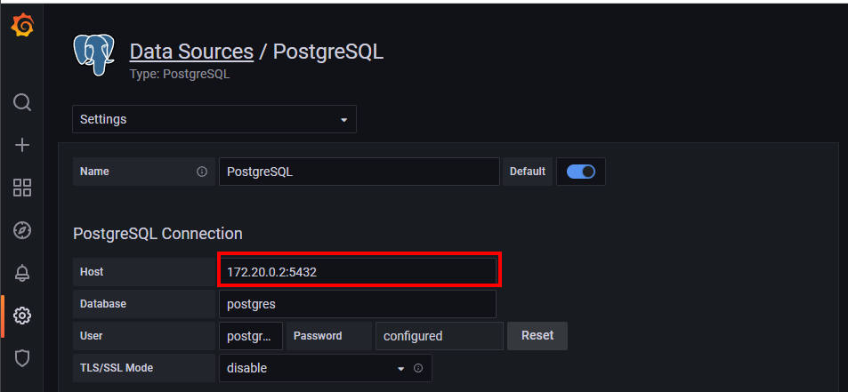

- 위부분을 현재 컨테이너의 ip로 변경해주면되는데 

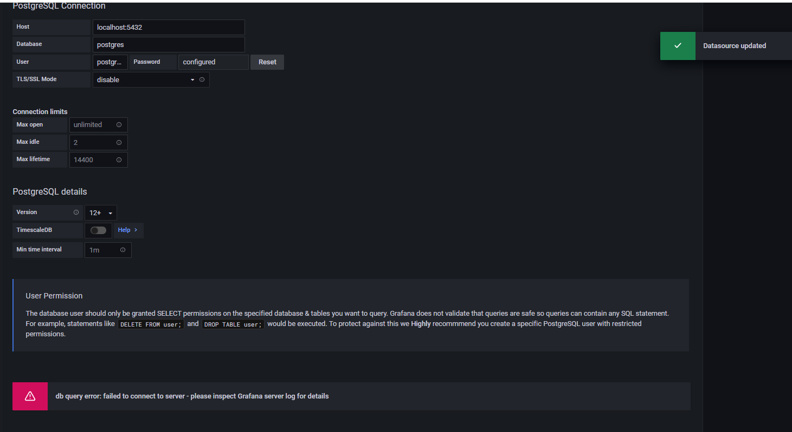

- localhost.com으로 한 경우 testing이 계속 나오거나 저 에러가 발생함 즉, 연결이 제대로 되지 않기 때문에
  - 임시방편으로 컨테이너의 ip주소로 연결함

### 04.1 컨테이너 네트워크 ip확인 및 연결

```sh
docker inspect grafana
```

- 위의 명령을 입력을 해주면 grafana라는 컨테이너의 정보를 확인 할 수 있음

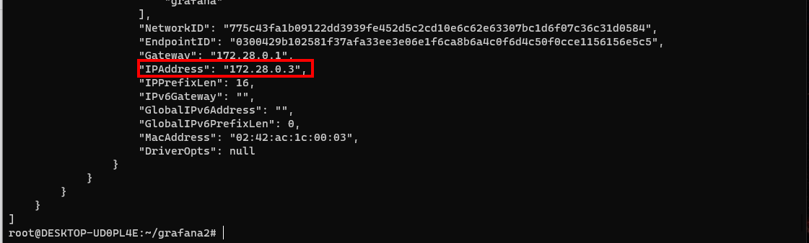

- 저 ip address를 입력을 해주면됨
- 근데 간혹 제대로 안된다고 하면 현재 pc의 네트워크 ip를 적어도됨

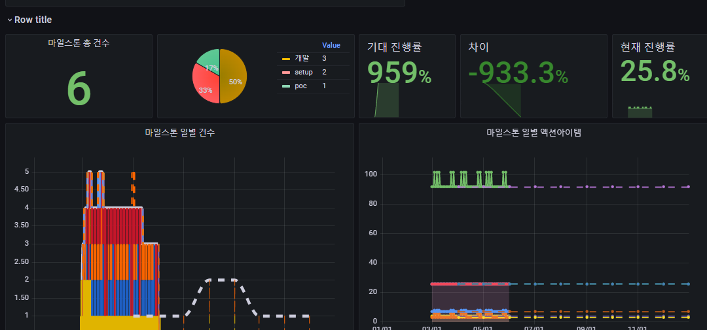

- 결국 위와 같이 대시보드가 나온다면 성공

