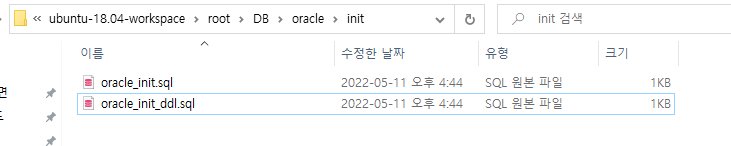
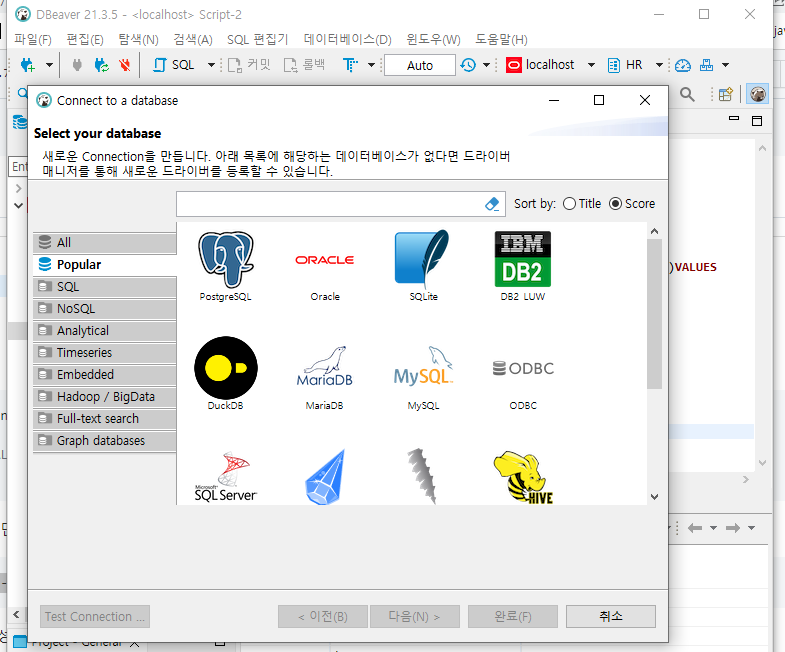
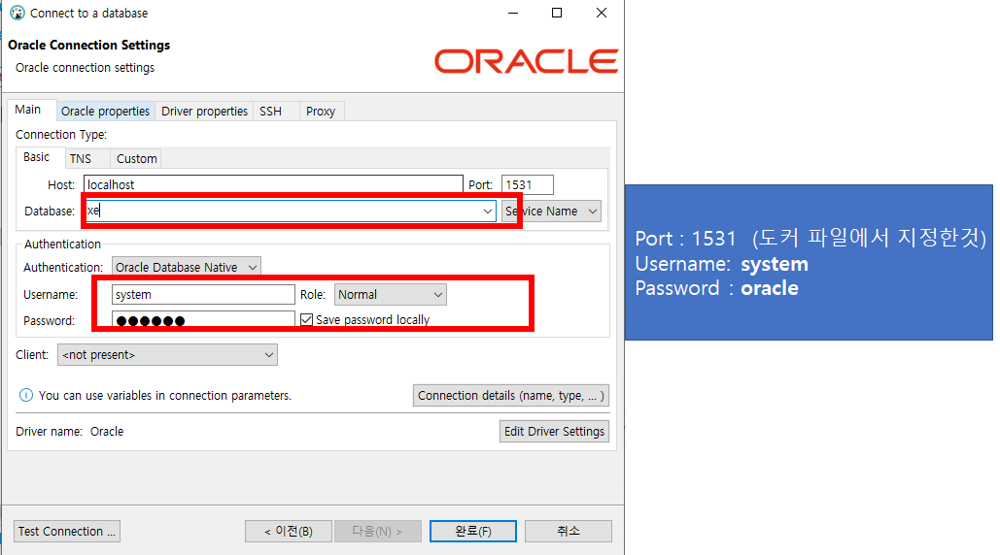
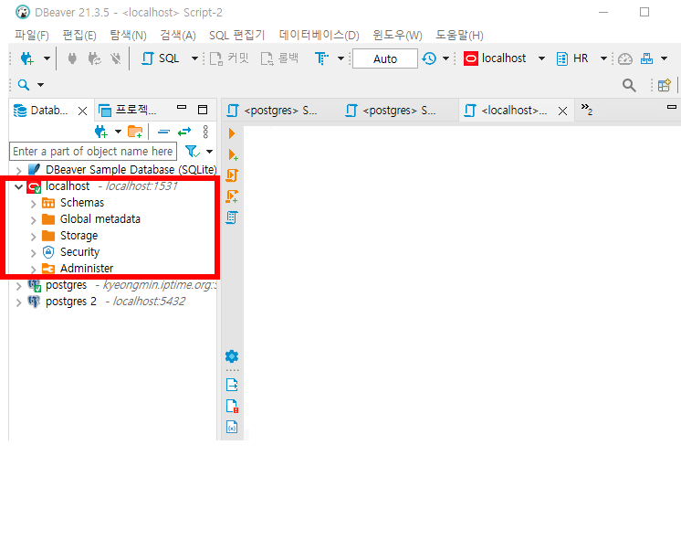
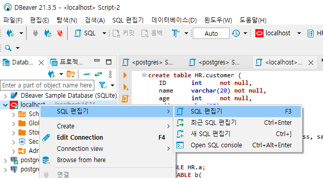
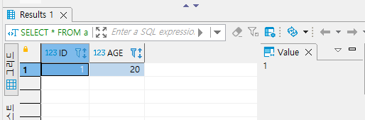

## 2022-05-11-오라클-Docker-설치

## 목차

>  01.오라클 설치를 위한 파일 구성하기
>
>  02.dockerfile 생성
>
>  03.docker-compose파일
>
>  04.데이터 베이스 연결해보기
>
>  05.테이블 생성 및 조회

## 01.오라클 설치를 위한 파일 구성하기

- 두개 파일을 init 폴더에 넣을 것

  - oracle_init.sql

    ```sql
    -- 테이블 스페이스 생성
    CREATE TABLESPACE TS_DEMO  datafile '/u01/app/oracle/oradata/XE/TS_DEMO.dbf' SIZE 100M AUTOEXTEND on next 100M;
    -- 임시 테이블스페이스 생성
    CREATE TEMPORARY TABLESPACE TS_DEMO_TEMP  TEMPFILE  '/u01/app/oracle/oradata/XE/TS_DEMO_TEMP.dbf' SIZE 100M AUTOEXTEND on next 10M;
    
    -- 계정생성
    CREATE USER DEMO  IDENTIFIED BY  "test1004"
    DEFAULT TABLESPACE TS_DEMO
    TEMPORARY TABLESPACE TS_DEMO_TEMP
    QUOTA UNLIMITED ON TS_DEMO;
    
    -- 접속 권한주기
    GRANT RESOURCE, CONNECT to DEMO;
    -- 테이블스페이스 사용권한
    GRANT UNLIMITED TABLESPACE TO DEMO;
    ```

  - oracle_init_ddl.sql

    ```sql
    CREATE TABLE DEMO.TEST_CONTENT 
    (
      TEST_SEQ_NO NUMBER(19,0) NOT NULL 
    , CONTENT VARCHAR(100) NOT NULL  
    , CONSTRAINT PK_TEST_CONTENT PRIMARY KEY 
      (
        TEST_SEQ_NO 
      )
    );
    
    CREATE SEQUENCE  DEMO.DEMO_TEST_SEQ_NO  MINVALUE 1 INCREMENT BY 1 START WITH 1 CACHE 20 NOORDER  NOCYCLE; 
    
    -- ALTER TABLE DEMO.TEST_CONTENT COMMENT '테스트';
    ```



- 위와 같이 만들어 주고 dockerfile로 이미지를 생성 할 것임

## 02.dockerfile 생성

```dockerfile
FROM oracleinanutshell/oracle-xe-11g

# ENV ORACLE_ALLOW_REMOTE true
ADD init/*.sql /docker-entrypoint-initdb.d/
```

- 별다른건 없고 생성시 데이터 베이스 생성해주는 것
- 저렇게 하면 초기 설정 자체를 하고 들어갈 수 있음
  - 굳이 저렇게 할 필요가 없다면 안해도됨

- 이미지 생성

  ```sh
  docker build --tag demo/oracle-xe-11g:latest .
  ```

## 03.docker-compose파일

```yml
sversion: "3.3"
services:
  oracle:
    container_name: demo_oracle
    build:
      context: ./oracle/
      dockerfile: Dockerfile
    image: demo/oracle-xe-11g:latest
    environment:
      - ORACLE_ALLOW_REMOTE=true
    ports:
      - "1531:1521"
```

- 만약에 저 도커파일 자체를 실행하고 싶은 경우는 저렇게 하면되지만

```yml
sversion: "3.3"
services:
  oracle:
    container_name: demo_oracle
    image: oracleinanutshell/oracle-xe-11g
    environment:
      - ORACLE_ALLOW_REMOTE=true
    ports:
      - "1531:1521"
```

- 위와 같이 해도 상관은 없음

## 04.데이터 베이스 연결해보기

- DBeaver를 주로 필자가 많이 사용함 여러 데이터베이스를 쓸 수 있어서 좋음



- 오라클 클릭 후 다음 클릭



- 위와 같이 적용 해주고 완료



-  이렇게 접속이 되면 성공



- 편집기를 켜고 테이블생성을 해보고 조회 까지 해보자

## 05.테이블 생성 및 조회

- 원래를 스키마를 만들고 권한 주고 해야하는데 우선 쉽게 
  - 만들어져 있는 HR이라는 스키마에 테이블을 만들자

```sql
ALTER SESSION SET CURRENT_SCHEMA = HR;
```

- 위를 해주면 table 생성시 `HR.table`이름을 할 필요가 없음

```sql
CREATE TABLE a(
 id int,
 age int
);

INSERT INTO a(id,age)values(1,20);

SELECT * FROM a;
```

