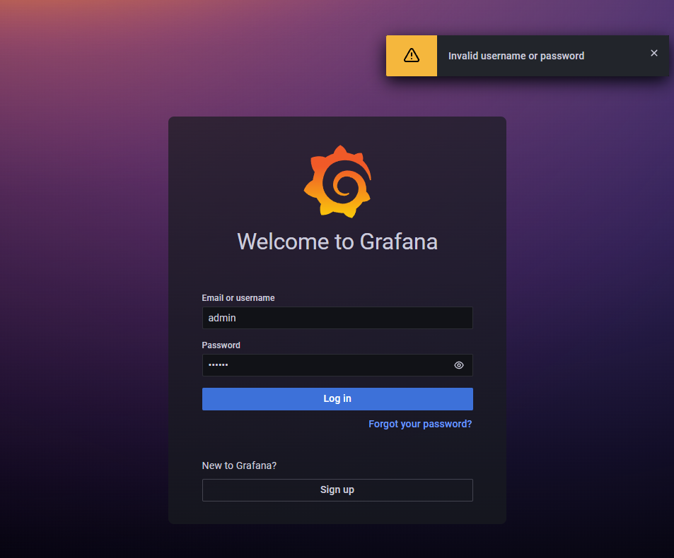
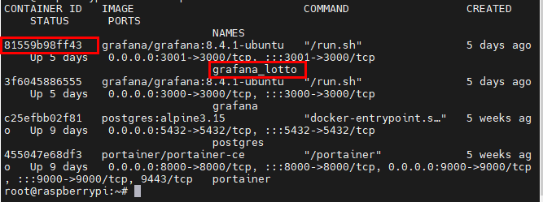

## 2022-05-24-Docker-Grafana-Admin-비번-초기화

## 목차

>01.그라파나 Admin 비번을 잃어버리거나 초기화 하고 싶은 경우
>
>02.도커 명령어로 비번 초기화 하기

## 01.그라파나 Admin 비번을 잃어버리거나 초기화 하고 싶은 경우



- 갑자기 admin 계정의 비밀번호가 안들어가지거나 초기화 해야하는 경우가 생긴다.
- 도커 명령어로 쉽게 위의 문제를 해결할 수 있다.

## 02.도커 명령어로 비번 초기화 하기

- 초기화 할 수 있는 명령어

  ```sh
  docker exec -it {컨테이너 id 또는 컨테이너 이름} grafana-cli admin reset-admin-password -password-from-stdin
  ```

- 실제 사용하기

  ```sh
  docker ps
  ```

  - 실제 도커 컨테이너 아이디 또는 이름 확인 용도

    

  - 비번 초기화 하기 | 컨테이너 ID

    ```sh
    docker exec -it 81559b98ff43 grafana-cli admin reset-admin-password -password-from-stdin

  - 비번 초기화 하기 | 컨테이너 이름

    ```sh
    docker exec -it grafana_lotto grafana-cli admin reset-admin-password -password-from-stdin
    ```

    

    - 다시 새로운 PW를 입력하면 된다.

  

  - 위와 같이 제대로 화면이 나왔다면 제대로 변경이 완료된 것 이다.
  - 혹시나 비번을 잃어버리더라도 걱정하지 말고 위 와 같은 방법으로 해결해보자.
