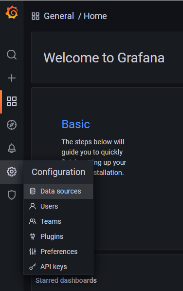
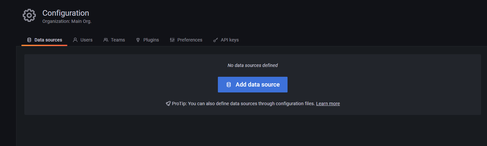
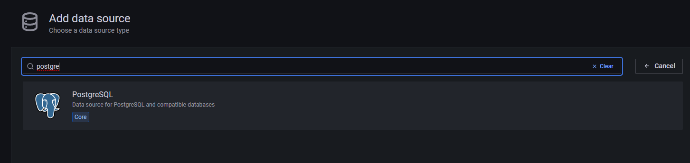
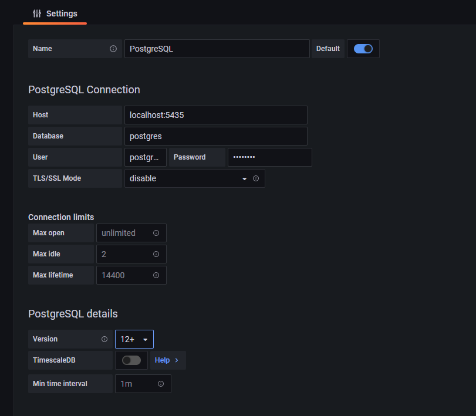
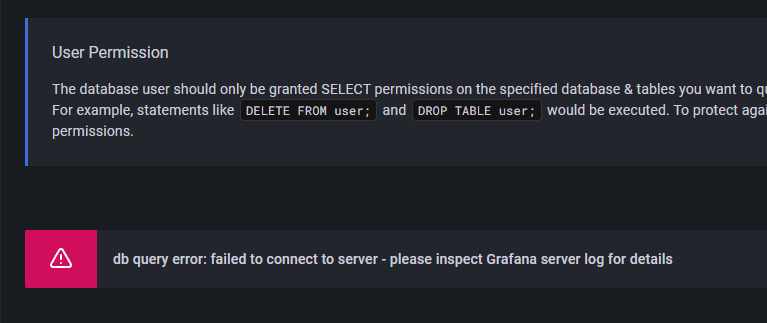
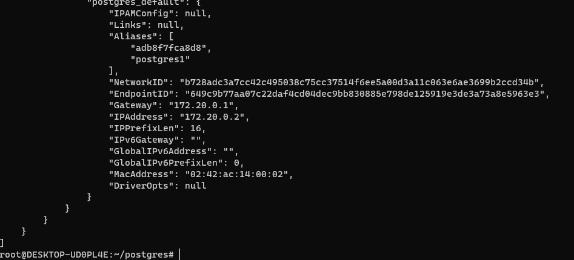
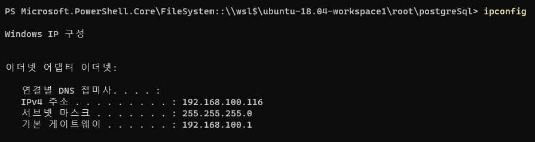

## 2022-05-25-간단한-DB설치와-그라파나

## 목차

## 01. 오라클 설치

```yml
version: "3.3"
services:
  oracle:
    container_name: demo_oracle
    image: oracleinanutshell/oracle-xe-11g  
    environment:
      - ORACLE_ALLOW_REMOTE=true
    ports:
      - "1531:1521"
```

- Host: localhost
- Port: 1531
- Database: xe
- Username: system
- Password: oracle

## 02. PostgreSQL설치와 그라파나 설치 

```yaml
version: '3.1'

services:
  grafana:
    image: grafana/grafana:8.4.1-ubuntu
    container_name: grafana
    restart: always
    ports:
      - 3000:3000
    
  postgres:
    image: postgres:alpine3.15
    container_name: postgres
    restart: always
    environment:
      POSTGRES_USER: postgres     # define credentials
      POSTGRES_PASSWORD: postgres # define credentials
      POSTGRES_DB: postgres       # define database
    ports:
      - 5432:5432                 # Postgres port
    volumes:
      - ./docker/postgres/sql:/docker-entrypoint-initdb.d
```

- Host: localhost
- Port: 5432
- Database: postgres
- Username: postgres
- Password: postgres

## 03.DB IDE 환경과 테이블 생성후 그라파나 테이블 생성하기

- **oracle**

```yaml
ALTER SESSION SET CURRENT_SCHEMA = HR;

-- 위를 적용하지 않은 경우
CREATE TABLE HR.a(
 id int,
 age int
);

-- 적용한 경우
CREATE TABLE a(
 id int,
 age int
);

INSERT INTO a(id, age) VALUES
(1,2);
```

## 03.1 그라파나 접속후 데이터 링크 연결

http://localhost:3000/

ID : admin

PW: admin



- data sources 클릭



- add data source 클릭



- postgres 입력후 클릭



- Host: localhost:5435

- Database: postgres

- User: postgres

- Password: postgres

  

  - save & test 누르면 위와 같이 나오는데

```
docker inspect postgres 
```



- IP Address 로 입력 또는 현재 ip주소 입력

  

- localhost 대신 입력해주고 넘기면됨


