## 2022-05-25-간단한-DB설치와-그라파나

## 목차

>01.오라클 설치
>
>02.PostgreSQL설치와 그라파나 설치 
>
>03.Oracle과  PostgreSQL | Dbeaver 이용
>
>> Oracle 연결
>>
>> Postgres 연결
>>
>> 03.1 Oracle과 Postgres에 테이블 생성과 데이터 삽입
>>
>> > Oracle
>> >
>> > PostgreSQL
>
> 04.데이터 그라파나에서 확인하기
>
>>  04.1 테이블 그래프 생성하기

## 01. 오라클 설치

```yml
version: "3.3"
services:
  oracle:
    container_name: demo_oracle
    image: oracleinanutshell/oracle-xe-11g  
    environment:
      - ORACLE_ALLOW_REMOTE=true
    ports:
      - "1531:1521"
```

- Host: localhost
- Port: 1531
- Database: xe
- Username: system
- Password: oracle

## 02. PostgreSQL설치와 그라파나 설치 

```yaml
version: '3.1'

services:
  grafana:
    image: grafana/grafana:8.4.1-ubuntu
    container_name: grafana
    restart: always
    ports:
      - 3000:3000
    
  postgres:
    image: postgres:alpine3.15
    container_name: postgres
    restart: always
    environment:
      POSTGRES_USER: postgres     # define credentials
      POSTGRES_PASSWORD: postgres # define credentials
      POSTGRES_DB: postgres       # define database
    ports:
      - 5432:5432                 # Postgres port
    volumes:
      - ./docker/postgres/sql:/docker-entrypoint-initdb.d
```

- Host: localhost
- Port: 5432
- Database: postgres
- Username: postgres
- Password: postgres


## 03 Oracle과  PostgreSQL | Dbeaver 이용

###  Oracle 연결

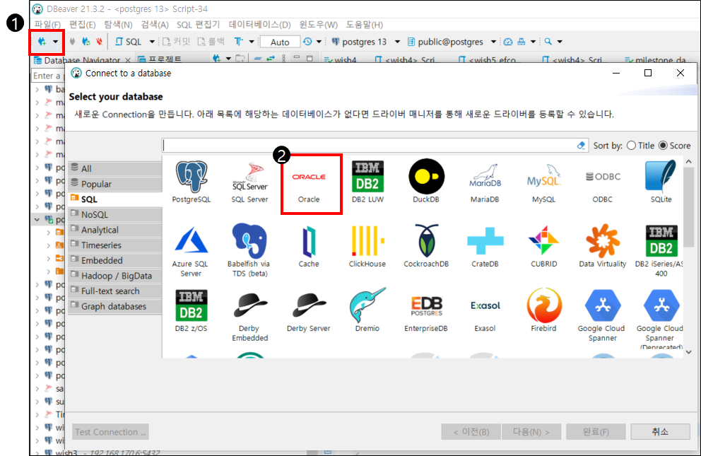

- 다음 버튼 클릭

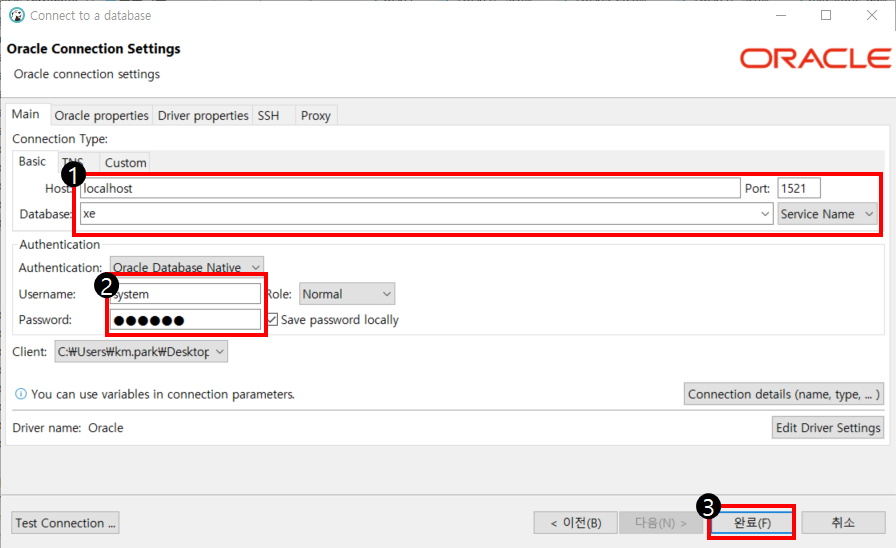

- `Host` : localhost
- `Port` : 1521
- `Database` : xe
- `Username` : system
- `Password` : oracle

### Postgres 연결

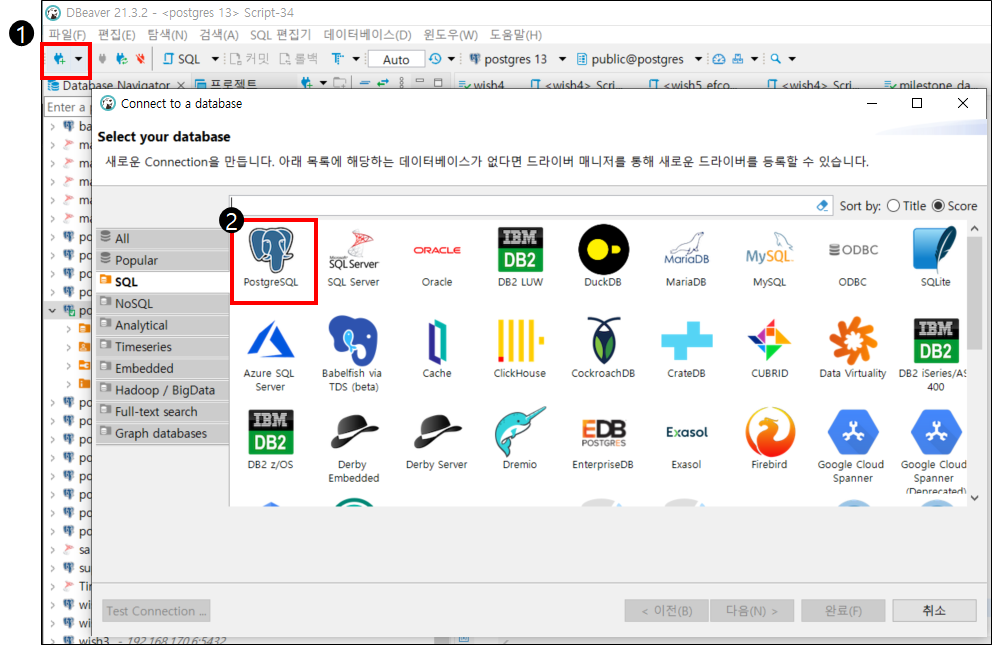

-  연결 콘센트 아이콘 클릭 후 PostgreSQL 클릭 후 다음 버튼 클릭

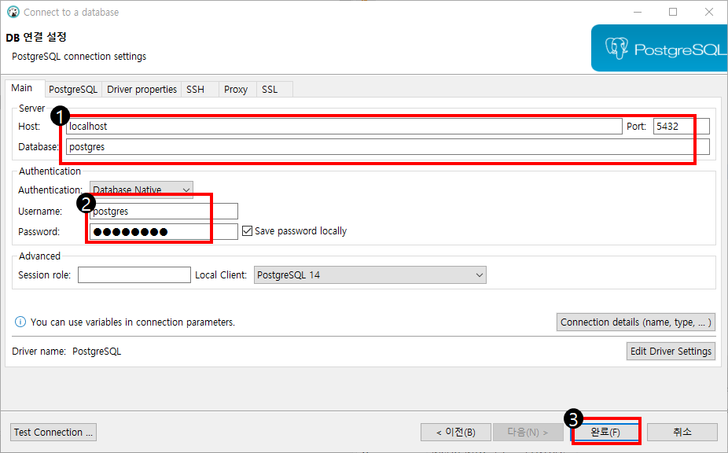

- `Host` : localhost
- `Port` : 5432
- `Database` : postgres
- `Username` : postgres
- `Password` : postgres

### 03.1 Oracle과 Postgres에 테이블 생성과 데이터 삽입

[csv -> sql 변경 사이트 링크](https://bfotool.com/ko/csv-to-sql)

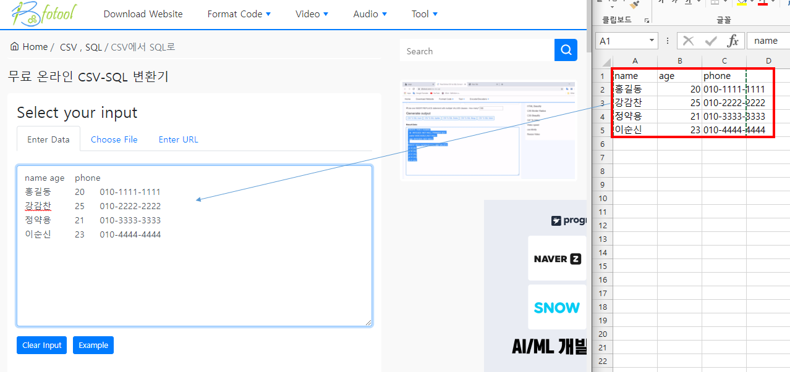

- 엑셀로 위와 같이 데이터를 만들어서 사이트로 붙여넣기

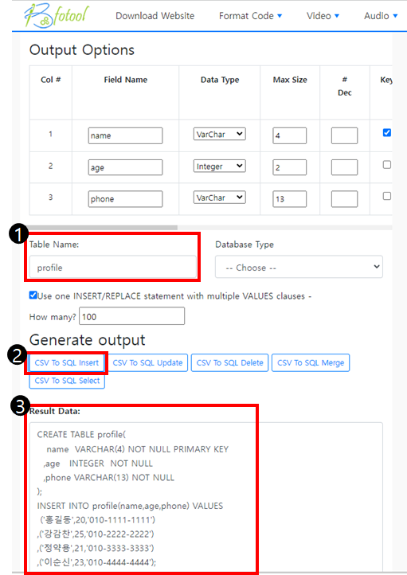

- 원하는 테이블 이름 설정
- CSV To SQL Insert 버튼 클릭
- Result Data의 데이터 복사해서 각 DB에 명령어를 입력하면된다.

#### Oracle

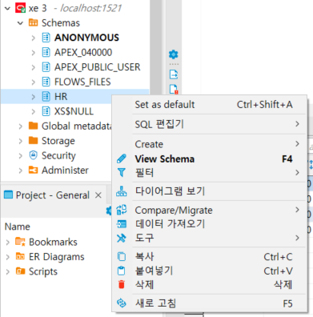

- 사용하기 전에 사용한 기본 스키마 설정 

  - 위에서는 HR을 디폴트로 선택

  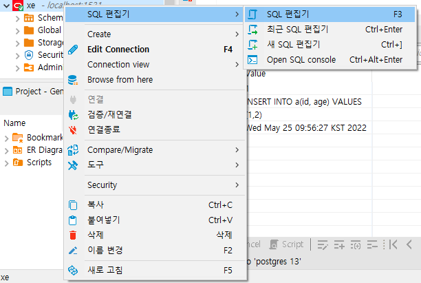

  - SQL 편집기 실행 후 사이트에서 복사한것 실행

  ```sql
  ALTER SESSION SET CURRENT_SCHEMA = HR;
  
  CREATE TABLE profile(
     name  VARCHAR(4) NOT NULL PRIMARY KEY
    ,age   INTEGER  NOT NULL
    ,phone VARCHAR(13) NOT NULL
  );
  
  INSERT INTO profile(name,age,phone) VALUES 
   ('홍길동',20,'010-1111-1111');
  INSERT INTO profile(name,age,phone) VALUES 
   ('강감찬',25,'010-2222-2222');
  INSERT INTO profile(name,age,phone) VALUES 
  ('정약용',21,'010-3333-3333');
  INSERT INTO profile(name,age,phone) VALUES 
  ('이순신',23,'010-4444-4444');
  
  SELECT * FROM PROFILE;
  ```

#### PostgreSQL

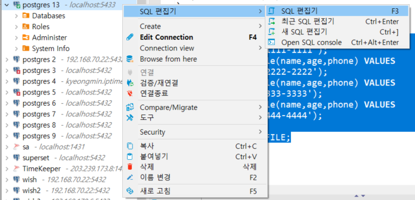


```sql
create table profile(
   name  VARCHAR(4) NOT NULL PRIMARY KEY
  ,age   INTEGER  NOT NULL
  ,phone VARCHAR(13) NOT NULL
);

insert into profile(name,age,phone) values
 ('홍길동',20,'010-1111-1111')
,('강감찬',25,'010-2222-2222')
,('정약용',21,'010-3333-3333')
,('이순신',23,'010-4444-4444');

select * from profile;
```

## 04.데이터 그라파나에서 확인하기

[그라파나 접속 링크 ] http://localhost:3000

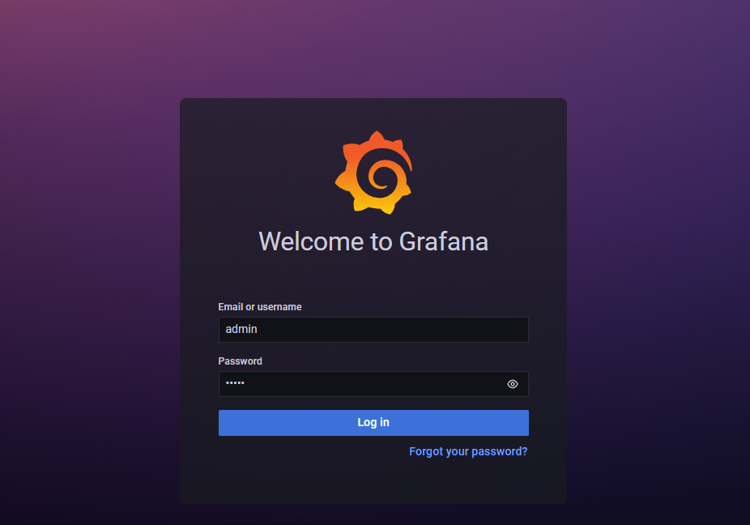

- 위 와 같은 화면이 나오게 됨
  - `Email or username` : admin
  - `Password` : foobar
- Log in 클릭 해준다.

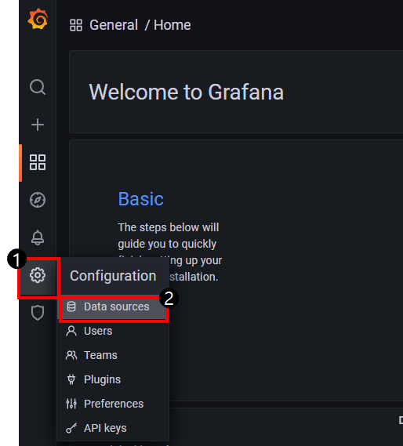

- 톱니바퀴 아이콘 클릭 후 Data Sources 클릭

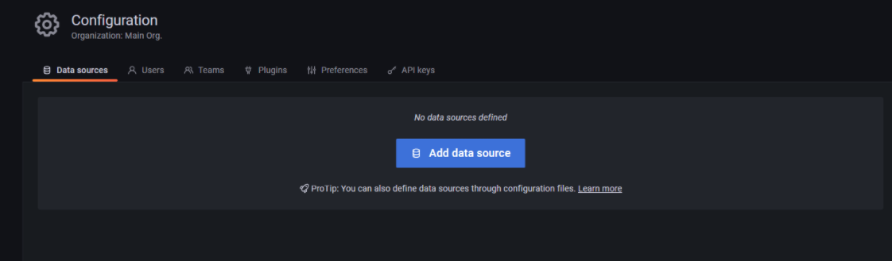

- Add data source 클릭

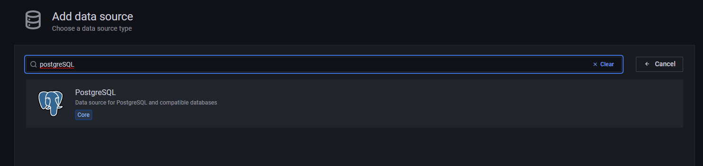

PostgreSQL 클릭 하여 들어간다.

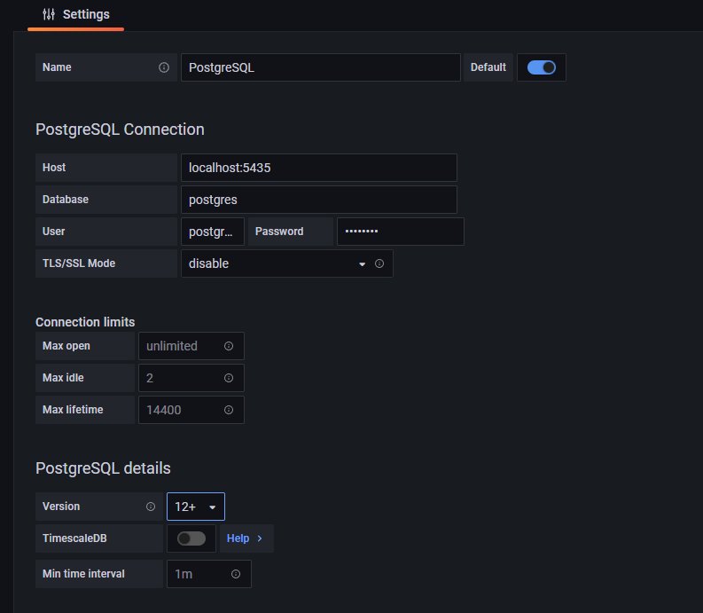

- Host: localhost:5432

- Database: postgres

- User: postgres

- Password: postgres

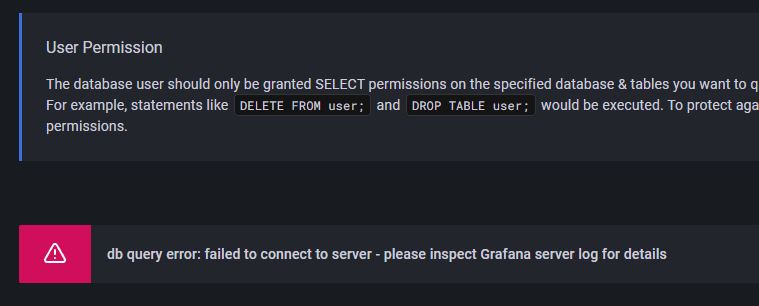

save & test 누르면 위와 같이 나오는데 이때 localhost:5432 부분을 로컬PC IP로 해서 진행하면 문제없이 진행됨

- before
  - localhost:5432
- after |  PC IP : 192.123.123.123 인 경우
  - 192.123.123.123:5432 로 Host를 변경해주면됨

### 04.1 테이블 그래프 생성하기

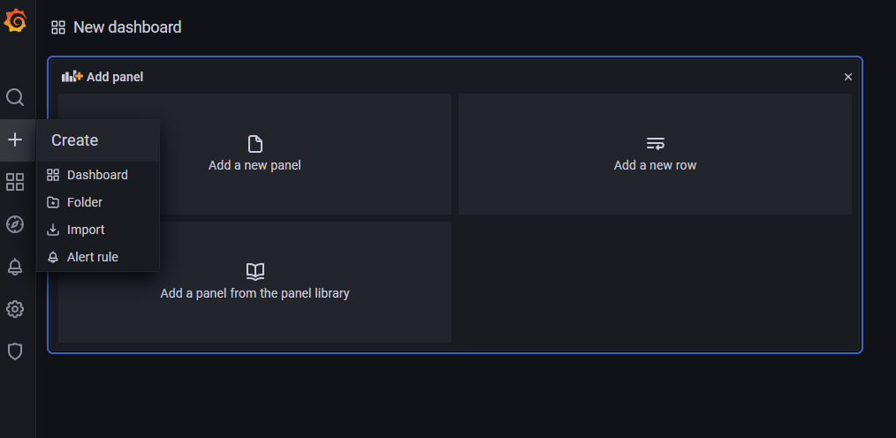

- `+` 아이콘 클릭하면 위와 같이 화면이 나오는데 Add a ne panel 클릭을 한다.

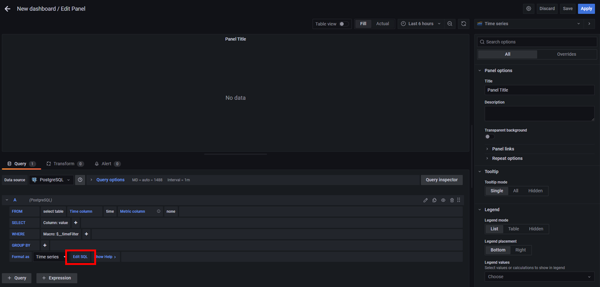

- Edit SQL 클릭 하여 아래의 sql을 넣어주자

```sql
select * from profile;
```

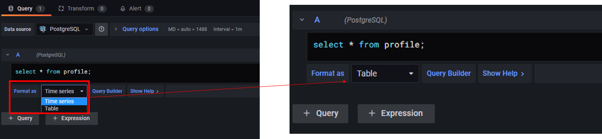

- 그리고 Format as의 Time series를 Table로 변경한 후

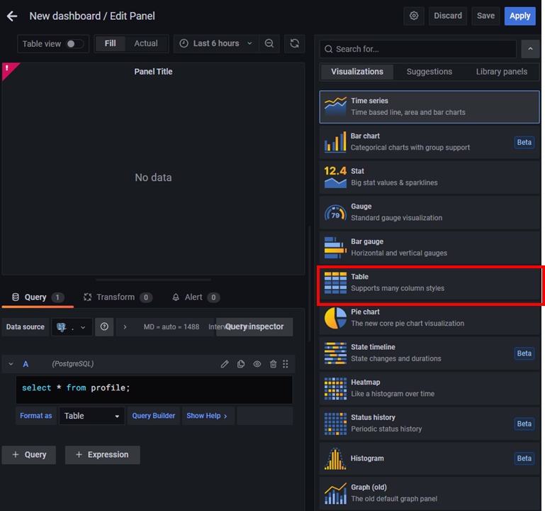

- Visualizations를 Table로 바뀌고 Apply를 클릭한다.

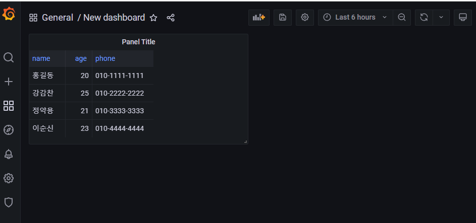

- 위와 같이 나오게 된다면 제대로 동작하고 연결한 것이다.
