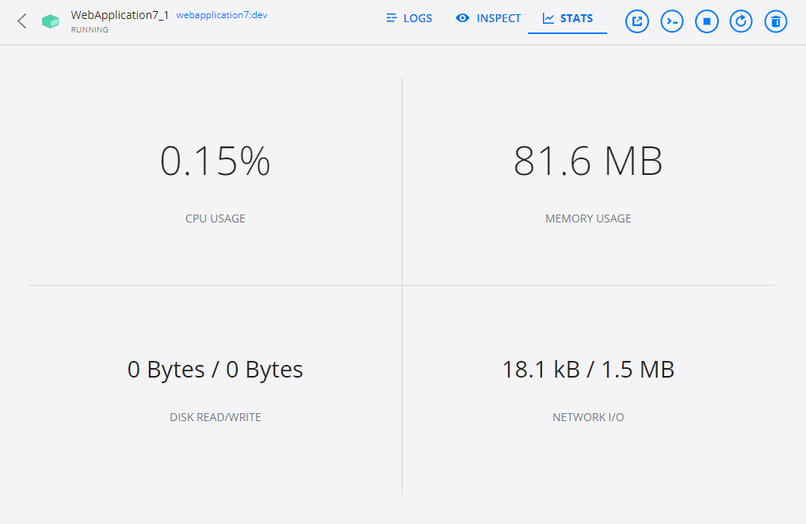
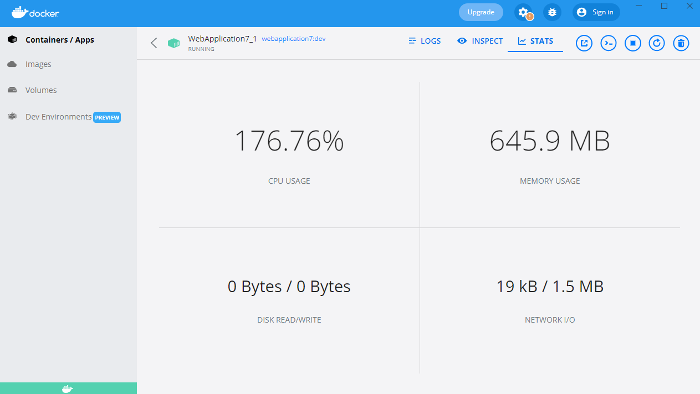
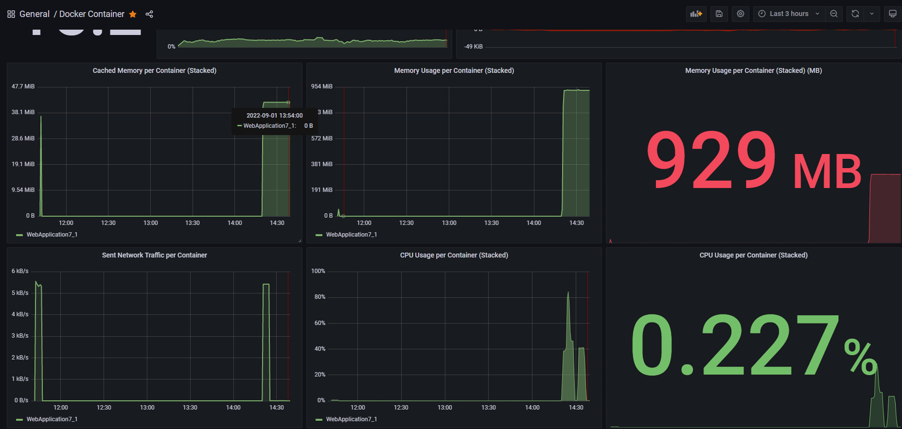
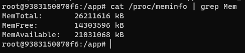
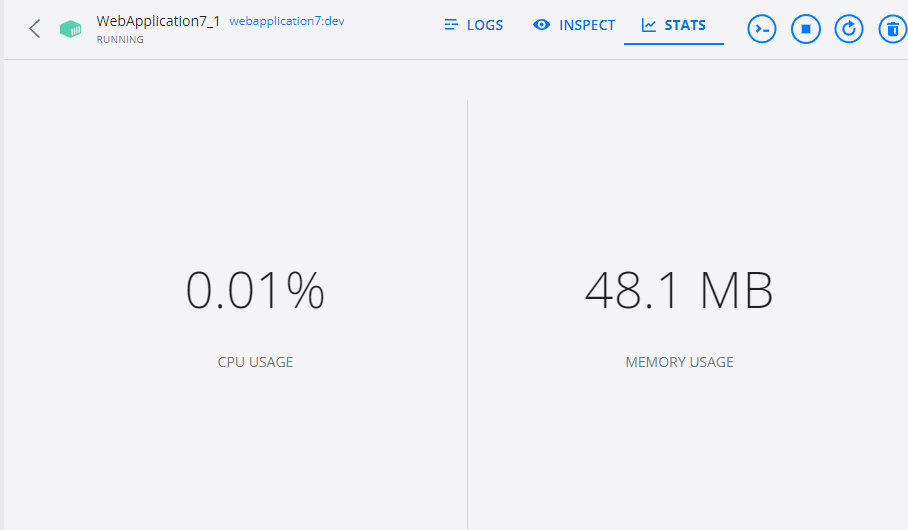
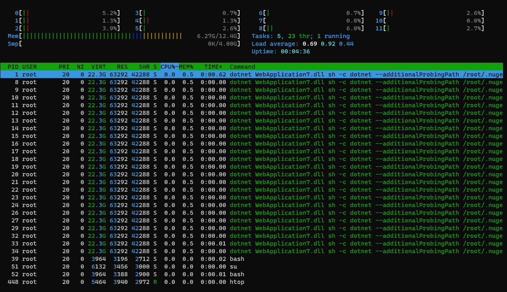

## Issue-Web-Api-메모리이슈-확인

## 01.메모리 이슈가 발생하는 상태

- 초기 상태

  

- api GET 하는 상황

  

  - 우선 동작을 과부화 시켜서 메모리 증가시키는 과정 진행


## 02.이슈확인을 위한 모니터링 구성



- 두가지 경우를 나눠서 볼 수 있게 함
  - 우선 두가지 경우에 포함은 아니지만 전체 컨테이너 부분을 볼 수 있는 것
  - 도커로 api서비스 올리는 경우
  - 윈도우에서 자체로 실행시키는 경우 

```yml
version: '2.1'

services:
  prometheus:
    image: prom/prometheus:v2.36.1
    container_name: prometheus
    volumes:
      - ./prometheus:/etc/prometheus
      - ./prometheus/data:/prometheus
      - /etc/localtime:/etc/localtime
    command:
      - '--config.file=/etc/prometheus/prometheus.yml'
      - '--storage.tsdb.path=/prometheus'
      - '--web.console.libraries=/etc/prometheus/console_libraries'
      - '--web.console.templates=/etc/prometheus/consoles'
      - '--storage.tsdb.retention.time=14d'
      - '--web.enable-lifecycle'
    restart: unless-stopped
    ports:
      - 9090:9090
    expose:
      - 9090
    networks:
      - memory_net
    labels:
      group: "monitoring"
      
  nodeexporter:
    image: prom/node-exporter:v1.3.1
    container_name: nodeexporter
    volumes:
      - /proc:/host/proc:ro
      - /sys:/host/sys:ro
      - /:/rootfs:ro
      - /etc/localtime:/etc/localtime
    command:
      - '--path.procfs=/host/proc'
      - '--path.rootfs=/rootfs'
      - '--path.sysfs=/host/sys'
      - '--collector.filesystem.mount-points-exclude=^/(sys|proc|dev|host|etc)($$|/)'
    restart: unless-stopped
    expose:
      - 9100
    networks:
      - memory_net
    labels:
      group: "monitoring"

  cadvisor:
    image: gcr.io/cadvisor/cadvisor:v0.44.0
    container_name: cadvisor
    privileged: true
    devices:
      - /dev/kmsg:/dev/kmsg
    volumes:
      - /:/rootfs:ro
      - /var/run:/var/run:ro
      - /sys:/sys:ro
      - /var/lib/docker:/var/lib/docker:ro
      - /etc/localtime:/etc/localtime
      #- /cgroup:/cgroup:ro #doesn't work on MacOS only for Linux
    restart: unless-stopped
    expose:
      - 8080
    networks:
      - memory_net
    labels:
      group: "monitoring"

  grafana:
    image: grafana/grafana:8.5.5
    container_name: grafana
    volumes:
      - ./grafana/data:/var/lib/grafana
      - ./grafana/provisioning/dashboards:/etc/grafana/provisioning/dashboards
      - ./grafana/provisioning/datasources:/etc/grafana/provisioning/datasources
      - /etc/localtime:/etc/localtime
    environment:
      - GF_SECURITY_ADMIN_USER=${ADMIN_USER:-admin}
      - GF_SECURITY_ADMIN_PASSWORD=${ADMIN_PASSWORD:-admin}
      - GF_USERS_ALLOW_SIGN_UP=false
    restart: unless-stopped
    ports:
      - '4000:3000'
    expose:
      - 4000
    networks:
      - memory_net
    labels:
      group: "monitoring"
      
  webapplication7:
    image: ${DOCKER_REGISTRY-}webapplication7
    build:
      context: .
      dockerfile: ./WebApplication7/WebApplication7/Dockerfile
    labels:
      group: "monitoring"
    environment:
      - ASPNETCORE_LOGGING__CONSOLE__DISABLECOLORS=true
      - ASPNETCORE_ENVIRONMENT=Development
      - ASPNETCORE_URLS=http://+:80      
    command: >
      sh -c ""dotnet" --additionalProbingPath /root/.nuget/fallbackpackages3 --additionalProbingPath /root/.nuget/fallbackpackages --additionalProbingPath /root/.nuget/fallbackpackages2  \"RemoteProcessKill.dll\" | tee /dev/console"
    ports:
    - 5169:80
    networks:
      - memory_net

networks:
  memory_net:
    name: memory_net
    driver: bridge
```

- 컨테이너 데이터 긁어오기 위해서 cadvisor사용 진행
- 컨테이너로 올라가는 서버 주소 정보
  - 그라파나: http://localhost:4000
  - 프로메테우스: http://localhost:9090
  - webApiServer: http://localhost:5169/swagger/index.html
- 직접 visual Studion로 실행하는 webApiServer
  - http://localhost:5170/swagger/index.html

### 02.1 metric beat를 이용하여 elk쪽으로 데이터 input

```
version: '2'
services:      
  metricbeat:
    restart: always
    user: root
    container_name: metricbeat
    image: docker.elastic.co/beats/metricbeat-oss:7.9.1
    env_file: .env
    command: metricbeat -e -system.hostfs=/hostfs -strict.perms=false
    volumes:
      - ./config/metricbeat/metricbeat.yml:/usr/share/metricbeat/metricbeat.yml:rw
      - ./config/metricbeat/conf:/usr/share/metricbeat/conf:rw
      - ./config/metricbeat/modules.d:/usr/share/metricbeat/modules.d:rw
      - ./config/metricbeat/modules.d/system.yml:/usr/share/metricbeat/modules.d/system.yml:rw
      - /var/run/docker.sock:/var/run/docker.sock
      - /proc:/hostfs/proc:rw
    networks:
      - memory_net
networks:
  memory_net:
    name: memory_net
    driver: bridge
```

- 메트릭을 이용해서 데이터 긁어오는 부분의 경우 우선 대기

<<<<<<< HEAD
## 03.컨테이너 외부 메모리와 내부 메모리 비교

- 내부 메모리 확인 소스

  ```sh
  cat /proc/meminfo | grep Mem
  ```

- 외부 메모리의 경우 도커 컨테이너 desktop에서 확인

- 내부 메모리



- 외부 메모리

  

=======
## 03.메모리 확인

- 도커 컨테이너 메모리

  

- 도커 컨테이너 안에 프로세스 메모리

  
>>>>>>> 1dab7c7f3e241909b5b246859d0287b4673c7be4
