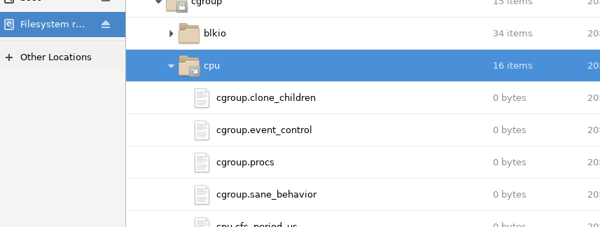
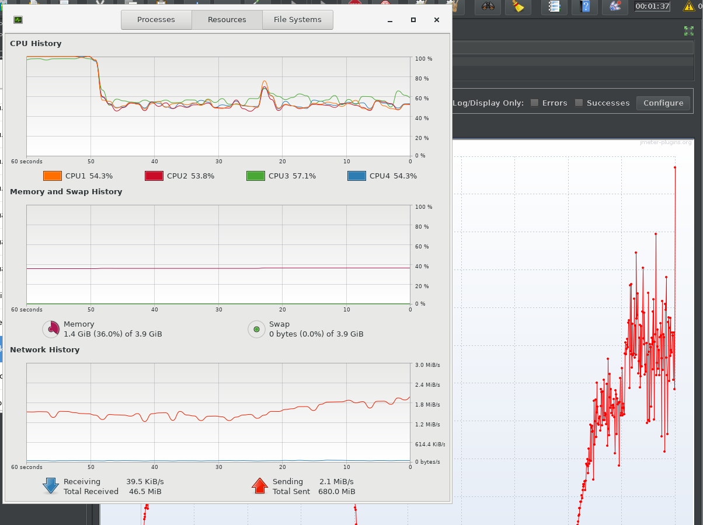

# 2022-10-17-Docker1일차.md

## 1교시시작 (19:00)

```
 systemctl enable docker
 systemctl start docker
 systemctl status docker
```

- 이자체는 데몬으로 실행되는 것이라서 저 enable을 해줘야함


- admin
- admin


## MY SQL 설치

```
docker container run -d --name=guestbookdb -e MYSQL_ROOT_PASSWORD=edu -e MYSQL_DATABASE=guestbook -p 3306:3306 yu3papa/mysql_hangul:1.0
```

- 컨테이너로 실행

- heidisql.exe 실행

  

  - 192.168.56.91로 변경
    - root
    - edu

- 방명록

  ```sh
   docker container run -d --name=guestbookapp -p 8080:8080 --link guestbookdb:mysql yu3papa/guestbook:1.0
  ```

  - 완료 후 

    - 192.168.56.91:8080

    

## 2교시 시작 (20:00)

- 도커
  - dock 부두라는 단어
  - 부두에서 일하는 부두 노동자임
  - it 적인 도커 컨테이너 이야기를 하고자 하는것 아닌 물류 시스템 현실 이야기
  - 도커라는 사람은 짐을 내리고 올리고 하는사람임
    - 짐은 컨테이너 넣고 짐을 운반하는 규격화 한 사람이 있음
      - 이를 통해서 물류 시스템의 변화를 보자
      - 짐은 무엇이든 상관없고, 컨테이너에 싣고, 이 컨테이너만 가지고 운영함
        - 이를 가지고 트럭으로 운반 하거나 기차로 하거나 항구에 도착하면 기중기로 배에 싣고 등등
          - malcolm
    - 트위스트락? 컨테이너 찝고 하는 것 같은 기술
      - keith 가 만듦 
      - 이 두사람은 이것에 대해서 특허신청을 안함 거의 오픈 소스 같은 느낌임
  - 도커는 고래 모양이고
    - 이를 보면사진에 수치는 도커를 사용했는데 얼마나 좋아진것을 의미함
    - 운영환경 80퍼 효율이 남
    - 90퍼 개발이 편해짐
      - 이를 왜 이렇게 효율이 좋고 편해지는지 알아보자
  - docker.com에서 개발하는 컨테이너 플랫폼임
    - 전세계 어디서나 어떤 앱이든지 공유가 가능하고 실행가능하다라는 것을 가지고 있음영어 글귀24p
    - MSA
      - MS 아키텍쳐와 붙으면 완전 대박이된다. 궁합이 완전 맞다
      - 마이크로 서비스를 패키지해서 하나로 조합해서 시스템 만듦
      - 꼭 써야하나? 가 아니고 같이 쓰면 시너지가 좋다임

### 컨테이너 기반기술

- 오늘은 리눅스 커널 기술을 배울 것
  - 가장 중요한 부분이다.

- 컨테이너 특징
  - vm가 가장 비교를 많이함
    - 호스트 OS에 하이퍼 바이저 소프트웨어를 통해서 호스트에 제공하는 hw디바이스를 가상으로 애뮬레이팅 해주는 것으로
    - VM에서 가상으로 제공해주는 것에 대해서 하드웨어 초기화 해서 완전한 게스트 OS로 부팅함
    - 대신 무겁고, 하이퍼 바이저라는 중간 매게로 쓰기 때문에 게스트 OS에서 CPU쓰는데 하이퍼 바이저를 거치기 때문에 성능 문제가 발생하고, 그리고 무거운 단점이 있음
  - 컨테이너는 VM가 격리된 환경 제공
    - 단, 리눅스 커널이 제공하는 cgroup, namespace를 이요해서 앱에 대한 격리 환경을 제공
      - 격리한다는 것이 중요함
      - 컨테이너는 OS입장에서 격리된 프로세스임
        - 프로세스를 위한 파일 시스템이 격리가되고, 네트워크또한 격리가 된다.
        - HOST OS입장에서 그냥 하나의 프로세스 일뿐임 그래서 부팅도 필요 없고,
        - 프로세스로 관리해서 CPU, 메모리, 네트워크 접속시 거치는 것이 없어서 저하 이슈 없고, 격리되어 있는 것
- 오늘은 cgruop, namesapce에 대해서 배울것


-


- 이런것이 하나의 프로세스에서 격리가됨
  - 그렇지만 가벼운것도 특징임
  - 버츄얼머신이 3개 띄우면 버벅거리는 곳도 같은 기능을 하는것 200개 띄워도 성능 이슈가 적음

## Chroot

- 루트 파일 시스템을 제공?

  - 명령 또는 쉘을 실행하는데 특별한 루트 디렉토리로 실행
    - 도커 시스템 이해하는데 중요함

- 개발한 프로그램 또는 아파치 웹, mysql ,nginx,등 같은 웹서버 같은 것인데

  - 무튼 아파치 웹서버 실행하는데 필요한것이
    - 아파치 웹서버 실행파일
      - 이 실행파일이 실행되면서 추가적으로 사용하는 라이브러리 파일
      - 실행되면서 참고하는 설정파일이 있다면 아파치 웹서버가 실행되는데
        - 대신에 아파치 웹서버가 실행되면서, 필요한 os가 제공해주는 시스템 콜 라이브러리는 리눅스os가 제공해주는데 그것 말고,
        - 아까 앞서 말한 것과 기타 설정파일만 있다면 웹서버가 돌아가게됨
    - 이 세가지 파일을 묶어 놓은것을 이미지라고 함
      - 이것은 내일 할것

-  nautilus

  - 실행

  - 실행파일 등은 그 규칙을 지켜야하고

    ```sh
    mkdir -p ~/newroot/bin newroot/lib64
    ```


- 배 쉬 내부적으로 실행할때 필요한 라이브러리 확인하면 아래와 같음

  

  

- ls, date같은 것을 우리가 만든 newroot 폴더에 복사할것임

  ```
  cp /lib64/libtinfo.so.5 newroot/lib64
  cp /lib64/libdl.so.2 newroot/lib64
  cp /lib64/libc.so.6 newroot/lib64
  cp /lib64/ld-linux-x86-64.so.2 newroot/lib64
  cp /lib64/libselinux.so.1 newroot/lib64
  cp /lib64/libcap.so.2 newroot/lib64
  cp /lib64/libacl.so.1 newroot/lib64
  cp /lib64/libpcre.so.1 newroot/lib64
  cp /lib64/libattr.so.1 newroot/lib64
  cp /lib64/libpthread.so.0 newroot/lib64
  ```

```
 cp /bin/bash newroot/bin
 cp /bin/ls newroot/bin
 cp /bin/date newroot/bin
```

```
chroot newroot

/bin/ls -l /

>출력
total 0
drwxr-xr-x 2 0 0  40 Oct 17 11:32 bin
drwxr-xr-x 2 0 0 214 Oct 17 11:31 lib64
>

bash-4.2# /bin/date
Mon Oct 17 11:37:12 UTC 2022
#현재는 UTC로 나오고 path 설정 후

PATH=/bin:$PATH

exit 하면 그 프로세스가 종료됨
```

- 이렇게 하면 특정 프로세스한테 파일시스템을 루트로 인식 할 수 있게 만들어주는것
  - 여기에는 path가 안되어 있어서 path를 걸어야 ls, date명령이 제대로 실행됨


- 이빨간 부분을 이미지로 만들면 이를 어디서나 사용할 수 있는 것이 생성됨

## namespaces

- 리눅스 커널이 격리해줄 수 있는 것

  - 사용자 계정,  user
  - 호스트 네임 uts
  - 프로세스 네임 pid
  - 특정 프로세스를 위한 마운트 프로세스도 Mount
  - 네트워크도
  - ipc자원도 특정 프로세스 위한 것으로 격리해주는 기술

- 이를 이용하기 위해서 시스템 콜 명령어 사용함

  - 커널이 업데이트 되어도 기존에 있던 시스템 콜 그대로 유지되고 같은 시스템콜 사용해서 우분투이든 뭐든 상관 없는 것

- ### unshare 명령

  - 부모프로세스로 부터 격리된 네임스페이스 제공

  - 31p 설명만 할것

  - unshare -m

    - 마운트 격리함

    ```sh
    unshare -u /bin/bash
    
    hostname con01
    
    hostname
    ```

    


- exit 할때까지 격리된 부분임
  - 다른 격리된 곳이 아닌곳에서 hostname을 하게 되면 dockeredu가 나옴

## LAB

- 특정 프로세스에게 네트워크 격리해주는 실습
- 특정 프로세스에게 네트워크 격리를 이렇게 한다고만 느끼면됨
  - 글로벌 네임스페이스 만들어지고 네트워크 카드 하나 장착되어 있음
- testnet이라는 네임스페이스를 생성할 것임
  - 그리고 리눅스 네트워크 기술인 리눅스 브릿지라는 기술 가지고 일종의 랜선을 만들것(링크 쌍) 이를 testspace로 할당하고 서로 통신이 되는지 확인 할것임
    - 이것이 리눅스 kbe?라는것과 도커에서도 비슷한 기술도 쓰임
- 브릿지라는 네트워크 장치
  - 네모박스 하드웨어 머신	
  - 예전에는 브릿지라고 했지만 스위치 장치라고 함
    - 이 스위치 장치는 어떤 역할을 하는지? 컴퓨터와 다른 네트워크가 통신할 때 
    - 트래픽 을 보이면 레이어2에서하는것이 트래픽인데
      - 각 맥어드레스 기반으로 다른 포트에 있는 곳에 라우팅해주는것 이 스위치 장치

```
ip address

 ip link
 
 ip netns add testnet

ip netns exec testnet ip link

ip netns exec testnet ip link set lo up

ip netns exec testnet ip link

ip link add veth0 type veth peer name veth1

ip link


#4
ethtool -S veth1

ip link set veth1 netns testnet

ip link

#5
ip netns exec testnet ip link

ip link set veth0 up

ip address add 172.16.0.1/24 dev veth0
 ip addr show dev veth0


ping -c 2 172.16.0.2

```


```

ip netns exec testnet ip link set veth1 up
ip netns exec testnet ip address add 172.16.0.2/24 dev veth1
ip netns exec testnet ip address show dev veth1


ip netns exec testnet ping -c 2 172.16.0.1
```


#### 최종


## Control Groups

- 컨트롤 그룹
  - vm 실행 할때 cpu, memory등 어떻게 쓸것인지 할당 함
  - 컨트롤 그룹은 리눅스 os에서 실행되는 프로세스 하나하나마다
    - os가 제공해주는 리소스를 제한해주는 기능임
  - 특정 프로세스가 cpu100프로 독점할 경우 있는데 어떤 프로젝트는 몇프로만 쓰라고 제약을 런타임에 걸 수 있음
  - 이는 구글에서 개발했고, 리눅스 커널 제단에 기부함
    - 2.6.24에 부터 적용됨

```sh
gnome-system-monitor
```


- 윈도우 작업 관리자 같은 역할이라고 생각하면됨.
- 


- 이렇게 보면 컨트롤 그룹이라는게 보이게 되는데 이 프로세스는 저 컨트롤 그룹의 제약을 받고 있는 것

- sys, dev, proc는 리눅스 커널에 있는 sudo파일 시스템임

  - 컨트롤 그룹은 sys/fs/cgroup에서 
  - 즉, 어떤 것에 대한 자원을 런타임에서 사용 못하게 조절하는것 또는 사용 할 수있게 조절 제어하는 것

- ### 100프로 인것을 제어하는 실습을 할 것

  - 파일의 내용을 바꾸면서 제어할 것임
    - cpu.shares
    - cpu.cfs_period_us
    - cpu.cfs_quota_us


```
yum install -y libcgroup-tools

- 실습 편하게 하기 위함


cgcreate -g cpu:limit_cpu_50
```

- 현재 이거 실행전에는 

  

- 폴더가 없는데 폴더를 생성하게됨


- 10899 인것을 지정하면

- ```
   cgclassify -g cpu:limit_cpu_50 10899
  ```

  

- cpu에 있는 테스크에 저것이있음

```
cgset -r cpu.cfs_quota_us=200000 limit_cpu_50
```

- 아직은 설정만 100000 -> 200000올 변경

- 이렇게 하면 갑자기 사용률이 줄어듦

  

  - 런타임에 특정 프로세스 cpu값을 조절할 수 있음
    - 이렇게 제어함으로써 cpu를 독점하지 않도록 함


- 이것은 커널에 대해서 깊게 알아야하는것이라서 지금은 알필요 없음
  - 무튼 이런것을 도커 컨테이너가 그대로 이용하는 것임
