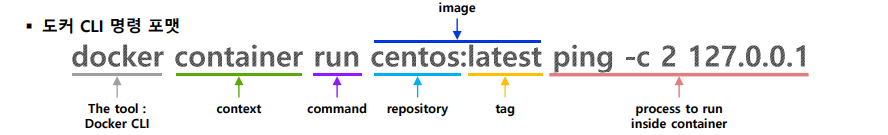
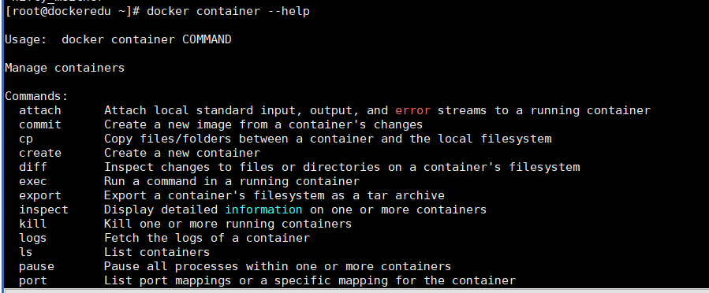

## 2022-10-18-Docker2일차

## 1교시

- 도커는 방화벽을 꺼야함
- 왜 꺼야하는지 이유는 나중에 진행하면서 설명할것

- 쉘로 설치를 하면 최신버전으로 깔리는데 그게 완전 좋은거 아니다
  - 쿠버네티스를 하면 특정 버전이 필요함 그래서 오늘은 특정 버전을 설치하는 것을 할 것임

```
yum install -y yum-utils device-mapper-persistent-data lvm
```

- yum-utils를 설치해야함
  - 이곳에 yum-config-manager가 있어서 설치함

```
yum-config-manager --add-repo https://download.docker.com/linux/centos/docker-ce.repo
```

- 레지토리 추가

```
yum list docker-ce --showduplicates
```

- 도커 버전 확인

  

```
# yum install -y docker-ce-<VERSION_STRING>

yum install -y docker-ce-20.10.6
```

- 특정 버전 설치
- 도커는 데몬 형태로 돌아서 enable해줘야 리눅스 재시작되더라도 설정되게 하는것

```
systemctl enable docker

systemctl start docker

systemctl status docker
```


- running 되어 있으면 돌아가고 있는 것임

```
docker version
```


- rest api로 돌아가고 명령 입력하면 rest call하는 식으로 되어 있음
  - 이 도커 데몬이 특정 포트를 리슨하는 것
  - 로컬에서는 유닉스 로 동작
  - 외부에서는 포트 리슨함

```
docker info
```

- storage Driver: overlay2
  - 대게 NTFS, ext4, xfs등의 파일 시스템이 있는데 도커는 overlay타입을 사용함
  - overlay 레이어를 여러개 오버해서 쌓는다는것
  - cgroup Driver : cgroupfs

- swarm
  - 쿠버네티스 같은 것
  - 라이센스를 구매해야함
  - 이것 많이 안쓰고 그냥 쿠버네티스가 업계 표준으로 자리 잡음
- Docker Root Dir : /var/lib/docker
  - **이부분 다시듣기**

```
nautilus
```

- Registry:
  - 이것이 나왔다고 기억하자 곧 설명할 것

### 참고

- Linux Netfilter Subsytem
  - 하드웨어로 패킷빠르게 하지만 자체 os있음
  - 리눅스 장비도 네트워크 장비(라우터, 스위치)등으로 서버로 사용할 수 있음
    - 커널 자체에 네트워크 하위가 돌고 있음
- 도커 컨테이너는 아이피를 갖음
  - 이것이 물리적인 아이피가 아니라 소프트웨어 적으로 런타임에 가상으로 만들어지는 아이피임
  - 그렇기 때문에 방화벽을 꺼야함

- Netfilter 설정하는 것
  - iptables임

## 도커설치 전 후

```
iptables -t filter -vnL

iptables -t nat -vnL
```

- 도커설치전에는 별 설정이 없지만 도커를 설치하면 docker0라는 서브넷이랑 내부적으로 컨테이너 격리되는 것은 어제 실습했던 과정으로 격리가됨

### 도커 탭탭 으로 

```
yum install -y bash-completion
```


- 탭탭 하면 그하위에 필요한 명령어 나옴

## 도커 용어 정리

- 여러 파일 등을 모아 놓은 것들
  - image
- repository
  - 여러가지 이미지를 구분해주는 것
- tag
  - repository에 7번 태그 또는 8번 태그 등등 같은 레파지토리에 버전 구분하는 것

- registry
  - 이런 이미지 어디에서든 호스팅하는 것
  - 인터넷에 있을 수 있고, 사내나 private등이 있음
- container
  - 특정 격리된 프로세스로 띄운것
    - 이미지에 라이브러리등 파일들이 있는데 이미지 기반으로 여러 컨테이너를 실행 가능함
    - 객체지향 같이 인터페이스와 클래스의 관계와 비슷하다.

```
docker container run -it centos:7.6.1810
```

- 위를 실행하면 아래와 같이 커맨드창이 바뀜

  

- 이미지 없으면
  - Registry가 아까 info거기에서 hub.docker.com으로 연결되는 것
    - open jdk,  python 등등 알고 있는 오픈소스 솔루션, 상용 솔루션이 도커가 있음
  - Container안 1번 프로세스로 /bin/bash 프로세스가 실행됨

- 컨테이너 생성시
  - /var/lib/docker/container에 생기게됨

### Moby

- docekr swam, docker compose등을 개발함

## 2교시

```
yum install -y net-tools
```

- centos에서 ifconfig하면 안되는데 위를 설치하면 됨

```
ctl...
```

- 리눅스 브릿지 장비 정보 볼 수 있음

### 파일 시스템 격리 확인

```
ll -h /
```


```
du -hs /* 2> /dev/null
```


```
/var/lib/docker/overlay/47~~~/merged
- 이부분이 그 centos의 부분임
```

- 게스트 os 자체가 없어서 빠르고 가볍다

```
docker container run centos:latest ping -c 2 127.0.0.
```




## 도커 명령어 확인

```
docker help
```

- manage containers가 있고  그냥이 있는데

- 컨테이너 목록 보는것 

  ```
  docker ps
  docker ps -a
  ```

  

  - context 단위로 명령을 지정함

```
docker container --help
```



```
docker container run --help
```


- 어마어마한 옵션을 볼 수 있음

### 예전 스타일 명령어로 컨테이너 실행 

- httpd:2.4

  - 아파치 웹서버 이미지

  

  ```
  curl http://172.17.0.2:80
  ```

  

```
 curl http://localhost:8080
```


```
192.168.56.91:8080
```

- 이렇게 해도 웹에서 확인가능

  

- 172.17.0.2 

  - 런타임에서 가상 아이피 생성됨
  - 마지막 보면 tcp dpt: 8080 to:172.17.0.2:80
    - 8080을 80으로 포워딩 해주겠다고 하는것이  나옴

```
iptables -t filter -vnL

iptables -t nat -vnL
```


- 가상으로 선언해주는것임 네트워크 역시도

## docker container ls

- 실행중인 컨테이너 만

- -a

  - 종료된 컨테이너까지 보여줌

    

```
watch docker container ls -a
```

- -q

  - 컨테이너 아이디만

    ```
    docker container ls -aq
    ```

    

### container 라이프 사이클


- 프로세스 부분 
  - 라이터블 레이어
    - 이곳에서 쓰이고 실행되는 것

- create는 실행은 하지 않고 스냅샷만 찍고 컨테이너 생성만 함
  - 프로세스는 실행되지 않음

```
control + p + q
- 실행중인 컨테이너안에서 종료하지 않고 나오는것
```

## stop

- 아이디, 이름 으로 종료가 가능함


- 종료시 코드가 다른데 이것을 잘 봐야함

  - container를 stop한다는것 컨테이너 1번 프로세스를 종료하는 것

    ```
    kill -l
    ```

    - 각 시그널  있는데
    - 대개 9번인 SIGN KILL을 쓰는데 

  - 137 인경우 128 + 9 즉,9에서 종료 됬음을 의미
    

## rm

- 종료된 컨테이너를 아예 삭제하는 것
  - 실행중인 컨테이너는 삭제가 안됨

## -f

- force 옵션을 사용하면 실행중인 컨테이너도 삭제됨

  ```
  docker container rm -f ...
  ```

- 한번에 삭제

  ```
  docker container rm -f $(docker container ls -aq)
  ```

```
alias dcrmall
```

- 컨테이너 필요 없는것 한번에 정리함

## docker container ls

- -i
- -t
  - 쉘프로세스 정상적으로 사용되려면
  - 사용자 입력을 받는 standard input 이 있어야함
- 1번 프로세스가 쉘이면
  - -it 옵션이 필수 이다.


```
cat /etc/resolv.conf
```


- host랑 컨테이너랑 같은 resolv.conf를 사용

```
sys/fs/cgroup/cpu/docker
```

- 위 부분의 host os 입장에서 tasks에 pid가 입력 되어 있음

## d 옵션

```
docker container run -d --name=T01 tomcat:6
```

- tomcat은 자바기반 웹서버

- ```
  firefox
  ```

  - 리눅스 기반 firefox가 실행됨

    ```
    http://172.17.0.2:8080
    ```

    

    

```
docker container exec T01 cat /etc/hosts
```


```
docker container exec -it T01 /bin/bash
```

```
docker container logs -f T01
```

```
docker container logs -ft T01
```

- t 옵션의 경우 날짜 포맷이 다를수 있는데 도커 자체에서 로그의 타임스탬프를 찍어줌
  - 빅데이터 수집시 로그수집하는데 이때 특정 시간때를 저장하는데 
  - 도커로 실행되는 모든 소루션은 t옵션 사용
  - 가끔 사용을 한다.

## 포트 노출(중요함)

```
docker container run -d -p 7070:8080 tomcat:6
```


```
yum install bridge-utils

brctl show
```

## 환경 변수

```
docker container run -it -e FOO=BAR -e JAVA_HOME=/usr/local/jdk1.8 centos
```

- 환경 변수 많으면 파일 만들어서 env_list로 줄수도 있지만 
  - 잘쓰지는 않음
- 일반적으로 많아도 다 명시하는것이 일반적임

## -W

- 워킹 디렉토리 설정

  - 1번 프로세스의 pwd의 현재 경로 지정할때 가끔씩 사용함
  - 원래 프로그램 그렇게 개발하면 안되지만 그렇게 해야하는 경우 필요

  ```
  docker container run -it -w=/tensorflow centos
  ```

## docker container prune

- prune
  -  쓸데없는 나무가지를 치는 것
- 컨테이너에서 정지된 컨테이너 일괄적으로 삭제시 사용

### docker pause/unpause

- 실행중인 컨테이너 일시정지도 가능

```
curl -s 172.17.0.2:8080 | grep DOCTYPE

while ....
```

## docker container cp

- 호스트에 있는 것을 컨테이너로
- 컨테이너에 있는것을 호스트로

- 활용도 중간 정도

```
echo "Hello Docker" > hello.html

docker container run -d --name=web httpd:2.4

 docker container cp hello.html web:/usr/local/apache2/htdocs
```

## docker container diff

- 컨테이너 아이디에 해당하는 폴더가 /var/lib/docker/overlay2에 만들어짐

## docker container inspect

- 자주 써야함

- 컨테이너의 상태정보를 json 상태로 보여줌

- 컨테이너 아이피 확인하는 것

  ```
  docker container inspect --format="{{.NetworkSettings.Networks.bridge.IPAddress}}" c01
  
  con_ip c01
  ```

  