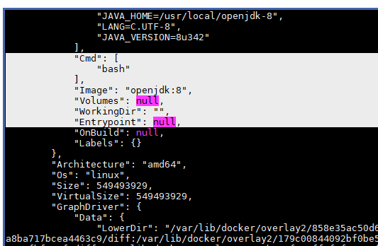
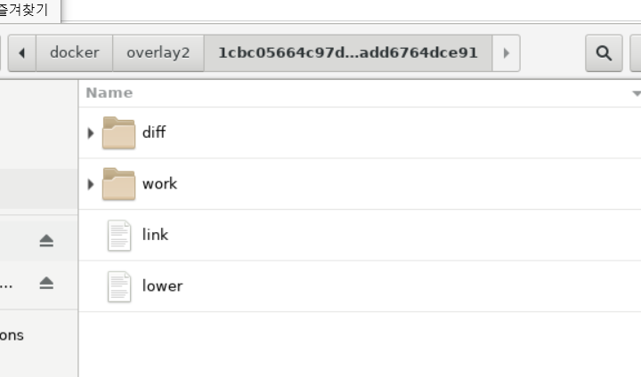

## 2022-10-19-Docker3일차.md

## 이미지 export

```
docker container run -it --name guestbookH2_c01 openjdk:8

docker container export -o guestbookH2_c01.tar guestbookH2_c01

# tar명령
tar tvf guestbookH2_c01.tar | more

gzip guestbookH2_c01.tar
```

- export를 import해보기


108 ` 114

### 이미지 import

```
docker image import guestbookH2_c01.tar.gz yu3papa/guestbook_h2:1.0

# 서버에 있는것도 가져올 수 있음
docker image import http://jadecross.iptime.org:7778/dockeredu/guestbookH2_c01.tar.gz yu3papa/guestbook_h2:2.0


docker container commit -m "SpringBoot Guestbook(H2) created" guestbookH2_c01 yu3papa/guestbook_h2:3.0

docker container run yu3papa/guestbook_h2:3.0 java -jar /guestbook_H2.jar
```

### Container commit

```
 docker container commit -m "SpringBoot Guestbook(H2) created" guestbookH2_c01 yu3papa/guestbook_h2:3.0
```

### docker image save

- 레이어를 유지한 채로 저장

```
## 한번에 1개이상 같은 이름으로 묶음
docker image save -o save.tar yu3papa/guestbook_h2

 tar tvf save.tar | more
```

### docker image load

```
docker image rm yu3papa/guestbook_h2:1.0 yu3papa/guestbook_h2:2.0 yu3papa/guestbook_h2:3.0

docker image load -i save.tar
```

## 이미지 허브 닷컴에 push

- docker login

  

  - username
  - password를 입력하자

```
docker image tag yu3papa/guestbook_h2:3.0 <사용자ID>/guestbook_h2:3.0

docker image tag yu3papa/guestbook_h2:3.0 black92/guestbook_h2:4.0

docker image push black92/guestbook_h2:3.0
```

```
docker container run black92/guestbook_h2:3.0 java -jar /guestbook_H2.jar
```

### docker image pull

```
docker image pull centos
docker image pull centos:7
docker image pull -a centos
docker image pull coordinatorj/debian-cowsay

이미지 이름 구성 요소
레지스트리주소/사용자ID/레파지토리:태그
```

- public 같은 것은 레지스트리주소를 생략해도 되지만
- 그런것이 아닌 다른 것 private나 azur등 은 레지스트리주소를 써야함
  - 구글에서 쓰는 것 레지스트리가 있음

- 같은 것을 받아오는경우 레이어가 있는것은 안받아오고 writeble 변경된것만 받아온다.

### docker image tag

- tag 를 교체하는 경우 사용

  ```
   docker image tag yu3papa/guestbook_h2:3.0 yu3papa/guestbook_h2:4.0
  ```

### docker image history

- 이미지 레이어로 되어있는데

- 위를 명령하면 레이어의 모습을 보여준다.

  ```
  docker image history yu3papa/guestbook_h2:3.0
  ```


### docker image inspect

- 이미지의 상세를 json으로 보여줌

  ```
  docker image inspect yu3papa/guestbook_h2:3.0
  ```

  - cmd, entrypoint등이 보이는데

    - 이미지를 만들때

    

    - cmd에 bash가 1번포인트인데
      - 이것은 오버라이드 가능함
    - entrypoint만있으면 이것이 1번이고
    - entry와 cmd가 있으면 
      - 1번이 entry이고 cmd가 entry의 아규먼트로 들어옴

### image rm

- 이미지 지우는것

### image prune

```
docker image prune -a
```

- 컨테이너로 생성 안되어 있는 이미지 전부 삭제

### docker search

```
docker search tomcat
docker search --filter=stars=10 tomcat
docker search --filter=is-automated=true tomcat
docker search --no-trunc=true tomcat
```

- 이렇게 명령어 하는것 보다는 홈페이지 들어가서 찾는게 일반적인 것


### 3교시

- registry

  - 설치

  

  ```
  docker run -d -p 5000:5000 --restart always --name registry registry:2
  
  docker container run -d --name registry --restart always -p 5000:5000 registry:2.7
  
  docker image pull haproxy:1.9
  
  docker image tag haproxy:1.9 localhost:5000/yu3papa/myhaproxy:1.9
  
  docker image push localhost:5000/yu3papa/myhaproxy:1.9
  
  curl localhost:5000/v2/_catalo
  ```

  - 기능이 약함, 로그인안해도 push가 가능

    

    - https도 아니고 인증도없이 가볍게 쓸 수 있는 레지스트리 서버임

      ​                                                                                                                                                                                                                                                                                                                                                                                                                                                                                                                                                                                                                                                                                                

    - cncf.io

      - 이곳은 리눅스재단의 하위재단임
      - cloud native open source 펀딩해주는곳
        - 완성도 높여주게 해주는 여기서 incubating의 단계를 거치게됨
        - 완성도  후에 grauated 졸업을 시켜줌
          - 여기서 가장 유명한것이 쿠버네티스임
      - harbor
        - 이것 도커레지스트리 해주는 역할하는 서버임
        - 이전에는 넥서스를 많이 썼지만 지금은 이것 많이씀

### docker volume

- 방명록 어플리케이션 파일 첨부 기능있는데
  - 방명록을 하나만 하지 않고 또다른 것을 컨테이너 올릴 수 있는데
  - 그 컨테이너의 파일을 다운 받으려고 하면 컨테이너를 접속하면되는데

- 업로드한 첨부파일을 안전하게 보관하는 방법
  - 이것이 도커의 볼륨임
- 3가지 볼륨
  - bind mount,]
    - 호스트쪽 
  - volume, 
    - 도커안
  - tmpfgs mount
    - 호스트 컴퓨터 메모리 써서 io속도 빠름

####  컨테이너 디폴트 스토리지 위치

- 컨테이너 만들면 디폴트로 잡히는 부분이 있음

```
docker container run --name=c01 yu3papa/guestbook_h2:3.0 java -jar guestbook_H2.jar

# GraphDrive 찾고 8줄 보기
docker container inspect c01 | grep -A 8 GraphDrive
```




- 이대로 해서 삭제하면 보존 안됨

### bind mount

- 도커 컨테이너만 쓸때 효율적임

````
mkdir /tmp/updir

docker container run -v /tmp/updir:/upload --name=bindmount01 yu3papa/guestbook_h2:3.0 java -jar guestbook_H2.jar

## bash셀 접속
docker container exec -it bindmount01 bash
````


- 현재 파일 없는것 확인하고


- 방명록 남기면

- 컨테이너 안에는

  

  - 남겨지고 이때 컨테이너 삭제하더라도 tmp/updir의 내용은 삭제가 안됨

    

```
docker container inspect bindmount01 | grep -A 10 \"Mounts\"
```


- 컴파일 할때 자바 버전만 바꾸면서 같은환경에서 사용이 가능함
  - 이런 컴파일 환경자체를 바꾸면서 하는것이 쉬운게 아님 
  - 그럴때 많이 씀

```
power off로 종료 해서 마무리
```


