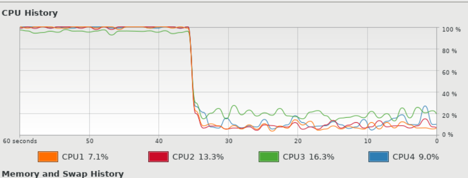

## 2022-10-20-Docker4일차

## 01.방명록 프로그램 도커로 운영중

```
scouter.client
```

- ro, rw 로 볼륨 사용 가능

## 02.도커 볼륨 개요

- 이름 없는 볼륨

  - 볼륨을 주는데 경로만 주는 경우

  ```
   docker container run -v /upload --name=volume01 yu3papa/guestbook_h2:3.0 java -jar guestbook_H2.ja
  ```

- 이름 있는 볼륨

  ```
  docker volume create upload
  ```

  


```
 docker container run -v uploadVol:/upload --name=volume02 yu3papa/guestbook_h2:3.0 java -jar guestbook_H2.jar
```

- 이름을 가진 볼륨에 매핑하은 경우

```
docker container run -it -v uploadVol:upload yu3
```

### 데이터 전용 컨테이너 사용

```
 docker container create --name=dataOnlyCon -v /upload busybox
```

- volumes-from옵션

  ```
   docker container run --volumes-from dataOnlyCon --name=volume03 yu3papa/guestbook_h2:3.0 java -jar guestbook_H2.jar
  ```


- tmfs mount

  - io속도는 빠름, 대신 컨테이너 날리면 메모리도 날아가서 파일 영속성은 보장하지 않음
    - 레디스같은 캐시서버 같은것은 쓰면 효과적임

  ```
   docker container run --tmpfs /upload --name=tmpfs01 yu3papa/guestbook_h2:3.0 java -jar guestbook_H2.jar
  ```

## 2교시

- CNM

  - 컨테이너와 컨테이너 네트워킹 되어야하고
  - 컨테이너와 호스트가 네트워킹 되어야하고
  - 컨테이너에서 외부어 어떤 것과도 되어야하고
  - 내부사용자가 컨테이너와도 네트워크 되어야하는 것을 정의한 스펙임
    - 컨테이너에 있는 것은 가상 ip임
    - 스펙을 구현하는 것은 libnetwork인데
      - 컨테이너마다 IPAM 인 네트워크 아이디 중복되지 않게 해주는
      - 가상넷이지만 tcp지원함
        - 도커에서는 libnetwork를 씀

  

  - bridge는 지금까지 썼던 네트워크
    - 첫날에 네트워크 실습을 해봤는데 리눅스 커널만 가지고 했던 실습
    - 소프트웨어적 브릿지 장치로 랜같이 만들어서 하는 그런 스위치 같은것을 브릿지
  - host는 네트워크를 컨테이너에게 격리하지 않는것
    - host의 네트워크를 그대로 쓰는것
  - none의 경우 컨테이너에 네트워크 제공하지 않는 것

- **bridge**

  

  - 주로 많이 씀

### host 네트워크

- `--network=host`
  - 호스트로 하면 컨테이너 아이디 자체도 호스트 주소임

```
 docker container run -d --network=host --name=nethost01 yu3papa/guestbook_h2:3.0 java -jar guestbook_H2.jar
```


- 그래서 그냥 리눅스 아이피를 그대로 사용함

  

  - 네트워크 들어가는것을 홉이라고 하는데
    - host는 네트워크 격리가 안되어 있어서 한번에 들어가고
  - 컨테이너 네트워크 뚫리면 호스트도 뚫릴수 있기때문에 위험하다.

#### bridge

- 호스트 컴퓨터가 172.17.0.1 이라는 것을 만들어주고 
  - 랜포트같이 한개씩 연결이 되어 있고한개씩 랜포트에 연결되어 있는 개념
  - docker 0와 eth0는 같은 172.17이라서 통신되고
  - 컨테이너 외부에 노출 어떻게 하는가?
    - 그래서 docker0를 현재는 게이트웨이 라우터로 사용해서 밖으로 나가게 함
      - 172.17.0.2 이 docker0에 헤더에 담겼다가 
        - 192.168.56.91로 호스트 ip로 바껴서 들어감

```
docker run -d httpd:2.4

docker container run -d --name=netbridge01 --network=bridge -p 80:8080 yu3papa/guestbook_h2:3.0 java -jar guestbook_H2.jar

cat /etc/resolv.conf
- 
```

- 

- 컨테이너 안

  

  - 브릿지를 생성시 hosts라는 파일 만들어서 사용

#### none 네트워크

- 이걸로 지정하면 네트워크 사용 안함
  - 왜? 안쓰는 경우가 있는지?
  - 네트워크가 필요 없는 업무인 경우

### 도커 네트워크 생성

```
docker network create --driver=bridge --subnet=172.27.0.0/16 whatap-bridge

docker container run -it --name=whatapsvr --network=whatap-bridge --ip=172.27.0.38 -p 8888:8888 yu3papa/whatap_collector:2.0
```

```
brctl show
```


- 이렇게 되는데 도커 올라가 있으면 이렇게됨

  

```
cd /whatap/bin; ./start.sh
```

```
192.168.56.91:8888

admin@whatap.io 
admin

docker container run -d --name=whatapguestbook1 --network=whatap-bridge yu3papa/whatap_guestbook:2.0
- 이것은 만든 네트워크에 연결바로됨

docker container run -d --name=whatapguestbook2 yu3papa/whatap_guestbook:2.
- 또다른거 실행하고 확인해보면
- 이것은 따로 connect해줘야함
docker network connect whatap-bridge whatapguestbook2
```


- 호출한것 모니터링됨


- 두개 연결된 경우

### overlay network

- 현재 리눅스 host에서만 하지만
- 기업에가면 리눅스host 환경이 여러개 있고 이것을 운영을 하는데
- 다른 컨테이너 끼리 네트워크되는 환경이 있어야하는데 이때
- 
  - overlay network를 설치해야함
    - dockerswam이나 쿠버네티스 같은것을 설치해야함

## 3교시

- vm보다 훨씬 가볍다
- 빅데이터 관심있으신분 하둡파일시스템 구축해봤을텐데
  - 클러스터 파일시스템 구축하려면 어쨌든 3대정도 있어야함
- 가상으로3대하려고 해도 hw가 좋아야하는데 도커로 하면 그런 걱정이 적다

### 컨테이너 모니터링

```
docker container stats
```

```
docker container top <컨테이너 이름>
```


- 해당 컨테이너 top을 볼 수 있는거

## GUI 적 모니터링

- cadvisor
  - 컨테이너 어드바이저
  - 이것은 컨테이너를 모니터링 할 수 있음

```
 docker run \
--volume=/:/rootfs:ro \
--volume=/var/run:/var/run:ro \
--volume=/sys:/sys:ro \
--volume=/var/lib/docker/:/var/lib/docker:ro \
--volume=/dev/disk/:/dev/disk:ro \
--publish=8090:8080 \
--detach=true \
--name=cadvisor \
google/cadvisor:v0.33.0
```

[cAdvisor - /](http://192.168.56.91:8090/containers/)

위로 접속 쿠버네티스에서는 자동으로 깔리고 이를 통계해서 과거데이터 조회도함

### 컨테이너 자원 제한 설정

- 컨테이너도 하나의 프로세스라서 자원을 독점할 수도 있음

  ```
  sys/fs/cgroup
  ```

  - sys에 있는 것은 메모리에 있는것 마운트한것임

```
#윈도우 작업관리자 같은것
gnome-system-monitor

docker container run -d --name=cpulimit01 -p 8080:8080 yu3papa/guestbook_h2:3.0 java -jar /guestbook_H2.jar

#과부화 프로그램
jmeter

docker container update --cpus="0.2" cpulimit01
```

- 도커에서는 위와 같이 하지만 쿠버네티스는 더 쉽다.


- 제어전 상황


- 제어후 상황 

- 참고
  - [허태준](https://hamonikr.org/oss/47121)
    - 리눅스 컨트롤 그룹의 커미터임

