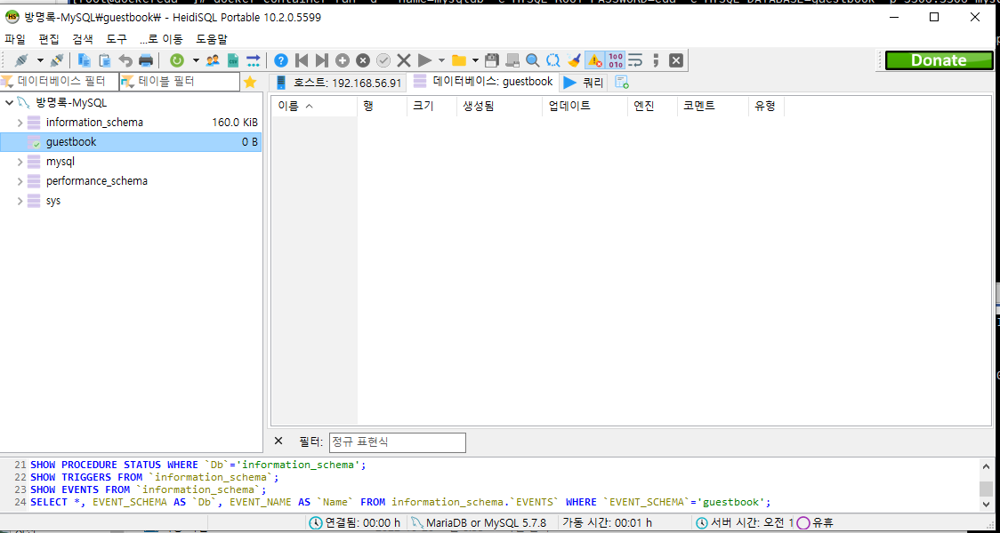
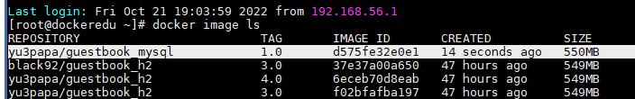
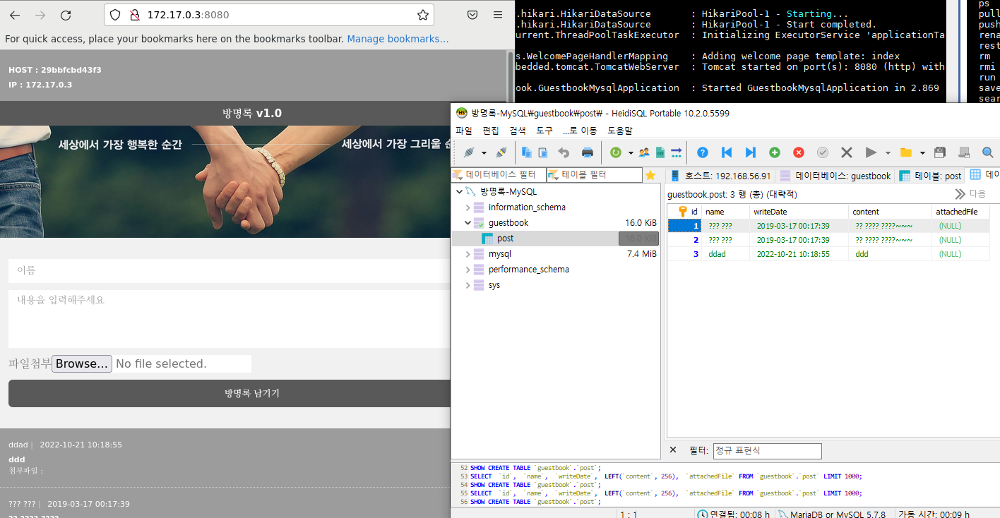
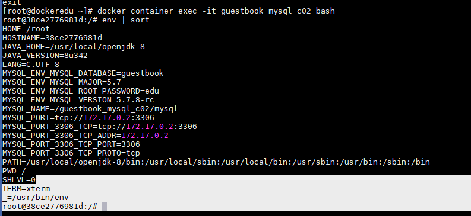
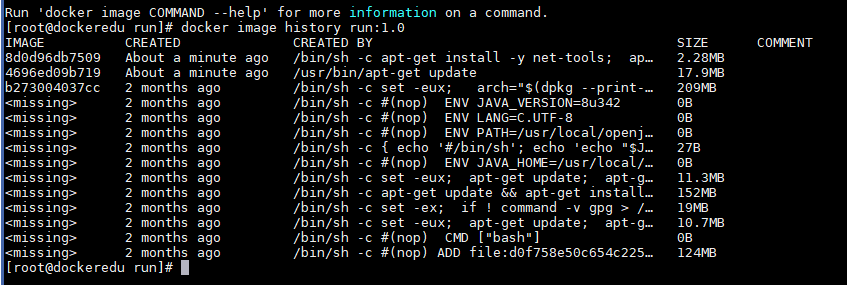
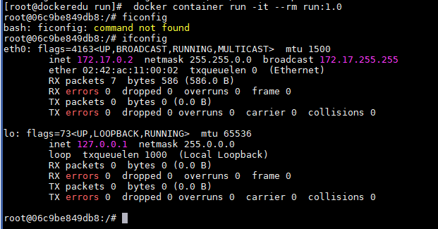

## 2022-10-21-Docker5일차

## 01.컨테이너

- Death star같이 생겨서 Death star아키텍처라고하고
- 대개 컨테이너 하나만 운영하지 않음

### 컨테이너 두개 운영

```
docker container run -d --name=mysqldb -e MYSQL_ROOT_PASSWORD=edu -e MYSQL_DATABASE=guestbook -p 3306:3306 mysql:5.7.8

# mysql 동작확인
호스트
192.168.56.91
root
edu
3306
```



- 위와 같이 뜨면 제대로 뜨는것

```
nautilus
```

```
자바가 필요해서 베이스 하나만들기
 docker container run -it --name guestbookMySQL_c01 openjdk:8
 
 # 컨테이너 안에 .jar 복사
 docker container cp ~/guestbook/guestbook_MYSQL.jar guestbookMySQL_c01:/
 
 docker container stop guestbookMySQL_c01

# 새로운 이미지 생성
 docker container commit -m "SpringBoot Guestbook(MySQL) created" guestbookMySQL_c01 yu3papa/guestbook_mysql:1.0
```



- 이것은 아직도 1번 프로세스가  bash

```
# db정보 환경변수로 넘기기
 docker container run \
-e MYSQL_PORT_3306_TCP_ADDR=172.17.0.2 \
-e MYSQL_PORT_3306_TCP_PORT=3306 \
-e MYSQL_ENV_MYSQL_DATABASE=guestbook \
-e MYSQL_ENV_MYSQL_ROOT_PASSWORD=edu \
--name=guestbook_mysql_c01 \
yu3papa/guestbook_mysql:1.0 \
java -jar /guestbook_MYSQL.jar
```



- 방명록을 남기게 되면 디비에 저장됨을 확인할 수 있음

### Lagacy container links

- docker container run --link <원본 컨테이너>:<앨리어스>

  - 링크를 걸었던 환경 변수들이  앨리어스 이름이 붙어서 나옴

- before

  ```
   docker container run \
  -e MYSQL_PORT_3306_TCP_ADDR=172.17.0.2 \
  -e MYSQL_PORT_3306_TCP_PORT=3306 \
  -e MYSQL_ENV_MYSQL_DATABASE=guestbook \
  -e MYSQL_ENV_MYSQL_ROOT_PASSWORD=edu \
  --name=guestbook_mysql_c01 \
  yu3papa/guestbook_mysql:1.0 \
  java -jar /guestbook_MYSQL.jar
  ```

- after

  ```
  docker container run \
  --link mysqldb:mysql \
  --name guestbook_mysql_c02 \
  yu3papa/guestbook_mysql:1.0 \
  java -jar /guestbook_MYSQL.jar
  ```

  ```
  -e MYSQL_PORT_3306_TCP_ADDR=172.17.0.2 \
  -e MYSQL_PORT_3306_TCP_PORT=3306 \
  -e MYSQL_ENV_MYSQL_DATABASE=guestbook \
  -e MYSQL_ENV_MYSQL_ROOT_PASSWORD=edu \
  
  이것이
  
  --link mysqldb:mysql \
  
  이걸로 대체
  ```

  - 이런것을 링크로 하는법을 알아보자

```
docker container exec -it mysqldb bash

 env | sort
 
```

- 링크한것의 환경변수가 받아짐



- 맹점이 있긴함
  - 돌아는 가지만 부족한 기술이긴함

## Dockerfile

### FROM

- 베이스로 쓸 이미지 생성

````
mkdir -p ~/buildlab/from && cd $_

vi Dockerfileㅐ
```

docker build -t from:1.0 .
 
docker container run -it from:1.0
````

## RUN

- 베이스 이미지로 임시 컨테이너 생성
- 임시 컨테이너에서 커맨드 명령쓰거나
- shell form
- exec form을 사용함
  - 두개가 있는 이유가 있음

- shell form

  - run 명령어가 많아지고

  - bin/sh -c에서 명령실행해서 쉘 폼이라고함

  - 변수 확장이 가능함

  - 쉘의 기능인 

  - ; 앞의 명령어하고 뒤에 명령어 하고 

  -  &&  앞의명령어 성공하면 뒤의 명령어하고 하는것

    - 이런것이 명령 

  - 가독성이 안좋음

    - 레이어 한개 만들기 위해서

      ```
      RUN apt-get update; \
      apt-get install -y net-tools; \
      apt-get clean
      ```

  - exec form

    ```
    RUN ["/bin/bash", "-c", "apt-get update;\
    apt-get install -y net-tools;\
    apt-get clean"]
    ```

````
mkdir -p ~/buildlab/run && cd $_

vi Dockerfile
```
FROM openjdk:8

# exec form
RUN ["/usr/bin/apt-get", "update"]

# shell from
RUN apt-get install -y net-tools; \
        apt-get clean; \
        rm -rf /var/lib/apt/lists/*
```

docker build --no-cache -t run:1.0 .

docker image hisory run:1.0
````



```
 docker container run -it --rm run:1.0
 
 ifconfig
```



--no cache

​	혹시나 공백기간동안 업데이트 나오는 경우 이를 안하면 생략하고 안만들어서 넣어주는것 권장

### COPY ADD

- copy 도커 초창기부터 있던 명령어
  - 기능이 좀 필요한 부분이 있어서 나온것 ADD
- ADD는 카피 그대로 사용하면서
  - 로컬만 사용했던 copy라면 Add는 인터넷에 있는 파일도 넣어줄 수 있는 기능임

````
mkdir -p ~/buildlab/copyadd && cd $_

cp ~/guestbook/guestbook_H2.jar .

vi Dockerfile
```
FROM openjdk:8
RUN apt-get update; \
apt-get install -y net-tools; \
apt-get clean; \
rm -rf /var/lib/apt/lists/*
COPY guestbook_H2.jar /app/
ADD https://github.com/scouter-project/scouter/releases/download/v2.6.1/scouter-min-2.6.1.tar.gz /
RUN tar xfz scouter-min-2.6.1.tar.gz; \
echo "net_collector_ip=172.17.0.1" > /scouter/agent.java/conf/scouter.conf; \
rm -fr scouter-min-2.6.1.tar.gz

```
docker build -t copyadd:1.0 .

 docker container run -it --rm copyadd:1.0

````

### ENV 와 LABEL

- 환경 변수는 환경 변수 설정하는 것
- 라벨은 도커 이미지에는 영향없고
  - 일종의 주석같이 쓰는 것

```
mkdir -p ~/buildlab/envlabel && cd $_

 cp ~/guestbook/guestbook_H2.jar .
 
 vi Dockerfile
 ```
FROM openjdk:8
RUN apt-get update; \
apt-get install -y net-tools; \
apt-get clean; \
rm -rf /var/lib/apt/lists/*
COPY guestbook_H2.jar /app/
ADD https://github.com/scouter-project/scouter/releases/download/v2.6.1/scouter-min-2.6.1.tar.gz /
RUN tar xfz scouter-min-2.6.1.tar.gz; \
echo "net_collector_ip=172.17.0.1" > /scouter/agent.java/conf/scouter.conf; \
rm -fr scouter-min-2.6.1.tar.gz
LABEL maintainer="HwanYeoul Jeong<coordinatorj@jadecross.com>" \
title="guestbook App" \
version="1.0" \
description="Thιs ιmage is guestbook service"
ENV APP_HOME /app
 ```
  docker build -t envlabel:1.0 .
  
  docker image inspect envlabel:1.0 | grep -A4 Labels
  
   docker container run -it --rm envlabel:1.0
   
    env
```

##  EXPOSE, VOLUME

- Expose 포트 리슨해주는 것
- volume은 볼륨 매핑해주는 것

```
mkdir -p ~/buildlab/exposevolume && cd $_

 cp ~/guestbook/guestbook_H2.jar .
 
  vi Dockerfile
  ```
FROM openjdk:8
RUN apt-get update; \
apt-get install -y net-tools; \
apt-get clean; \
rm -rf /var/lib/apt/lists/*
COPY guestbook_H2.jar /app/
ADD https://github.com/scouter-project/scouter/releases/download/v2.6.1/scouter-min-2.6.1.tar.gz /
RUN tar xfz scouter-min-2.6.1.tar.gz; \
echo "net_collector_ip=172.17.0.1" > /scouter/agent.java/conf/scouter.conf; \
rm -fr scouter-min-2.6.1.tar.gz
LABEL maintainer="HwanYeoul Jeong<coordinatorj@jadecross.com>" \
title="guestbook App" \
version="1.0" \
description="Thιs ιmage is guestbook service"
ENV APP_HOME /app
EXPOSE 8080
VOLUME /upload
  ```
 docker build -t exposevolume:1.0 .
 
 docker container run -it --rm -P exposevolume:1.0
 
 mount | grep upload
 
 df -h
 
```

##  CMD ENRYPOINT

- cmd 있으면

  - cmd로 지정한것이 1번 프로세스

  - cmd만써서 하는것은 그 이미지 기반으로 컨테이너 실행할때 1번 프로세스를 오버라이딩 할 수 있는 특징이 있음

-  entrypoint는 오버라이드가 안됨

  - entrypoint로 1번 지정되어 있는 것은 1번 프로세스 오버라이딩 하지 말라는 것이랑 비슷

- 두개가 같이 있는 경우

  - enty가 1번 프로세스가되고
  - cmd의 명령어가 파라미터로 들어감

- 1번프로세스가 계속 돌아야하는 경우가 있고 함

  - 1번프로세스가 죽으면 안됨
  - /bin/bash는 유지 되지만
  - sh, mvn으로 하면 그냥 하고 죽어버림

- 엔트리롤 쓰는거 mysql, postgress 

  - 1번 포인트를 스크립트 포인트로함
    - mysql : ENTRYPOINT ["docker-entrypoint.sh"] 
    - postgress : ENTRYPOINT ["docker-entrypoint.sh"]
      - 쉘 실행되면 동작하고 죽음

- exec
  - 1번 동작하다가
  - 1번이 exec만나면 그것의 id를 exec로 넘겨줌
- 

```
mkdir -p ~/buildlab/cmdentrypoint && cd $_

 cp ~/guestbook/guestbook_H2.jar .
 
  vi Dockerfile

FROM openjdk:8
RUN apt-get update; \
apt-get install -y net-tools; \
apt-get clean; \
rm -rf /var/lib/apt/lists/*
COPY guestbook_H2.jar /app/
ADD https://github.com/scouter-project/scouter/releases/download/v2.6.1/scouter-min-2.6.1.tar.gz /
RUN tar xfz scouter-min-2.6.1.tar.gz; \
echo "net_collector_ip=172.17.0.1" > /scouter/agent.java/conf/scouter.conf; \
rm -fr scouter-min-2.6.1.tar.gz
LABEL maintainer="HwanYeoul Jeong<coordinatorj@jadecross.com>" \
title="guestbook App" \
version="1.0" \
description="Thιs ιmage is guestbook service"
ENV APP_HOME /app
EXPOSE 8080
VOLUME /app/upload
WORKDIR $APP_HOME
ENTRYPOINT ["java"]
CMD ["-javaagent:/scouter/agent.java/scouter.agent.jar", "-jar", "guestbook_H2.jar"]

docker build -t cmdentrypoint:1.0 .

 scouter.server.boot
 
 scouter.client
 
 docker container run -it cmdentrypoint:1.0
```

## 한글 설정하기

- 한글 지원하는것 만드는것	

  ```
  cd ~/workspace/mysql_hangul/
  
  vi Dockerfile
  
  # docker build -t yu3papa/mysql_hangul:1.0 .
  
  docker container run -d --name=guestbookdb -e MYSQL_ROOT_PASSWORD=edu -e MYSQL_DATABASE=guestbook
  yu3papa/mysql_hangul:1.0
  ```

## 연습문제

- 공유 폴더쓰는 샘플
- 한개 쉘이 무한 반복이라서 계속 실행하는 것


## Vscode 프로그램을 이용한 개발환경 설정

- 에디터등 테스트위한 것등을 위한 것 다 만들어주고 개발환경 다 구성해주는 것

````
cd ~/buildlab/vscode
mkdir work
cat Dockerfile
vim Dockerfile
```
FROM centos:centos7.7.1908
# vscode
ADD code-1.52.1-1608137084.el7.x86_64.rpm /
# Language, Locale
ENV TZ=Asia/Seoul
RUN localedef -f UTF-8 -i ko_KR ko_KR.UTF-8; \
ln -snf /usr/share/zoneinfo/$TZ /etc/localtime && echo $TZ > /etc/timezone
# x-window + sshd + vscode
RUN yum install -y xorg-x11-xauth; \
yum install -y dbus-x11; \
yum install -y openssh-server openssh-clients openssh-askpass; \
yum localinstall -y /code-1.52.1-1608137084.el7.x86_64.rpm
RUN echo "jadecross" | passwd root --stdin; \
sed -i --follow-symlinks 's/#X11UseLocalhost yes/X11UseLocalhost no/g' /etc/ssh/sshd_config; \
sed -i --follow-symlinks 's/#HandleLidSwitch=suspend/HandleLidSwitch=ignore/g' /etc/systemd/logind.conf; \
mkdir ~/.code-workspace; \
echo "alias code='code --user-data-dir ~/.code-workspace > /dev/null 2>&1 &'" >> ~/.bashrc; \
echo "export LANG=ko_KR.UTF-8" >> ~/.bash_profile
EXPOSE 22
VOLUME /work
CMD ["/usr/sbin/init"]
```

docker image build --no-cache -t yu3papa/centos7vscode:1.0 .

docker container run --privileged -d --name=vscode \
-v /root/buildlab/vscode/work:/work \
-p 20022:22 yu3papa/centos7vscode:1.0


````

## Docker Compose

- 경량의 오케스트레이션 툴
- 설치

```
curl -L https://github.com/docker/compose/releases/download/1.24.0/docker-compose-`uname -s`-`uname -m` -o /usr/local/bin/docker-compose

chmod +x /usr/local/bin/docker-compose

docker-compose --version
```

```
version: "3.7"
services:
  app:
    image: yu3papa/guestbook:1.0
    environment:
      - MYSQL_PORT_3306_TCP_ADDR=db
      - MYSQL_PORT_3306_TCP_PORT=3306
      - MYSQL_ENV_MYSQL_DATABASE=guestbook
      - MYSQL_ENV_MYSQL_ROOT_PASSWORD=edu
  volumes:
    - upload-data:/app/upload
  ports: 
    - "80:8080"
  links:
    - db
  depends_on:
    - db
  db:
    image: yu3papa/mysql_hangul:1.0
    environment:
      - MYSQL_DATABASE=guestbook
      - MYSQL_ROOT_PASSWORD=edu
    volumes:
      - mysql-data:/var/lib/mysql
volumes:
mysql-data:
upload-data:
```

###  docker compose 명령어

- exec
  - compose의 경우 exec 하면 -it 생략하고도 실행 가능
- logs
  - 컴포즈 1번 스탠다드 아웃에 대한 것을 보여줌
  - 모든 컨테이너의 로그를 보여줌

- config
  - 문법에 오류가 없는지 센텍스에러 정도
- down
  - 컴포즈 전체 컨테이너 삭제하는 명령어

## docker-compose를 이용한 CI 환경 구성

- 깃랩
- 젠킨스
- sonarQube

```
cd ~/gitlab-jenkins-sonarqube/

 cat docker-compose.yml
 
docker-compose up -d
```

```
version: "3"
services:
  web:
    image: 'gitlab/gitlab-ce:11.10.3-ce.0'
    restart: always
    hostname: 'gitlab'
    environment:
      GITLAB_OMNIBUS_CONFIG: |
        external_url 'http://localhost:8000'
    ports:
      - '8000:8000'
      - '8443:8443'
      - '23:22'
    volumes:
      - 'gitlab-config:/etc/gitlab'
      - 'gitlab-logs:/var/log/gitlab'
      - 'gitlab-data:/var/opt/gitlab'
  jenkins:
    build:
      context: .
      dockerfile: Dockerfile.jenkins
    restart: always
    hostname: 'jenkins'
    ports:
      - '8080:8080'
      - '50000:50000'
    volumes:
      - 'jenkins_home:/var/jenkins_home'
      - '/var/run/docker.sock:/var/run/docker.sock'
  sonarqube:
    image: 'sonarqube:7.6-community'
    ports:
      - '9000:9000'
    volumes:
      - 'sonarqube_conf:/opt/sonarqube/conf'
      - 'sonarqube_data:/opt/sonarqube/data'
      - 'sonarqube_logs:/opt/sonarqube/logs'
      - 'sonarqube_extensions:/opt/sonarqube/extensions'

volumes:
  gitlab-data:
  gitlab-logs:
  gitlab-config:
  jenkins_home:
  sonarqube_conf:
  sonarqube_data:
  sonarqube_logs:
  sonarqube_extensions:

```

```
8000번 깃랩

8080 젠킨스

9000 소나큐브
```

## 쿠버네티스 데모

- 시간나면진행

---

https://www.youtube.com/watch?v=LXJhA3VWXFA

- 참고해볼 사이트

- 요새는 하버를 사용함


- docker 원격 접속
  - visual studio code를 설치하면
  - 도커는 데몬으로 동작
    - 이것은 rest api 서버임
    - 이런 도커 데몬을 외부에서 접속할 수 있게 아이피 설정하면 리눅스 셀에 안들어가고 
    - 외부에서 rest call가능함
- docker context를 사용해보기

## 참고

```
195 - FROM ========
# 베이스 이미지 지정
FROM openjdk:8
    
197 - RUN
FROM openjdk:8

# exec form
RUN ["/usr/bin/apt-get", "update"]
# shell from
RUN apt-get install -y net-tools; \
    apt-get clean; \
    rm -rf /var/lib/apt/lists/*
    
201 - COPY와 ADD
FROM openjdk:8
RUN apt-get update; \
    apt-get install -y net-tools; \
    apt-get clean; \
    rm -rf /var/lib/apt/lists/*
COPY guestbook_H2.jar /app/
ADD https://github.com/scouter-project/scouter/releases/download/v2.6.1/scouter-min-2.6.1.tar.gz /
RUN tar xfz scouter-min-2.6.1.tar.gz; \
    echo "net_collector_ip=172.17.0.1" > /scouter/agent.java/conf/scouter.conf; \
    rm -fr scouter-min-2.6.1.tar.gz
    
202 - ENV와 LABEL
FROM openjdk:8
RUN apt-get update; \
    apt-get install -y net-tools; \
    apt-get clean; \
    rm -rf /var/lib/apt/lists/*
COPY guestbook_H2.jar /app/
ADD https://github.com/scouter-project/scouter/releases/download/v2.6.1/scouter-min-2.6.1.tar.gz /
RUN tar xfz scouter-min-2.6.1.tar.gz; \
    echo "net_collector_ip=172.17.0.1" > /scouter/agent.java/conf/scouter.conf; \
    rm -fr scouter-min-2.6.1.tar.gz
LABEL maintainer="HwanYeoul Jeong" \
      title="guestbook App" \
      version="1.0" \
      description="Thιs ιmage is guestbook service"
ENV APP_HOME /app
    
205 - EXPOSE 와 VOLUME
FROM openjdk:8
RUN apt-get update; \
    apt-get install -y net-tools; \
    apt-get clean; \
    rm -rf /var/lib/apt/lists/*
COPY guestbook_H2.jar /app/
ADD https://github.com/scouter-project/scouter/releases/download/v2.6.1/scouter-min-2.6.1.tar.gz /
RUN tar xfz scouter-min-2.6.1.tar.gz; \
    echo "net_collector_ip=172.17.0.1" > /scouter/agent.java/conf/scouter.conf; \
    rm -fr scouter-min-2.6.1.tar.gz
LABEL maintainer="HwanYeoul Jeong" \
      title="guestbook App" \
      version="1.0" \
      description="Thιs ιmage is guestbook service"
ENV APP_HOME /app
EXPOSE 8080
VOLUME /upload
    
209 - CMD 와 ENTRYPOINT
FROM openjdk:8
RUN apt-get update; \
    apt-get install -y net-tools; \
    apt-get clean; \
    rm -rf /var/lib/apt/lists/*
COPY guestbook_H2.jar /app/
ADD https://github.com/scouter-project/scouter/releases/download/v2.6.1/scouter-min-2.6.1.tar.gz /
RUN tar xfz scouter-min-2.6.1.tar.gz; \
    echo "net_collector_ip=172.17.0.1" > /scouter/agent.java/conf/scouter.conf; \
    rm -fr scouter-min-2.6.1.tar.gz
LABEL maintainer="HwanYeoul Jeong" \
      title="guestbook App" \
      version="1.0" \
      description="Thιs ιmage is guestbook service"
ENV APP_HOME /app
EXPOSE 8080
VOLUME /app/upload
WORKDIR $APP_HOME

ENTRYPOINT ["java"]
CMD ["-javaagent:/scouter/agent.java/scouter.agent.jar", "-jar", "guestbook_H2.jar"]

    
212 - 한글이 지원되는 MySQL
FROM mysql:5.7.8
COPY my.cnf /etc/mysql/
    
213 - 한글이 지원되는 MySQL DB를 사용하는 방명록
FROM openjdk:8
RUN apt-get update; \
    apt-get install -y net-tools; \
    apt-get clean;\
    rm -rf /var/lib/apt/lists/*
COPY guestbook_MYSQL.jar /app/
ADD https://github.com/scouter-project/scouter/releases/download/v2.6.1/scouter-min-2.6.1.tar.gz /
RUN tar xfz scouter-min-2.6.1.tar.gz; \
    echo "net_collector_ip=172.17.0.1" > /scouter/agent.java/conf/scouter.conf; \
    rm -fr scouter-min-2.6.1.tar.gz
LABEL maintainer="HwanYeoul Jeong" \
      title="guestbook App" \
      version="2.0" \
      description="Thιs ιmage is guestbook service(MySQL)"
ENV APP_HOME /app
EXPOSE 8080
VOLUME /app/upload
WORKDIR $APP_HOME 
ENTRYPOINT ["java"]
CMD ["-javaagent:/scouter/agent.java/scouter.agent.jar", "-jar", "guestbook_MYSQL.jar"]

    
216 - cowsay-loop.sh
#!/bin/bash
while true
do
  echo '<pre>' > /var/htdocs/index.html
  date >> /var/htdocs/index.html
  fortune | cowsay >> /var/htdocs/index.html
  echo '</pre>' >> /var/htdocs/index.html
  cat /var/htdocs/index.html
  sleep $INTERVAL
done

    
216 - Dockerfile
FROM centos:7.6.1810
COPY fortune-mod-1.99.1-17.sdl7.x86_64.rpm /
COPY cowsay-loop.sh /
WORKDIR /
VOLUME /var/htdocs
RUN yum install -y epel-release; \
    yum install -y cowsay; \
    yum install -y fortune-mod-1.99.1-17.sdl7.x86_64.rpm; \
    chmod u+x cowsay-loop.sh
ENTRYPOINT ["/cowsay-loop.sh"]

    
```

