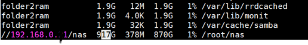

## 2022-11-20-라즈베리파이-나스마운트

## 목차

> 01.필수 설치
>
> 02.마운트 해보기
>
> 03.Auto Mounting 하기

## 01.필수 설치

```sh
apt-get install cifs-utils
apt-get install samba
```

- 사실 samba는 설치 안해되 될것 같긴함 

## 02.마운트 해보기

- 형식

  ```sh
  mount -t cifs -o user=아이디,pass=비밀번호,vers=1.0 //나스주소/공유폴더 /root/라즈베리파이원하는폴더위치
  ```

- 사용해보기

  - 아이디: admin
  - 비밀번호:admin
  - 나스주소:192.168.0.1
    - 공유폴더:nas
  - 라즈베리파이원하는폴더위치: nas

  ```sh
  mount -t cifs -o user=admin,pass=admin,vers=1.0 //192.168.0.1/nas /root/nas
  ```

  - 위와 같이 적용하면됨

## 03.Auto Mounting 하기

```sh
vim /etc/fstab
```

- 에디터 편집은 vi로 가능하고 nano로 가능하니 편한것 쓰면됨

  ```sh
  //192.168.0.1/nas /root/nas cifs uid=0,user=admin,password=admin,vers=1.0,noperm 0 0
  ```

  - 위의 내용을 입력해주기

```sh
mount /root/nas

mount -a
```

- 위와 같이하고 다시 재시작해준다.

```sh
df -h
```

- 이것을 했을떄

  

  - 위에 처럼 나오면 성공한것이다.

