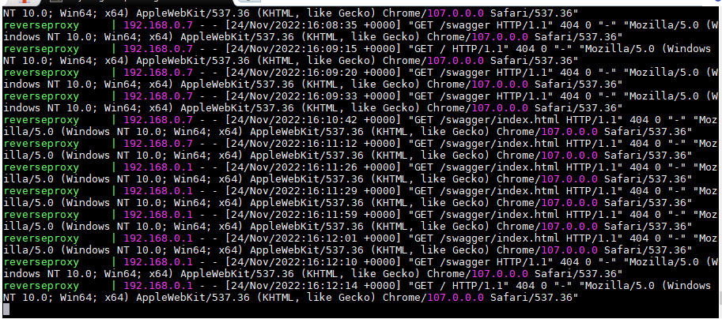

## 2022-11-24-Cs-.Net-ASP-Nginx배포-적용기

## 목차

## 01.ASP Dockerfile

```dockerfile
#See https://aka.ms/containerfastmode to understand how Visual Studio uses this Dockerfile to build your images for faster debugging.

FROM mcr.microsoft.com/dotnet/aspnet:6.0 AS base
WORKDIR /app
EXPOSE 80 # 웹 포트 노출
EXPOSE 443 # 웹 SSL 포트 노출

FROM mcr.microsoft.com/dotnet/sdk:6.0 AS build
WORKDIR /src
COPY ["ASP/ASP.csproj", "ASP/"]
RUN dotnet restore "ASP/ASP.csproj"
COPY . .
WORKDIR "/src/ASP"
RUN dotnet build "ASP.csproj" -c Release -o /app/build

FROM build AS publish
RUN dotnet publish "ASP.csproj" -c Release -o /app/publish /p:UseAppHost=false

FROM base AS final
WORKDIR /app
COPY --from=publish /app/publish .
ENTRYPOINT ["dotnet", "ASP.dll"]
```

```sh
docker build -f ./ASP/Dockerfile -t asp .
//위치는 ASP/ASP/Dockerfile있다면 ASP/에서 진행
```

## 02.Nginx-ASP.NET용 리버스 프록시

```yml
worker_processes 1;
events { worker_connections 1024; }
http {
    sendfile on;
    upstream randomproject {
        server asp:80; # the name of the docker container
    }
server {
        listen 80;
        server_name asp.com; # the domain
        location / {
            proxy_pass         http://randomproject;
            proxy_redirect     off;
            proxy_set_header   Host $host;
            proxy_set_header   X-Real-IP $remote_addr;
            proxy_set_header   X-Forwarded-For $proxy_add_x_forwarded_for;
            proxy_set_header   X-Forwarded-Host $server_name;
        }
    }
}
```

- dockerfile

  ```dockerfile
  FROM nginx:alpine 
  COPY nginx.conf /etc/nginx/nginx.conf 
  ```

  ```sh
  docker build -t reverseproxy .
  ```

## 03.docker-compose 파일 구성

```yml
version: '3.1'
services:
    reverseproxy:
        image: reverseproxy
        container_name: reverseproxy
        ports:
          - 80:80
          - 443:443
        restart: always
    
    postgres:
        image: postgres:12
        container_name: postgres
        environment:
          POSTGRES_USER: postgres     # define credentials
          POSTGRES_PASSWORD: rud123 # define credentials
          POSTGRES_DB: postgres       # define database
        ports:
           - 8432:5432
        volumes:
           - ./docker/volumes/postgres/_data:/var/lib/postgresql/data
        
    randomproject:
        depends_on:
           - reverseproxy
        image: asp
        container_name: asp
        restart: always
        volumes:
          - ./srv/asp:/app/App_Data
```


