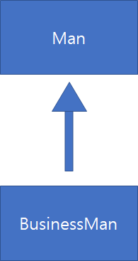

## 2022-05-24-자바-상속이란

## 목차

>
>01.상속이란
>
>>  01.1 상속 명칭
>
> 02.상속시 제대로 생성자쓰기
>
>>  02.1 생성자를 통한 초기화 원칙이 어긋난 경우
>
> 03.생성자 호출 관계 파악하기
>
>>  03.1 상위 클래스의 생성자 호출 지정
>
> 04.그래서 제대로된 생성자 정의는?
>
> 05.클래스 변수와 클래스 메소드의 상속?

## 01.상속이란

- 상속의 기본 문법 이해
- 상속에서는 생성자의 정의가 중요하다.
- 상속은 코드 재활용을 위한 문법이 아니다.
  - 연관된 일련의 클래스들에 대한 공통적인 규약을 정의할 수 있음
- 사실상 code는 다시 구현하는 것이 안전하고 빠르지만 컴포넌트로 만들어서 하는 방법이라면 재활용이 가능하다.
- 상속을 사용하는 이유는 각각의 클래스가 있다고 했을 때,
  - 클래스가 각 각 다르면 규약이 다를 수 밖에 없음 하지만 상속을 하면 규약을 같게 할 수 있음

```java
class Man{
    String name;
    public void tellYourName(){
		System.out.println("My name is " + name);
    }
}

class BusinessMan extends Man{
    String company;
    String position;
    public void tellYourInfo(){
		System.out.println("My company is " + company);
        System.out.println("My position is " + position);
        tellYourName();
    }
}
```



- UML 표시

```java
class Man{
    String name;
    
    public Man(String name){
		this.name = name;
    }
    
    public void tellYourName(){
		System.out.println("My name is " + name);
    }
}

class BusinessMan extends Man{
    String company;
    String position;
    
    public BusinessMan(String company, String position){
        this.company = company;
        this.position = position;
    }
    
    public void tellYourInfo(){
		System.out.println("My company is " + company);
        System.out.println("My position is " + position);
        tellYourName();
    }
}
```

- 위와 같이 생성자를 만들면 man은 초기화 되지 않는다.

### 01.1 상속 명칭

- 상위 클래스 , 기초 클래스, 부모 클래스
- 하위 클래스, 유도 클래스, 자식 클래스
  - 대개 상위라고 하면 하위,
    - 기초라고 하면 유도
      - 부모라가 하면 자식 이라고 쓰임

## 02.상속시 제대로 생성자쓰기

### 02.1 생성자를 통한 초기화 원칙이 어긋난 경우

- before

  ```java
  class Man{
      String name;
      
      public Man(String name){
  		this.name = name;
      }
      
      public void tellYourName(){
  		System.out.println("My name is " + name);
      }
  }
  
  class BusinessMan extends Man{
      String company;
      String position;
      
      public BusinessMan(String company, String position){
          this.company = company;
          this.position = position;
      }
      
      public void tellYourInfo(){
  		System.out.println("My company is " + company);
          System.out.println("My position is " + position);
          tellYourName();
      }
  }
  ```

- after

  ```java
  class Man{
      String name;
      
      public Man(String name){
  		this.name = name;
      }
      
      public void tellYourName(){
  		System.out.println("My name is " + name);
      }
  }
  
  class BusinessMan extends Man{
      String company;
      String position;
      
      public BusinessMan(String name, String company, String position){
          this.name = name;
          this.company = company;
          this.position = position;
      }
      
      public void tellYourInfo(){
  		System.out.println("My company is " + company);
          System.out.println("My position is " + position);
          tellYourName();
      }
  }
  ```

  - man 클래스에 있는 것의 name은 원칙상 man 클래스에서 진행해야함
  - 위의 경우 동작하기 위한 코드이고 좋은 코드라고 할 수는 없음

## 03.생성자 호출 관계 파악하기

```java
class SuperCLS{
    public SuperCLS(){
		System.out.println("I'm Super class");
    }
}

class SubCLS extends SuperCLS{
    public SubCLS(){
        //1
        System.out.println("I'm Sub class");
    }
}

class SuperSubCon{
    public static void main(String[] args){
        new SubCLS();
    }
}


/*
I'm Super class
I'm Sub class
*/
```

- 위와 같이 나온다.
- //1 위치에 호출할 상위 클래스의 생성자를 명시하지 않으면 void 생성자 호출 됨
  - super(); 이것이 컴파일러가 알아서 생성해서 실행함

### 03.1 상위 클래스의 생성자 호출 지정

```java
class SuperCLS{
    public SuperCLS(){
        System.out.println("...");
    }
    
    public SuperCLS(int i){
		System.out.println("...");
    }
    
    public SuperCLS(int i, int j){
		System.out.println("...");
    }
}


Class SubCLS extends SuperCS{
    public SubCLS(){
		System.out.println("...");
    }
    
    
    public SubCLS(int i){
        super(i);
		System.out.println("...");
    }
    
    
    public SubCLS(int i int j){
        super(i,j);
		System.out.println("...");
    }
}
```

- 위와 같이 super를 통해 상위 클래스의 생성자 호출을 명시할 수 있음

## 04.그래서 제대로된 생성자 정의는?

```java
class Man{
    String name;
    
    public Man(String name){
		this.name = name;
    }
    
    public void tellYourName(){
		System.out.println("My name is " + name);
    }
}

class BusinessMan extends Man{
    String company;
    String position;
    
    public BusinessMan(String company, String position){
        super(name);
        this.company = company;
        this.position = position;
    }
    
    public void tellYourInfo(){
		System.out.println("My company is " + company);
        System.out.println("My position is " + position);
        tellYourName();
    }
}
```

- 그리고 상속은 다중 상속을 지원하지 않는다.

## 05.클래스 변수와 클래스 메소드의 상속?

- 결론만 말하자면 부모의 집에 어떤 사람이 세를 내고 사는데 자식이 그 집을 상속 받았다고 해서 세를 내고 사는 사람들의 짐이 자기것이 아니다라고 생각하면 이해하기 쉬움
  - 즉, static 변수, 메소드가 들어있다고 해도 상속 아니다.
    - 자식과 관계없음
    - 부모꺼가 아니라 상속이 안됨

```java
class SuperCLS{
    static int count = 0;//클래스 변수
    
    public SuperCLS(){
		count++;
    }
}

class SubCLS extends SuperCLS{
    public void showCount(){
		System.out.println(count);
    }
}
```

- 위를 보면 SuperCLS를 상속 받은 SubCLS에서 count를 그냥 사용하는데
  - 이때 접근수준 지시자가 허용하는 범위라면 상속은 아니지만 클래스 변수나 메소드의 권한은 가지게 됨
    - 그래서 위의 경우처럼 직접 접근이 허용되는 것이다.