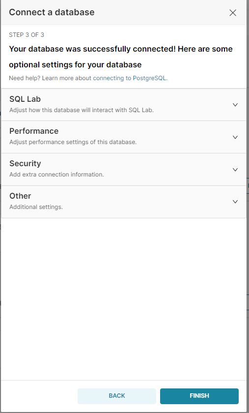
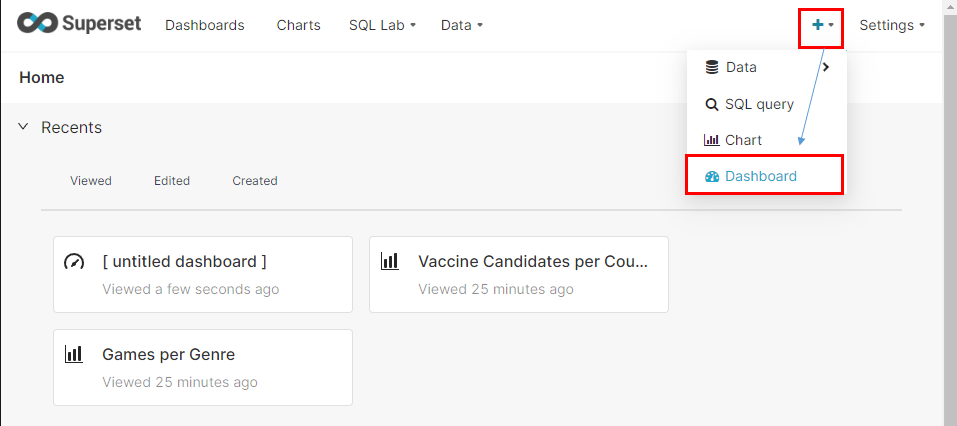

## 2022-05-11-Superset-설치-및-테스트

### 1.완료조건(주요 결과)

- Superset을 이용하여 대시보드를 작성한다.

### 2.상세내용

- 목적 : Superset설치와 대시보드를 작성해 본다.
- 목표
  -  Superset 설치를 진행하고 DB와 연결하여 그래프를 자유롭게 그려본다.

#### 3.참고

- [Superset 시작하기](https://guide.ncloud-docs.com/docs/das-das-0-2)
- [오픈소스 시각화 툴 Superset 설치하기](https://inkkim.github.io/bi/%EC%98%A4%ED%94%88%EC%86%8C%EC%8A%A4-%EC%8B%9C%EA%B0%81%ED%99%94-%ED%88%B4-Superset-%EC%84%A4%EC%B9%98%ED%95%98%EA%B8%B0/)

### 4.과정

## 목차

>01.Superset이란?
>
>02.Superset 설치
>
>03.Superset 로그인
>
>04.데이터링크 연결 (DB)
>
>>04.1 DataSet 생성
>
>05.대시보드만들기
>
>06.커스텀한 쿼리를 이용하여 대시보드 작성하기
>
>>06.1 SQL Lab에서 Data set 만들기
>>
>>06.2 대시보드 비슷하게 작성 해보기
>
>07.결론


## 01.Superset이란?

- Airbnb에서 개발해서 오픈소스로 공개한 Apache Incubator 프로젝트라고 함

- Superset은 Apache 오픈 소스 웹 기반의 데이터 시각화 BI툴 
- 업로드한 excel파일이나 PostgreSQL DB에 저장한 데이터를 이용해서 쉽게 시각화 대시보드를 작성할 수 있음
- 다수 상용 RDBMS와 호환
  - Amazon Redshift, Google BigQuery, Snowflake, Presto
  - Oracle, PostgreSQL, MySQL, MariaDB, SQL Server, IBM DB2
  - SQLite, Sysbase, Vertica, Druid, Greenplum

## 02.Superset 설치

- 도커를 이용해서 설치를 진행해보자.

- Superset git 설치 사이트 : [`링크클릭`](https://github.com/apache/superset)

  ```sh
  mkdir superset
  git clone https://github.com/apache/incubator-superset.git
  cd incubator-superset
  docker-compose up -d
  ```

  - 일단 위와 같이 진행하게되면 이미 완성된 docker-compose.yml이 있기때문에 사이트가 올라감
  - http://localhost:8088 
    - 위를 입력해서 들어가보자

## 03.Superset 로그인


- username: admin
- password: admin
  - 위에 까지 하면 접속은 완료됨

## 04.데이터링크 연결 (DB)

- DB연결
  - UserName : superset
  - PassWord : superset
  - DbName : superset


- Superset의 오른쪽 위쪽 상단에 + 아이콘 클릭 -> Data 클릭 -> Connect database 클릭


- PostgreSQL 클릭


- 데이터 베이스 정보에 맞게 입력 하고 connect 클릭



- 우선  finish 클릭

### 04.1 DataSet 생성


- Data -> Datasets클릭


- schema를 public, information_schema를 선택할 수 있고 거기에 see table schema를 지정해주고 add를 해준다.


- 위가 만들어진 상태이다.

## 05.대시보드만들기



- +아이콘 클릭 Dashboard 클릭


-  CREATE A NEW CHART 클릭


- 위와 같은  화면이 나오게됨 여기서 순서대로 진행


- 위에서 만든 DATASET 클릭 후 원하는 그래프 클릭 후 CREATE NEW CHART 클릭


- Query -> Metrics -> Custom Sql


- 위와 같이 설정을 하게 되면 저렇게 쿼리를 생성해서 결과를 산출함

## 06.커스텀한 쿼리를 이용하여 대시보드 작성하기

- 우선 위에 처럼 하게되면 테이블을 한개만 사용할 수 밖에 없음 
  - 그렇게되는 경우가 한개의 테이블을 이용하여 그래프를 그리는 경우는 상관없으나
    - 두개 이상의 테이블을 이용해서 그래프를 그려야하는 경우는 안됨

### 06.1 SQL Lab에서 Data set 만들기

- 이전 그라파나에 있던 쿼리문

  ```sql
  select m.time, m.status, count(m.status) as " "
  from (select s.time, s.status
  		from milestone m,milestone_daily_status s 
  		where 1=1
  			and m.id = s.milestone_id
  			and to_date(m.start_date,'yyyy-mm-dd') <= s.time and s.time <= to_date(m.end_date,'yyyy-mm-dd')
  			and m.team in ($team)
  			and m.project in ($project)
  			and m.project_code in ($project_code)
  			and s.status in ($status)
  			and m.category in ($category)
  			and (
  				$__timeFrom() <= m.start_date and m.end_date <= $__timeTo()
  				or $__timeFrom() <= m.start_date and m.start_date <= $__timeTo()
  				or $__timeFrom() <= m.end_date and m.end_date <= $__timeTo()
  				or ((m.start_date <= $__timeFrom() and  $__timeFrom()  <= m.end_date) and (m.start_date <= $__timeTo() and  $__timeTo()  <= m.end_date)))
  ) m
  group by m.time, m.status
  order by m.time;
  ```

  

- SQL Lab

  

  - 위와 같이 우선 variable부분 을 제외하고 쿼리문 Run 한 결과

  - Save As 클릭을 하면 아래와 같이 나옴


- 원하는 이름으로 지정해주고 save 클릭


- Explore를 클릭 후 이름 지정한뒤에 save explore 클릭해주면 Data set으로 저장이되고 아래와 같은 화면으로 전환


## 06.2 대시보드 비슷하게 작성 해보기


- view chart in Explore로 수정 가능


- 위와 같이 수정 하면 결과를 얻을 수 있음

## 07.결론

- 아직은 쿼리문 자체를 어떻게 적용을 할지 감이 잡히지는 않음
- 그리고 tiem series그래프 같은 시간을 적용하는 그래프를 그릴때  Metrics부분 자체가 무엇을 위한것인지 모르겠고 
- 나머지 기능을 어떻게 해야지 원하는 결과를 얻을수 있는지에 대해서는 추후 테스트가 필요함


