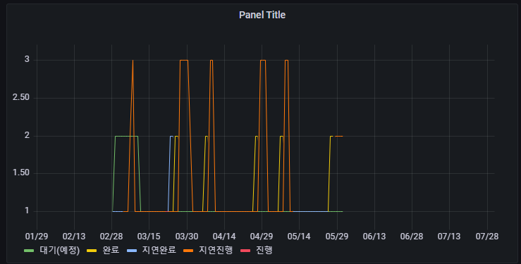
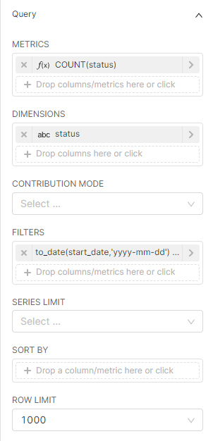
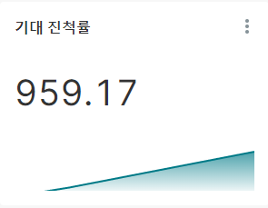
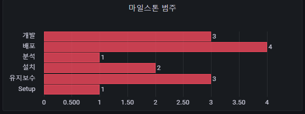

## 2022-05-12-grafana그래프-superset으로-적용해보기

## 목차

>목차
>
>00.장단점 | 그라파나와 비교시 
>
>>00.1 장점
>
>00.2 단점
>
>01.일별 마일스톤 개수 (상태)
>
>>01.1 Grafana
>>
>>01.2  Superset
>
>02.기대 진척률
>
>>02.1 Grafana
>>
>>02.2 Superset
>
>03.마일스톤 개수
>
>>03.1 Grafana
>>
>>03.2 Superset
>
>04.마일스톤 범주
>
>>04.1 Grafana
>>
>>04.2 Superset
>
>05.마일스톤 기간 요약
>
>>05.1 Grafana
>>
>>05.2 Superset
>
>06.최신마일스톤 데이터 테이블
>
>>06.1 Grafana
>>
>>06.2 Superset 
>
>07.필터 세그먼트 적용해보기
>
>>07.1 필터 적용시 대시보드

## 00.장단점 | 그라파나와 비교시 

### 00.1 장점

- 쿼리를 필요한 컬럼을 뽑아내는 용도로 쓰기 위하여 간단하게 구성하게됨

- 그래프에 결과에 따른 쿼리가 따로 생성이됨

- 그라파나와 비교하여 쿼리 결과의 컬럼을 필요한 부분을 가져다 쓰는 방식이 초보자들에게 쉬움

  

- 그래프자체가 이쁘고 보기가 좋음

- 테이블에 음영으로 양이 표시가되는 기능이 있음

  

- 그라파나 의 variable을 지정하면 변수로 넣지 않고 필터 박스로 그냥 필터를 적용하는 수월함

- 완성된 그래프의 쿼리를 볼 수 있음

  

## 00.2 단점

- 쿼리문 자체로 사용하는것이 안되고 쿼리의 컬럼으로 다시 그래프를 그려야하는점

  - 위의 경우는 두개이상의 테이블을 사용하는 경우 

  - 같은 대시보드에서 같은 차트를 복제하는것이 안됨
  - 개별적으로 그래프의 색을 지정할 수 없음
    - 1번은  빨강, 2번은 파랑 사용자가 지정하고 싶은경우 안됨 자동으로 색이 적용되는 점
  - 그라파나에 있는 시간 범위를 적용하는 것이 기본적으로 적용 되어있지 않음
    - 따로 필터박스를 생성해서 타임필터를 적용해야함

 ## 01.일별 마일스톤 개수 (상태)

### 01.1 Grafana

- variable의 경우 superset에서 적용하는것을 몰라서 빼고 진행



```sql
select m.time, m.status, count(m.status) as " "
from (select s.time, s.status
		from milestone m,milestone_daily_status s 
		where 1=1
			and m.id = s.milestone_id
			and to_date(m.start_date,'yyyy-mm-dd') <= s.time and s.time <= to_date(m.end_date,'yyyy-mm-dd')
		-- 	and m.team in ($team)
		-- 	and m.project in ($project)
		-- 	and m.project_code in ($project_code)
		-- 	and s.status in ($status)
		-- 	and m.category in ($category)
		-- 	and (
		-- 		$__timeFrom() <= m.start_date and m.end_date <= $__timeTo()
		-- 		or $__timeFrom() <= m.start_date and m.start_date <= $__timeTo()
		-- 		or $__timeFrom() <= m.end_date and m.end_date <= $__timeTo()
		-- 		or ((m.start_date <= $__timeFrom() and  $__timeFrom()  <= m.end_date) and (m.start_date <= $__timeTo() and  $__timeTo()  <= m.end_date)))
) m
group by m.time, m.status
order by m.time;
```

### 01.2  Superset


```sql
SELECT DATE_TRUNC('day', recent_time1) AS __timestamp,
       status AS status,
       count(status) AS "COUNT(status)"
FROM
  (select id,
          title,
          m.time as recent_time,
          team,
          project,
          project_code,
          category,
          start_date,
          end_date,
          days,
          s.time as recent_time1,
          milestone_id,
          percent_actual,
          percent_expectecd,
          percent_gap,
          opened,
          closed,
          total,
          opened_today,
          closed_today,
          total_today,
          status
   from milestone m,
        milestone_daily_status s
   where m.id = s.milestone_id) AS virtual_table
WHERE ((to_date(start_date, 'yyyy-mm-dd') <= recent_time1
        and recent_time1 <= to_date(end_date, 'yyyy-mm-dd')))
GROUP BY status,
         DATE_TRUNC('day', recent_time1)
ORDER BY "COUNT(status)" DESC
LIMIT 1000;
```

- Superset 설정

  - 기본 Data set 쿼리

    ```sql
    select 
    		  id,
              title,
              m.time as recent_time,
              team,
              project,
              project_code,
              category,
              start_date,
              end_date,
              days,
              s.time as recent_time1,
              milestone_id,
              percent_actual,
              percent_expectecd,
              percent_gap,
              opened,
              closed,
              total,
              opened_today,
              closed_today,
              total_today,
              status
       from milestone m,
            milestone_daily_status s
       where m.id = s.milestone_id
    ```

  - Time

    

  - Query

    

## 02.기대 진척률

### 02.1 Grafana


```sql
select 
	s.time as time,
	AVG(s.percent_expectecd) as "기대 진척률"
from milestone m  join milestone_daily_status s on s.milestone_id = m.id
where 1 = 1
	and m.id = s.milestone_id
-- 	and m.team in ($team)
-- 	and m.project in ($project)
-- 	and m.project_code in ($project_code)
-- 	and m.category in ($category)
-- 	and s.status in ($status)
-- 	and (
-- 		$__timeFrom() <= m.start_date and m.end_date <= $__timeTo()
-- 		or $__timeFrom() <= m.start_date and m.start_date <= $__timeTo()
-- 		or $__timeFrom() <= m.end_date and m.end_date <= $__timeTo()
-- 		or ((m.start_date <= $__timeFrom() and  $__timeFrom()  <= m.end_date) and (m.start_date <= $__timeTo() and  $__timeTo()  <= m.end_date)))
group by s.time
order by time asc
```

### 02.2 Superset



``` sql
SELECT DATE_TRUNC('day', recent_time1) AS __timestamp,
       AVG(percent_expectecd) AS "AVG(percent_expectecd)"
FROM
  (select id,
          title,
          m.time as recent_time,
          team,
          project,
          project_code,
          category,
          start_date,
          end_date,
          days,
          s.time as recent_time1,
          milestone_id,
          percent_actual,
          percent_expectecd,
          percent_gap,
          opened,
          closed,
          total,
          opened_today,
          closed_today,
          total_today,
          status
   from milestone m,
        milestone_daily_status s
   where m.id = s.milestone_id) AS virtual_table
WHERE ((start_date is not null
        and end_date is not null))
GROUP BY DATE_TRUNC('day', recent_time1)
LIMIT 50000;
```

- Time

  

- Query

  

## 03.마일스톤 개수

### 03.1 Grafana


``` sql
select count(*)
from milestone m
where 1=1
-- 	and m.team in ($team)
-- 	and m.project in ($project)
-- 	and m.project_code in ($project_code)
-- 	and m.category in ($category)
-- 	and (
-- 		   $__timeFrom()at time zone 'kst' + time '01:00:00' <= to_timestamp(m.start_date, 'YYYY-MM-DD HH24:MI:SS') and to_timestamp(m.end_date, 'YYYY-MM-DD HH24:MI:SS') <= $__timeTo()
-- 		or $__timeFrom()at time zone 'kst' + time '01:00:00' <= to_timestamp(m.start_date, 'YYYY-MM-DD HH24:MI:SS') and to_timestamp(m.start_date, 'YYYY-MM-DD HH24:MI:SS') <= $__timeTo()
-- 		or $__timeFrom()at time zone 'kst' + time '01:00:00' <= to_timestamp(m.end_date, 'YYYY-MM-DD HH24:MI:SS') and to_timestamp(m.end_date, 'YYYY-MM-DD HH24:MI:SS') <= $__timeTo()
-- 		or ((to_timestamp(m.start_date, 'YYYY-MM-DD HH24:MI:SS') <= $__timeFrom() and  $__timeFrom()at time zone 'kst' + time '01:00:00'  <= to_timestamp(m.end_date, 'YYYY-MM-DD HH24:MI:SS')) and (to_timestamp(m.start_date, 'YYYY-MM-DD HH24:MI:SS') <= $__timeTo() and  $__timeTo()  <= to_timestamp(m.end_date, 'YYYY-MM-DD HH24:MI:SS'))))
	and m.start_date is not null and m.end_date is not null
;
```

### 03.2 Superset


```sql
SELECT COUNT(*) AS count
FROM public.milestone
WHERE (((start_date is not null
         and end_date is not null)))
LIMIT 50000;
```

- Time

  

- Query

  

## 04.마일스톤 범주

### 04.1 Grafana



```sql
select m.category, count(*)
from milestone m
	where 1=1
		and m.team in ($team)
		and m.project in ($project)
		and m.project_code in ($project_code)
		and m.category in ($category)
		and m.start_date is null or m.end_date is null
group by m.category;
```

### 04.2 Superset


```sql
SELECT category AS category,
       COUNT(*) AS count
FROM public.milestone
WHERE ((start_date is null
        or end_date is null))
GROUP BY category
ORDER BY count DESC
LIMIT 10000;
```


## 05.마일스톤 기간 요약

### 05.1 Grafana


```sql
select 
	m.team as "팀"
	, m.project as "프로젝트"
	, count(*) as "총 건수"
	, sum(m.days) as "총 기간"
	, min(m.days) as "최소 기간"
	, max(m.days) as "최대 기간"
	, avg(m.days) as "평균 기간"
from milestone m
where 1=1
--	and m.team in ($team)
--	and m.project in ($project)
--	and m.project_code in ($project_code)
--	and m.category in ($category)
--	and (
--		$__timeFrom()at time zone 'kst' + time '01:00:00' <= to_timestamp(m.start_date, 'YYYY-MM-DD HH24:MI:SS') and to_timestamp(m.end_date, 'YYYY-MM-DD HH24:MI:SS') <= $__timeTo()
--		or $__timeFrom()at time zone 'kst' + time '01:00:00' <= to_timestamp(m.start_date, 'YYYY-MM-DD HH24:MI:SS') and to_timestamp(m.start_date, 'YYYY-MM-DD HH24:MI:SS') <= $__timeTo()
--		or $__timeFrom()at time zone 'kst' + time '01:00:00' <= to_timestamp(m.end_date, 'YYYY-MM-DD HH24:MI:SS') and to_timestamp(m.end_date, 'YYYY-MM-DD HH24:MI:SS') <= $__timeTo()
--		or ((to_timestamp(m.start_date, 'YYYY-MM-DD HH24:MI:SS') <= $__timeFrom() and  $__timeFrom()at time zone 'kst' + time '01:00:00'  <= to_timestamp(m.end_date, 'YYYY-MM-DD HH24:MI:SS')) and (to_timestamp(m.start_date, 'YYYY-MM-DD HH24:MI:SS') <= $__timeTo() and  $__timeTo()  <= to_timestamp(m.end_date, 'YYYY-MM-DD HH24:MI:SS'))))
	and m.start_date is not null and m.end_date is not null		
group by m.team, m.project
order by m.project
;
```

### 05.2 Superset


```sql
SELECT project AS project,
       team AS team,
       count(*) AS "count(*)",
       sum(days) AS "sum(days)",
       min(days) AS "min(days)",
       max(days) AS "max(days)",
       avg(days) AS "avg(days)"
FROM public.milestone
WHERE ((start_date is not null
        and end_date is not null))
GROUP BY project,
         team
ORDER BY "count(*)
" DESC
LIMIT 10000;
```


## 06.최신마일스톤 데이터 테이블

### 06.1 Grafana


```sql
select 
    t.url
	, m.team as "팀"
	, m.project as "프로젝트"
	, avg(s.percent_expectecd) as "기대 진척률"
	, avg(s.percent_gap) as "차이"	
	, avg(s.percent_actual) as "현재 진척률"
	, sum(s.total) as "액션아이템"
	, sum(s.opened) as "Opened 액션아이템"
	, sum(s.closed) as "Closed 액션아이템"
from milestone m, milestone_daily_status s, team t
where 1 = 1
	and m.url = s.milestone_id
	and m.team = t.title
-- 	and m.team in ($team)
-- 	and m.project in ($project)
-- 	and m.project_code in ($project_code)
-- 	and m.category in ($category)
-- 	and (
-- 		$__timeFrom() <= m.start_date and m.end_date <= $__timeTo()
-- 		or $__timeFrom() <= m.start_date and m.start_date <= $__timeTo()
-- 		or $__timeFrom() <= m.end_date and m.end_date <= $__timeTo()
-- 		or ((m.start_date <= $__timeFrom() and  $__timeFrom()  <= m.end_date) and (m.start_date <= $__timeTo() and  $__timeTo()  <= m.end_date)))
	and m.start_date is not null and m.end_date is not null
group by s.time, t.url, m.team, m.project
order by m.project 
;
```

### 06.2 Superset


```sql
SELECT url AS url,
       team AS team,
       project AS project,
       percent_expectecd AS percent_expectecd,
       percent_gap AS percent_gap,
       percent_actual AS percent_actual,
       total AS total,
       opened AS opened,
       closed AS closed
FROM
  (select t.url,
          m.create_time as recent_time,
          team,
          project,
          project_code,
          category,
          start_date,
          end_date,
          days,
          s.time as recent_time1,
          s.milestone_id,
          percent_actual,
          percent_expectecd,
          percent_gap,
          opened,
          closed,
          total,
          opened_today,
          closed_today,
          total_today
   from milestone m,
        milestone_daily_status s,
        team t
   where 1=1
     and m.url = s.milestone_id
     and m.team = t.title) AS virtual_table
WHERE ((start_date is not null
        and end_date is not null))
ORDER BY project ASC
LIMIT 1000;
```

- 일반 테이블에서는 링크를 걸거나 그라파나 처럼 lcd 게이지를 적용할 수 없음


- ### 대신 자체적으로 저렇게 음영으로 처리가 됨 

## 07.필터 세그먼트 적용해보기


- 위와 같이 만들면 알아서 필터가 적용이 됨

  - 적용 한 것

    

### 07.1 필터 적용시 대시보드

- before

  

- after

    