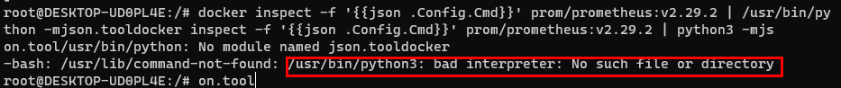
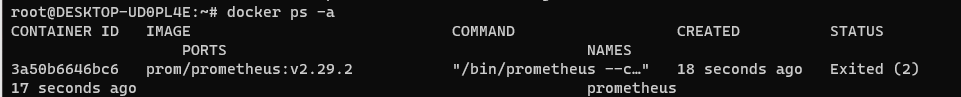

## 2022-06-22-[Prometheus]Docker를-이용하여-Prometheus설치하기

## 목차

>01.도커란?
>
>02.Prometheus 설치 옵션
>
>03.실습
>
>>03.1 폴더 생성
>>
>>03.2 prometheus.yml 생성
>>
>>03.3 기본 형식 확인하기
>
>04.옵션을 추가하여 Prometheus실행하기
>
>05.Management API
>
>>05.1 Health check
>>
>>05.2 Ready 체크
>>
>>05.3 --web.enable-lifecycle 설정
>
>06.재시작하지 않고 설정 변경하기
>
>07.retention 타입
>
>>07.1 retention 설정하기
>
>08.Log Level
>
>>08.1 log level 설정

## 01.도커란?

- 컨테이너 기반의 가상화 툴
- 개발환경이 안맞아도 손쉽게 배포 가능
- 호스트 시스템의 커널 사용
  - 기타 바이너리와 라이브러리 등은 이미지를 통해 가상화 가능

### 01.1 명령어

- **docker run**
  - 새로운 컨테이너에서 해당 명령어 실행
    - 옵션
      - `-d, --detach`: 백그라운드에서 컨테이너 실행 및 컨테이너 ID 출력
      - `--name`: 컨테이너 이름 할당
      - `--network`: 컨테이너 네트워크에 연결
      - `-v, --volume`: 컨테이너 볼륨을 호스트 볼륨에 바인딩
- **docker ps**
  - 컨테이너 목록 출력
  - `-a, --all`: ALL 옵션을 주지 않을 시, 실행중인  컨테이너만 출력
- **docker logs**
  - 컨테이너 로그 출력
    - 옵션
      - `-f, --follow`: 컨테이너 로그 추적
- **docker restart**
  - 하나 이상의 컨테이너 재시작
- **docker rm**
  - 하나 이상의 컨테이너 제거
    - 옵션
      - `-f, --force`: 실행중인 컨테이너 강제 제거

## 02.Prometheus 설치 옵션

- `--config.file`: 설정 파일 경로 설정
- `--storage.tsdb.path`: 메트릭 저장소 경로
- `--web.enable-lifecycle`: HTTP통신을 통한 Prometheus reload 및 shutdown 활성화
- `--storage.tsdb.retention.time`: 얼마나 오랫동안 데이터를 유지 할지
- `--log.level`: 지정된 단계 이상으로 로그를 보임 [debug, info, warn, error], 기본값 info

## 03.실습

### 03.1 폴더 생성

```sh
mkdir -p /prometheus/config /prometheus/data
```

- 위와 같이하면 prometheus의 폴더에 config와 data 폴더가 생성됨

### 03.2 prometheus.yml 생성

- 파일 생성

  ```sh
  vim /prometheus/config/prometheus.yml
  ```

- prometheus.yml 파일 

  ```yml
  scrape_configs: 			# 수집대상에 대한 설정
    - job_name: 'prometheus'  # job 이름
      scrape_interval: 3s	    # 수집 간격
      scrape_timeout: 1s      # 수집 안되는 경우 타임 아웃
      static_configs:         # 대상에 대한 설정
      - targets:
        - localhost:9090
  ```

### 03.3 기본 형식 확인하기

- --rm 옵션, 컨테이너 종료시 삭제됨

  ```sh
  docker run --rm --name prometheus prom/prometheus:v2.29.2
  ```

  

  - 우선 위와 같이 하는경우 실행된것

- 컨테이너 내부에서 실행하는 사용자 아이디 확인

  ```sh
  docker exec -it prometheus sh
  ```

  

- 권한 문제가 안생기게 저걸로 맞춰야함

- 기본 옵션 확인

  ```sh
  docker inspect -f '{{json .Config.Cmd}}' prom/prometheus:v2.29.2 | python3 -mjson.tool
  ```

  - 위의 명령어가 실행이 안된다면

    - python3가 없는것 이므로 설치를 진행한다.

      ```sh
      sudo update-alternatives --install /usr/bin/python python /usr/bin/python3.6 2
      ```

  - 설치하고도 안된다면 

    

    ```sh
    docker inspect -f '{{json .Config.Cmd}}' prom/prometheus:v2.29.2 | python -mjson.tool
    ```

    

    - 위와 같이 옵션이 확인이 된다.

## 04.옵션을 추가하여 Prometheus실행하기

```sh
docker run \
-d --name=prometheus \
--net=host \
-v /prometheus/config:/etc/prometheus \
-v /prometheus/data:/data \
prom/prometheus:v2.29.2 \
--config.file=/etc/prometheus/prometheus.yml \
--storage.tsdb.path=/data
```


- 컨테이너 확인

  

  - 바로 죽어버리는데 이것이 권한 문제로 인한것임

  ```sh
  docker logs -f prometheus
  ```

  

  - permission denied 문제로 종료됨

  ```sh
  docker logs -f prometheus 2>&1 | grep permission
  ```

  

- 문제 해결하기

  ```sh
  chown -R 65534:65534 /prometheus
  docker restart prometheus
  ```

  

  - 권한 설정해주고 다시 재시작해주면 됨

  

  - 제대로 컨테이너가 있는것이 확인됨

## 05.Management API

- 문제발생

  - before

    ```sh
    docker run \
    -d --name=prometheus \
    --net=host \
    -v /prometheus/config:/etc/prometheus \
    -v /prometheus/data:/data \
    prom/prometheus:v2.29.2 \
    --config.file=/etc/prometheus/prometheus.yml \
    --storage.tsdb.path=/data
    ```

  - after

    ```sh
    docker run \
    -d --name=prometheus \
    -p 9090:9090 \
    -v /prometheus/config:/etc/prometheus \
    -v /prometheus/data:/data \
    prom/prometheus:v2.29.2 \
    --config.file=/etc/prometheus/prometheus.yml \
    --storage.tsdb.path=/data
    ```

    - --net=host \ 제거
    - -p 9090:9090 \ 추가 
      - 그렇게 해야 이어서 하는 명령어 실행됨

### 05.1 Health check

```sh
curl localhost:9090/-/healthy -D /dev/stdout
```


### 05.2 Ready 체크

```sh
curl localhost:9090/-/ready -D /dev/stdout
```


### 05.3 --web.enable-lifecycle 설정

- 설정 안한 경우

  - reload

    ```sh
    curl localhost:9090/-/reload -XPOST -D /dev/stdout
    ```

    

    - 제대로 안되고 enable 하라고 나옴
  
  - quit 
  
    ```sh
    curl localhost:9090/-/quit -XPOST -D /dev/stdout
    ```
  
    
  
  - 해결하기
  
    ```sh
    docker rm -f prometheus
    
    docker run \
    -d --name=prometheus \
    -p 9090:9090 \
    -v /prometheus/config:/etc/prometheus \
    -v /prometheus/data:/data \
    prom/prometheus:v2.29.2 \
    --config.file=/etc/prometheus/prometheus.yml \
    --storage.tsdb.path=/data \
    --web.enable-lifecycle
    ```
  
- 설정한 경우

  - reload

    ```sh
    curl localhost:9090/-/reload -XPOST -D /dev/stdout
    ```

      

  - quit 

    ```sh
    curl localhost:9090/-/quit -XPOST -D /dev/stdout
    ```

    

    - 제대로 정상작동함이 보인다.

    - 이 경우 `docker ps -a`

      - prometheus가 종료된다.

      

## 06.재시작하지 않고 설정 변경하기

- [Prometheus 웹 실행](http://localhost:9090/)


- interval 변경해보기

  ```sh
  vim /prometheus/config/prometheus.yml
  ```

  

  - 3s -> 5s로 변경

  - reload 실행

    ```sh
    curl localhost:9090/-/reload -XPOST -D /dev/stdout
    ```

    

  - 웹사이트 다시 확인하기

    

    - 5초로 바뀐것을 확인 할 수 있음

## 07.retention 타입

```sh
docker logs -f prometheus 2>&1 | grep retention
```


- 기본 설정을 따로 하지 않으면 기본이 15일로 되어 있음

### 07.1 retention 설정하기

```sh
docker run \
-d --name=prometheus \
-p 9090:9090 \
-v /prometheus/config:/etc/prometheus \
-v /prometheus/data:/data \
prom/prometheus:v2.29.2 \
--config.file=/etc/prometheus/prometheus.yml \
--storage.tsdb.path=/data \
--web.enable-lifecycle \
--storage.tsdb.retention.time=20d

```


  - 위와 같이 20일이 설정됨
    - 20일간 최소한 보장하고 20일 딱 됬을때 지워지는것은 아니라고함

## 08.Log Level

- 기본은 info임

  - 세밀한 것을 보고 싶으면 debug로 설정하면됨

  

  

### 08.1 log level 설정

```sh
docker run \
-d --name=prometheus \
-p 9090:9090 \
-v /prometheus/config:/etc/prometheus \
-v /prometheus/data:/data \
prom/prometheus:v2.29.2 \
--config.file=/etc/prometheus/prometheus.yml \
--storage.tsdb.path=/data \
--web.enable-lifecycle \
--storage.tsdb.retention.time=20d \
--log.level=debug
```

- debug 확인

  ```sh
  docker logs -f prometheus 2>&1 | grep debug
  ```

  

  - 전체에서 확인해보기

    ```sh
    docker logs -f prometheus
    ```

    

    - 디버그도 나오는것이 확인됨
    - 위와 같이 설정을 할 수 있음