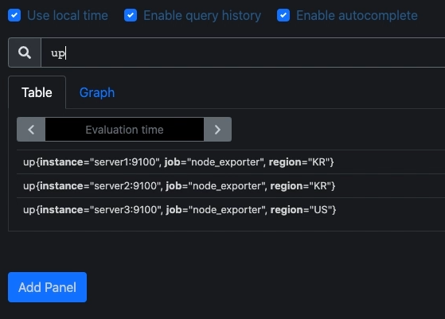

## 2022-06-22-[Prometheus]Prometheus란-무엇인가?

## 목차

>01.Prometheus 특징
>
>02.동작확인
>
>03.기능확인

## 01.Prometheus 특징

- 오픈소스 시스템
- 알람을 통해 문제를 알려줌

- 특징
  - 메트릭 이름과 키-값 쌍을 이뤄진 다차원 데이터 모델
    - `<메트릭 이름>{<라벨 이름>=<라벨 값>}<메트릭 값>`
  - 다차원 데이터 모델 활용을 위한 쿼리 언어
    - promQL
      - 실시간으로 시계열 데이터를 선택 및 가공
  - HTTP를 이용한 pull 방식 메트릭 수집
    - 장점
      - 브라우저를 통한 확인 가능
      - 고가용성을 위한 다수의 모니터링 용이
      - 모니터링 서버 변경 용이
    - 단점
      - 새로운 호스트 발생시 추가 필요
      - 모니터링 서버 부하

## 02.동작확인

- 강의에서는 up을 입력하고 들어오는 데이터 확인

  - 여기서 up은 메트릭 이름

    - 전체 메트릭스 데이터가 나옴

      

  - 일부의 조건으로만 검색하는 경우

    - up{region="KR"}

      - 위와 같이 검색도 할 수 있음

        

    - up == 0

      - 수집 되고 있지 않은것 확인

      - 이진연산자 사용할 수 있음

        

    - sum by(region) (up)

      - 수집 되고 있는 것 조회

        

## 03.기능확인

- 대상 호스트의 경로로 부터 데이터 받을 수 있음

- 메트릭 정보가 아래와 같이 수집이 됨을 브라우저로 확인

  

  - 이렇게 확인 가능한 것은 해당 서버에 exporter올려놨기 때문

