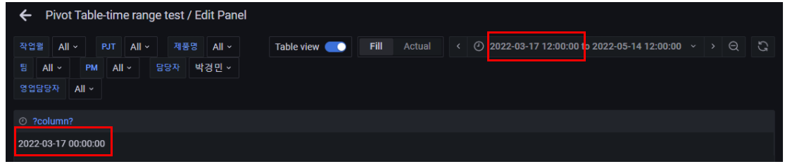
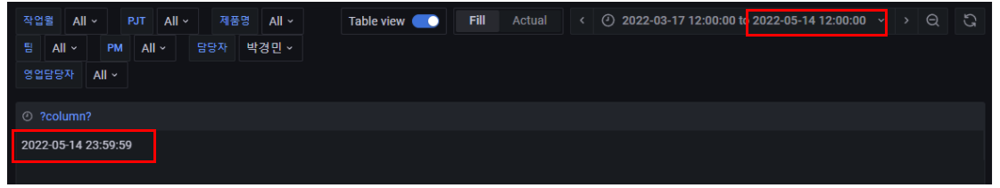

## grafana-시간데이터-활용하기

## 목차

>01.시간 범위 데이터에 대한 적용
>
>> 01.1 현재 문제점
>>
>> 01.2 해결방법

## 01.시간 범위 데이터에 대한 적용

### 01.1 현재 문제점

- 1년 단위를 무조건 고정해야함
  - 혹시나 작년기준으로 설정을 한 경우도 2022년도 데이터만 확인됨
- `$__timeTo()`, `$__timeFrom()`로 시간범위를 지정한경우 
  - 1월기준으로 두개의 데이터가 합쳐지는 현상이 발생, 기준에 따라 다르겠지만 그렇게 되면 데이터를 보기 힘들다고 판단

### 01.2 해결방법

- `$__timeTo()`를 기준으로 2021이라면 해당 년도의 데이터만 나올 수 있게 진행해서 2021은 2021의 데이터 범위만 볼 수 있게 조정

- `$__timeFrom()` 테스트

  ```sql
  -- 초기  (1월1일 00:00:00 인경우 12월31일로됨)
  select TO_TIMESTAMP(to_char($__timeFrom()::date, 'YYYY')||'-'||to_char($__timeFrom()::date, 'MM-DD')||' 00:00:00.000000', 'YYYY-MM-DD HH24:MI:SS.US')- interval'9' hour
  
  
  -- 개선 (정확히 그날짜 출력)
  select TO_TIMESTAMP(to_char($__timeFrom()at time zone 'kst', 'YYYY')||'-'||to_char($__timeFrom()at time zone 'kst', 'MM-DD')||' 00:00:00.000000', 'YYYY-MM-DD HH24:MI:SS.US')- interval'9' hour
  ```

  

- `$__timeTo()` 테스트

  ```sql
  select TO_TIMESTAMP(to_char($__timeFrom()::date, 'YYYY')||'-'||to_char($__timeTo()::date, 'MM-DD')||' 00:00:00.000000', 'YYYY-MM-DD HH24:MI:SS.US')+interval'14' hour+interval'59' minute+interval'59' second
  
  
  select TO_TIMESTAMP(to_char($__timeFrom()at time zone 'kst', 'YYYY')||'-'||to_char($__timeTo()at time zone 'kst', 'MM-DD')||' 00:00:00.000000', 'YYYY-MM-DD HH24:MI:SS.US')+interval'14' hour+interval'59' minute+interval'59' second
  ```

  

  - 시간은 to의 경우 00:00:00
    - from의 경우 23:59:59로 고정 