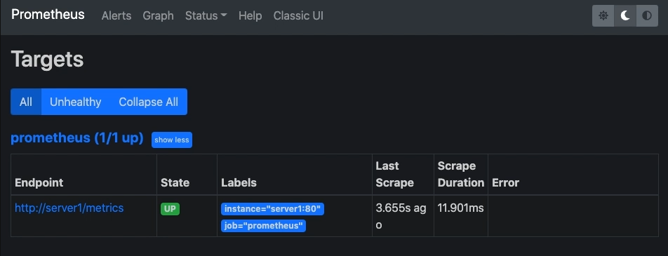

## 2022-06-23-[Prometheus]Prometheus설정-살펴보기

## 목차

>01.global
>
>02.alerting
>
>03.rule_files
>
>04.scrape_configs
>
>05.follow_redirects 실습

## 01.global

- 전역에서 사용하는것
  - 세부 설정 안되어 있으면 전체설정에 맞게 적용됨

```yml
global:
  scrape_interval: 15s
  scrape_timeout: 10s
  evaluation_interval: 15s
```

- global: 전역으로 사용되는 설정 값
  - scrape_interval: 메트릭 수집 주기 (1m)
  - scrape_timeout: 수집 요청 시에 timeout 시간 (10s)
  - evaluation_interval: rule_files에 명시된 규칙 확인 주기 (1m)

## 02.alerting

- 알람 매니저 관련 설정을 명시 해놓은 곳

```yml
alerting:
  alertmanagers:
  - follow_redirects: true
    scheme: http
    timeout: 10s
    static_configs:
    - targets:
      - 127.0.0.0:9093
  rule_files:
    - "/etc/prometheus/rules/*.yml"
```

- alerting: Alertmanager에 연관된 설정 명시부
  - alertmanagers: 알람을 받을 Alertmanager 서버 관련 설정
  - follow_redirects: 수집 시, 리다이렉션을 따를지 여부 (true)
  - scheme: 요청시 사용될 프로토콜 (http)
  - timeout: Alertmanager가 알람을 받을 시에 timeout 시간 (10s)
  - static_configs: Alertmanager로 사용될 대상 서버 설정
    - 서비스 디스커버리를 이용할 수도 있음
  - targets: Alertmanager로 사용될 대상 서버 리스트

## 03.rule_files

- 특정 매트릭에 대한 알림을 발생하는 조건이 작성되는 곳
  - rule_files: 메트릭 알람 조건

## 04.scrape_configs

- 매트릭 정보를 가져오는 대상의 관련된 설정하는곳

```yml
scrape_configs:
-job_name: prometheus
  scrape_interval: 15s
  scrape_timeout: 10s
  metrics_path: /metrics
  scheme: http
  follow_redirects: true
  static_configs:
  - targets:
    - 127.0.0.1:9090
```

- scrape_configs: 수집할 방법 및 대상을 설정하는 부분
- job_name: 수집될 메트릭에 할당될 그룹 이름
  - scrape_interval: 메트릭 수집 주기 (global 설정)
  - scrape_timeout: 수집 요청 시에 timeout 시간 (global 설정)
  - metrics_path: 메트릭을 가져올 요청 경로 (/metrics)
  -  scheme: 요청 시, 사용될 프로토콜 (http)
  - follow_redirects: 수집 시, 리다이렉션을 따를지 여부 (true)
  - static_configs: 수집될 대상 서버 설정
  - targets: 대상 서버 리스트
    - 다양한 서비스 디스커버리로 수집도 가능

## 05.follow_redirects 실습




- http://server1/mertrics 가 있다고 했을때

  ```sh
  curl http://server1/metrics -D /dev/stdout
  ```

  

- 리다이렉트 경로는 빨간 상자에 주소임

- false인 경우

  

  - 301코드를 보내서 정상적 수집이 안됨
  - 리다이렉트를 통한 대상 서버 수집 설정이 가능함

  