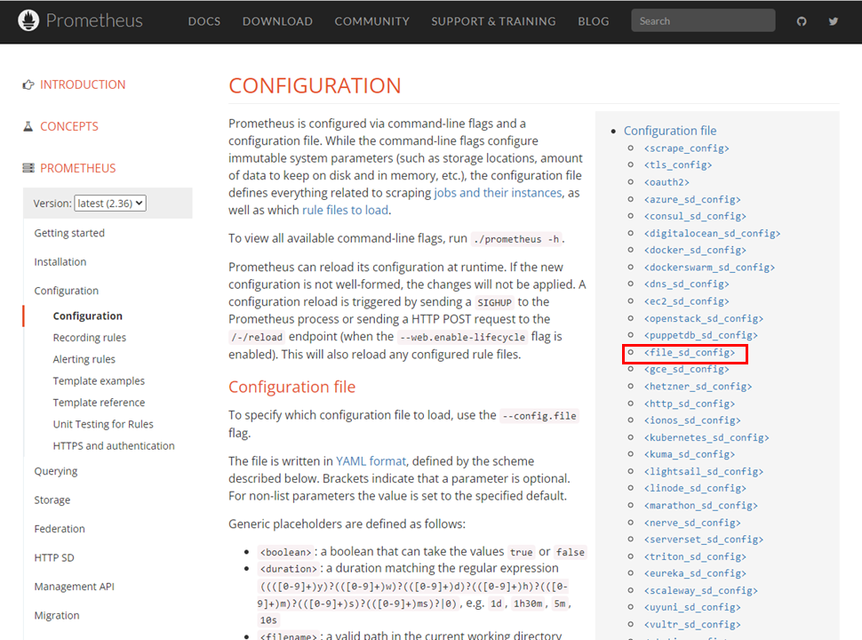
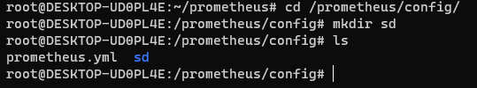
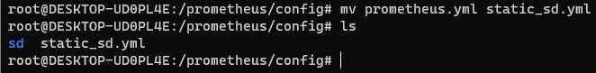
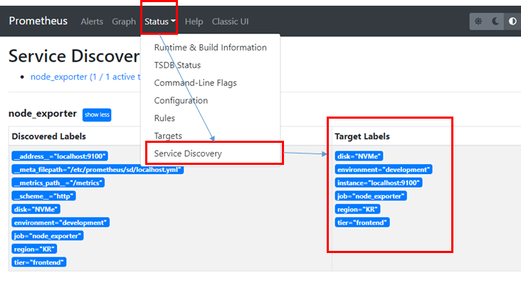
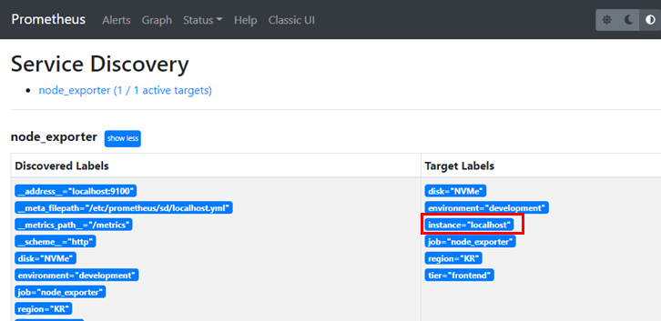

## 2022-06-23-[Prometheus]서비스-디스커버리-설정하기

## 목차

>01.서비스 디스커버리란?
>
>02.파일 서비스 디스커버리
>
>>02.1 relabel

## 01.서비스 디스커버리란?

- 타겟 서버에 대한 정보를 가지고 오기 위한 설정
- 라벨을 통한 타겟 서버 관리
  - 대상서버를 선정하기 위한것
  - static config는 정적으로 타겟 서버 지정
    - 새로운 서버 삭제 , 수정시  프로메테우스 재기동하는것  리로드하는것 번거로워서
      - 서비스 디스커버리를 이용해서 타겟서버를 관리함

## 02.파일 서비스 디스커버리

- 라벨적용해서 사용할 수 있음
  - [서비스 디스커버리 링크](https://prometheus.io/docs/prometheus/latest/configuration/configuration/)



- 0개 이상의 static config로 이루어진 파일 목록 읽음
  - 해당 파일 변경되면 감지해서 즉시 설정으로 적용됨
- 해당 파일, json, yml, yaml로 쓸 수 있음



- sd 폴더 생성

  ```sh
  cd /prometheus/config/
  mkdir sd
  ```

- 심볼릭 링크 걸기

  ```sh
  ln -sf
  ```

  - -s 심볼릭 링크 걸리
  - -f 기존에 심볼릭 링크로 해당파일이 되어 있어도 원하는 파일로 link함

- 이름 바꿔서 이동

  ```sh
  mv prometheus.yml static_sd.yml
  ```

  

- file_sd.yml 작성

  ```sh
  vim file_sd.yml
  ```

  ```yml
  scrape_configs:
    - job_name: 'node_exporter'
      follow_redirects: true
      scrape_interval: 5s
      scrape_timeout: 1s
    
      file_sd_configs:
      - files:
        - 'sd/*.yml'
  ```

  ```sh
  ln -sf file_sd.yml prometheus.yml
  ```

- **수집대상 서버가 명시될 파일**

  `vim /sd/localhost.yml `

  ```yml
  - targets:
    - localhost:9100
    labels:
      region: KR
      tier: frontend
      environment: development
      disk: NVMe

- reload 하기

  ```sh
  curl localhost:9090/-/reload -XPOST -D /dev/stdout
  ```



- status -> service Discovery 에서 확인 할 수 있음

### 02.1 relabel

- before

  ```yml
  scrape_configs:
    - job_name: 'node_exporter'
      follow_redirects: true
      scrape_interval: 5s
      scrape_timeout: 1s
      file_sd_configs:
      - files:
        - 'sd/*.yml'
  ```

- after

  ```yml
  scrape_configs:
    - job_name: 'node_exporter'
      follow_redirects: true
      scrape_interval: 5s
      scrape_timeout: 1s
      
      file_sd_configs:
      - files:
        - 'sd/*.yml'
        
      relabel_configs:
      - source_labels: ['__address__'] # 참조하는 레이블
        regex: '(.*):(.*)' # host명 : 포트
        replacement: '${1}' # 매칭되는 부분의 첫번째를
        target_label: 'instance' #레이블의 값을 사용하겠음
  ```

  ```sh
  curl localhost:9090/-/reload -XPOST -D /dev/stdout
  ```

  - page reload



- 위와 같이 바뀜이 확인됨

- target_label: 'instance' 
  - target_label: 'instance'
    - 새로운 레이블을 만들기 위해서는 위를 host로 변경해주면됨