## 2022-06-24-[Prometheus]PromQL알아보기

## 목차

>01.PromQL이란?
>
>02.PromQL 데이터 유형
>
>>02.1실습 테스트
>>
>>02.2 명령하기
>
>03.PromQL 연산자
>
>>03.1 실습테스트
>
>04.PromQL 함수
>
>>04.1 실습테스트


## 01.PromQL이란?

- Prometheus의 Query 언어, 시계열 데이터 실시간 처리
- 레이블을 사용하여 데이터 필터
- 함수를 이용하여 결과 값 도출

## 02.PromQL 데이터 유형

- Instant vector: 동 시간대 샘플 집합
- Range vector: 특정 시간 범위의 샘플 집합
- Scalar: 숫자
- String: 문자열

### 02.1실습 테스트

- static_sd.yml 수정

  - before

    ```yml
    scrape_configs:
      - job_name: 'prometheus'
      	follow_redirects: false
        scrape_interval: 5s
        scrape_timeout: 1s
        static_configs:
        - targets:
          - server1
    ```

  - after

    ```yml
    scrape_configs:
      - job_name: 'prometheus'
        follow_redirects: false
        scrape_interval: 5s
        scrape_timeout: 1s
        static_configs:
        - targets:
          - server1:9100
          labels:
            region: KR
            env: prod
        - targets:
          - server2:9100
          labels:
            region: KR
            env: dev
        - targets:
          - server3:9100
          labels:
            region: US
            env: prod      	 
    ```

    - 링크 연결후 리로드

      ```sh
      ln -sf static_sd.yml prometheus.yml
      
      curl localhost:9090/-/reload -XPOST -D /dev/stdout
      ```

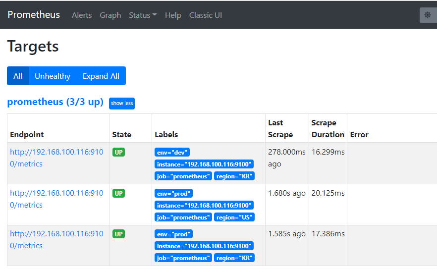

### 02.2 명령하기

- Instant vector: 동 시간대 샘플 집합

  - **node_memory_MemFree_bytes**

    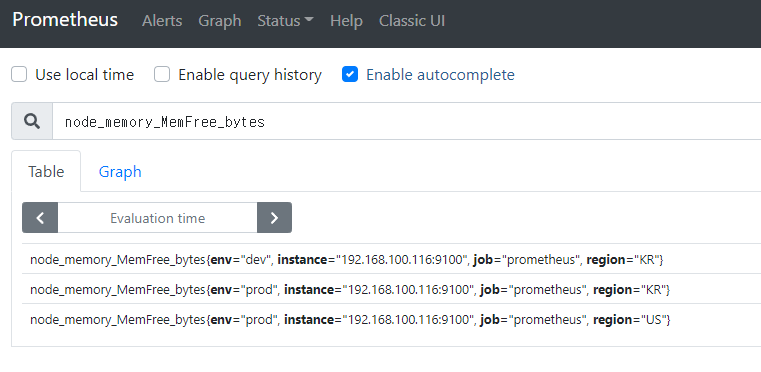

- Range vector: 특정 시간 범위의 샘플 집합

  - **node_memory_MemFree_bytes{instance="192.168.100.116:9100"}[1m]**

    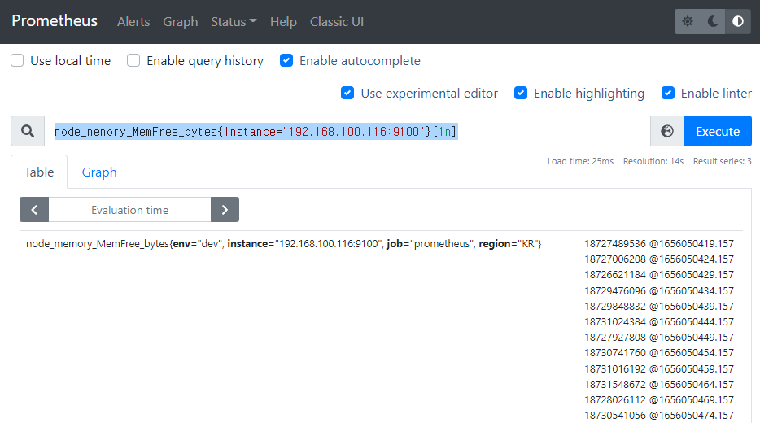

- Scalar: 숫자

  - **3.1456789**

    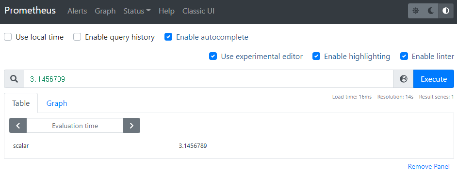

- String: 문자열

  - "Prometheus instance"

    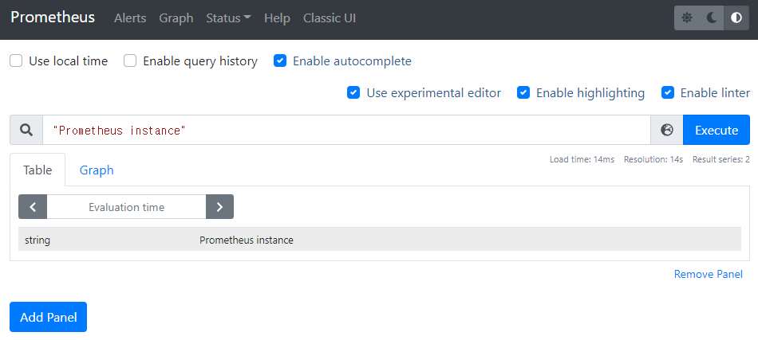

## 03.PromQL 연산자


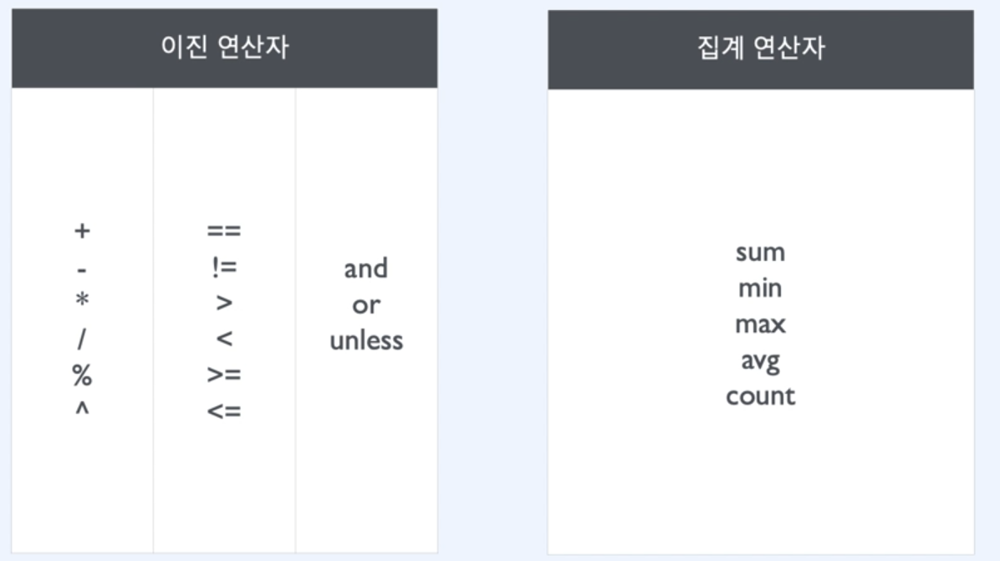

### 03.1 실습테스트

- **count(up) by(region)** 

  - count by(region) (up) 
    - 위 두개는 같은 결과가 나옴

  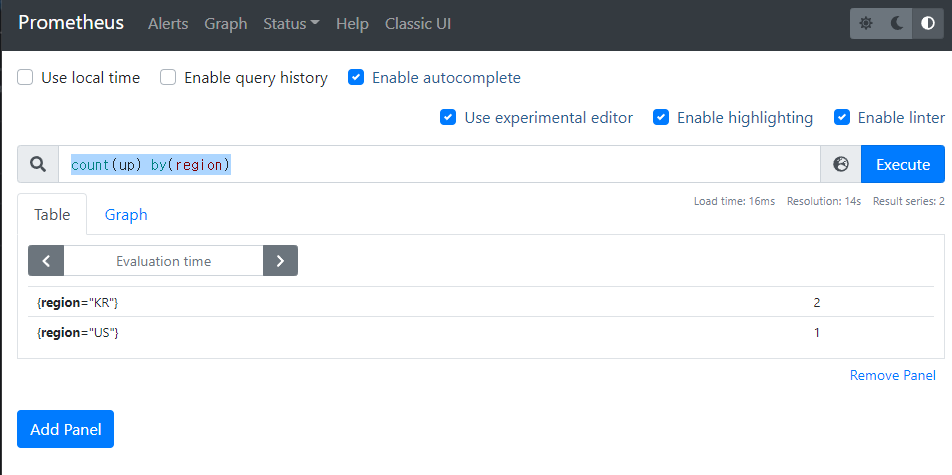

- **count(up) by(region, job)**

  - count by(region, job) (up)

  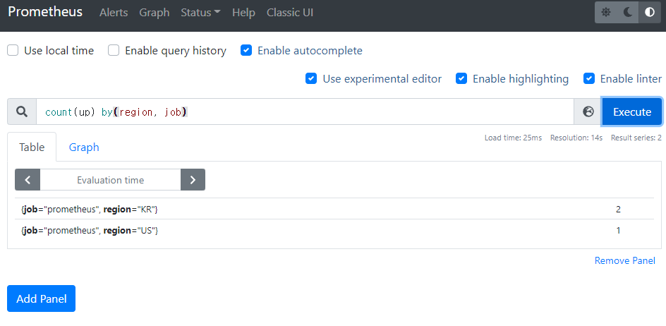

- **count(up) by(region, env)**

  - count by(region, env) (up)

  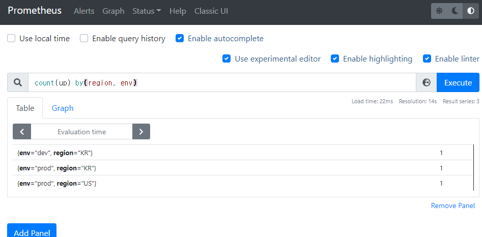

  

- **count(up) without(instance)**

  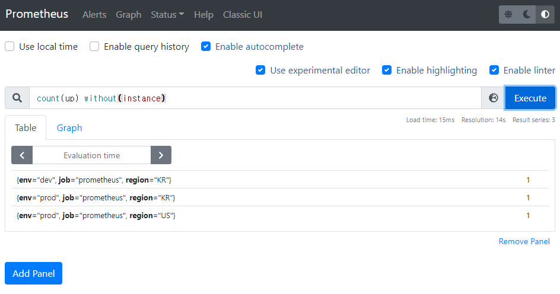

  - without과 by의 결과는 같음

## 04.PromQL 함수

- increase: 주어진 범위에서의 값 차이
- rate: 주어진 범위에서의 초당 변화량
- sort: 오름차순 정렬/ 내림차순: sort_desc
- time: 수행 시점의 epoch time

### 04.1 실습테스트

- 노드에서 보내는 바이트 총량 조회

  - **increase(node_network_transmit_bytes_total{device="eth0"}[1m])**

    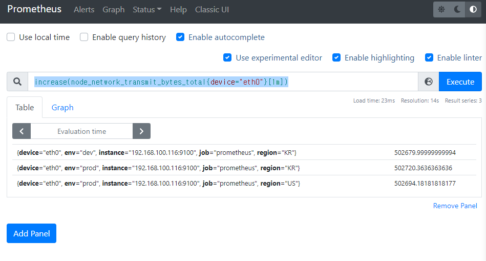

    - 얼마나 요청이 있었는지에 대해서

  - **rate(node_network_transmit_bytes_total{device="eth0"}[1m])**

    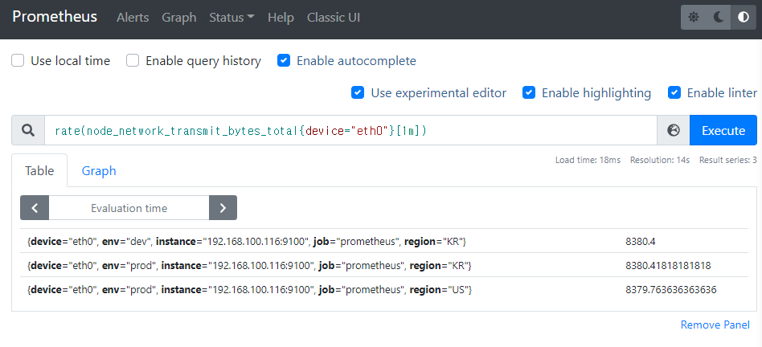

    - 1분동안 초당 얼마의 요청이 있었는지

  - **sort(rate(node_network_transmit_bytes_total{device="eth0"}[1m]))**

    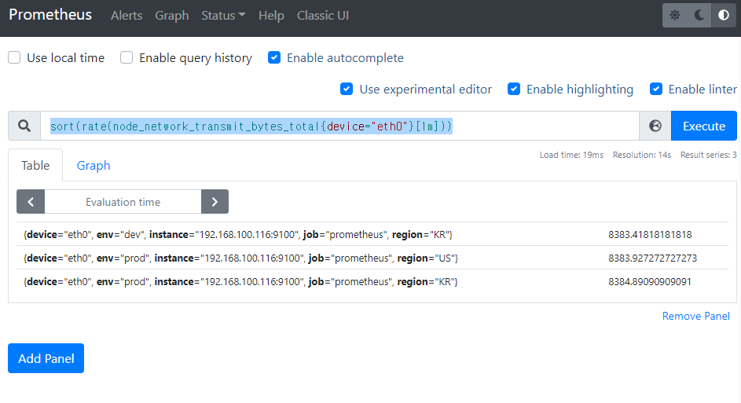

    - 오름차순 정렬

  - 부팅시간에 대한 타임 | 서버의 가동 시간

    - **time() - node_boot_time_seconds**

      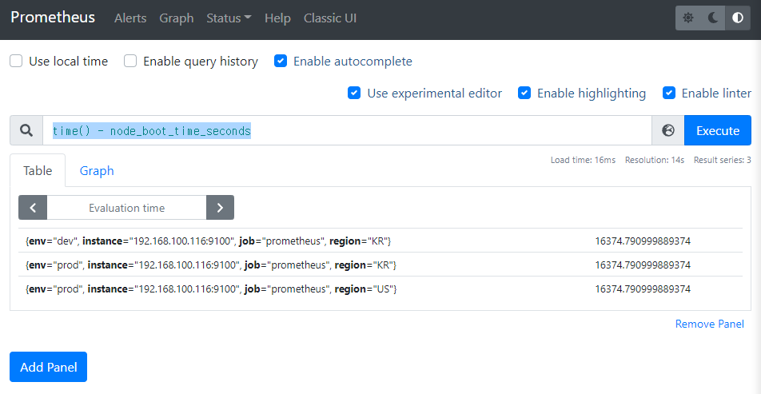

    