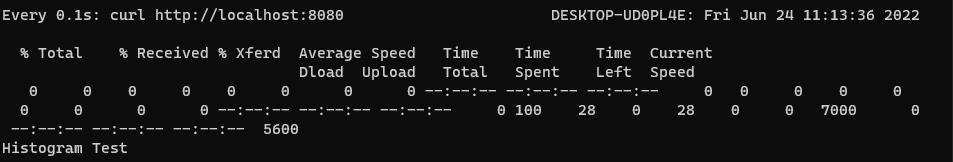
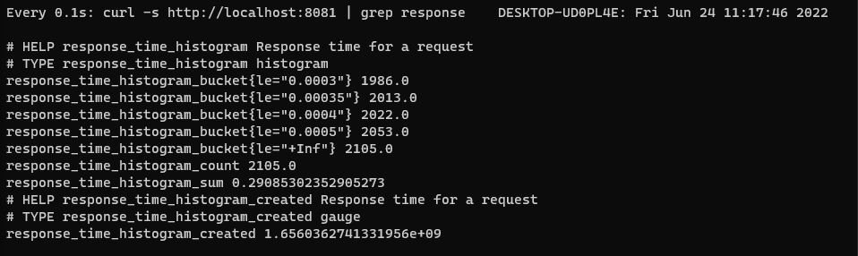
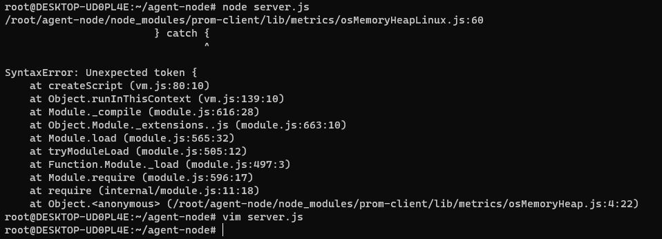
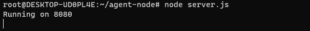
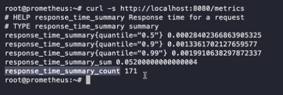

## 2022-06-24-[Promethues]메트릭-유형-알아보기

## 목차

>01.메트릭 종류
>
>02.코딩
>
>02.2 프로메테우스 클라이언트
>
>>02.3 서버에 요청
>>
>>> 매트릭 정보 확인
>
>03.node express framework를 통한 summary 데이터 알아보기
>
>03.해당 서버로 요청하기

## 01.메트릭 종류

- Count: 누적 개수
- Gauge: 현재 상태
- Histogram: 특정 기간 동안의 집계
- Summary: Histogram과 유사, Quantile

## 02.코딩

```sh
apt install -y python3-pip

# 프로메테우스 클라이언트 설치
python3 -m pip install prometheus_client 

# agent 만들 디렉토리 생성
mkdir agent-python
cd agent-pyhon

# main.py 생성
vim main.py
```

## 02.2 프로메테우스 클라이언트

```python
import http.server
import time
from prometheus_client import Histogram, start_http_server

histogram = Histogram(
        'response_time_histogram',
        'Response time for a request',
        buckets=[0.0003,0.00035,0.0004,0.0005])

class Handler(http.server.BaseHTTPRequestHandler):
    def do_GET(self):
        start = time.time()
        self.send_response(200)
        self.wfile.write(b"Histogram Test")
        histogram.observe(time.time() - start)

if __name__ == "__main__":
    start_http_server(8081)
    server = http.server.HTTPServer(('localhost', 8080), Handler)
    print('Exporter running on 8081')
    print('Server running on 8080')
    server.serve_forever()
```

### 02.3 서버에 요청

```sh
curl -s http://localhost:8080
curl http://localhost:8080
curl http://localhost:8080 --http0.9

watch -n 0.1 'curl http://localhost:8080'

# 추가 정보 없이 silent 추가
watch -n 0.1 'curl -s http://localhost:8080' 

```



#### 매트릭 정보 확인

```sh
watch -n 0.1 'curl -s http://localhost:8081 | grep response' 
```



- 유의미하게 적용하기

  - before

    ```python
    import http.server
    import time
    from prometheus_client import Histogram, start_http_server
    
    histogram = Histogram(
            'response_time_histogram',
            'Response time for a request',
            buckets=[0.0003,0.00035,0.0004,0.0005])
    
    class Handler(http.server.BaseHTTPRequestHandler):
        def do_GET(self):
            start = time.time()
            self.send_response(200)
            self.wfile.write(b"Histogram Test")
            histogram.observe(time.time() - start)
    
    if __name__ == "__main__":
        start_http_server(8081)
        server = http.server.HTTPServer(('localhost', 8080), Handler)
        print('Exporter running on 8081')
        print('Server running on 8080')
        server.serve_forever()
    ```

  - after

    ```python
    import http.server
    import time
    from prometheus_client import Histogram, start_http_server
    
    histogram = Histogram(
            'response_time_histogram',
            'Response time for a request',
            buckets=[0.00028,0.00030,0.0032,0.0034])
    
    class Handler(http.server.BaseHTTPRequestHandler):
        def do_GET(self):
            start = time.time()
            self.send_response(200)
            self.wfile.write(b"Histogram Test")
            histogram.observe(time.time() - start)
    
    if __name__ == "__main__":
        start_http_server(8081)
        server = http.server.HTTPServer(('localhost', 8080), Handler)
        print('Exporter running on 8081')
        print('Server running on 8080')
        server.serve_forever()

  ## 03.node express framework를 통한 summary 데이터 알아보기

  - node js, npm 설치

    ```sh
    apt install -y nodejs npm
    
    mkdir agent-node
    cd agent-node
    
    npm init -y
    
    npm i express prom-client
    
    vim server.js
    ```

  - server.js 

    ```sh
    const express = require('express')
    const client = require('prom-client')
    const app = express()
    
    const register = new client.Registry()
    const summary = new client.Summary({
            name: 'response_time_summary',
            help: 'Response time for a request',
            percentiles: [0.5, 0.9, 0.99],
            registers: [register]
    })
    
    app.use((req, res, next)=> {
            req.startTime= Date.now()
            next()
    })
    
    app.get('/',(req, res)=>{
            res.send('Summary Test')
            summary.observe((Date.now() - req.startTime)/1000)
    })
    
    app.get('/metrics', async(req,res)=>{
            res.end(await register.metrics())
    })
    
    port = 8080
    app.listen(port,()=>{
            console.log('Running on ${port}')
    })
    ```

    - `node server.js` 실행

      - 에러 발생

        

        - node 버전 문제

          ```sh
          nvm install v14.17.5
          nvm use v14.17.5
          ```

          - 위로 변경해주고 다시 시작해보면 됨

    

## 03.해당 서버로 요청하기

```sh
watch -n 0.1 'curl -s http://localhost:8080'

 curl -s http://localhost:8080/metrics
```



- 퍼센트별 몇초 안에 들어오는지 확인 할수 있음