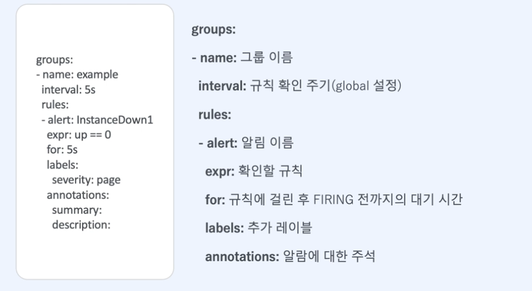

## 2022-06-27-[Prometheus]Alertmanager-알아보기

## 목차

>01.Alertmanager 관련 설정
>
>02.Prometheus 설정
>
>03.Rule
>
>04.Alertmanager
>
>05.실습
>
>05.1 동작확인
>
>06.알람매니저설치와 설정
>
>>06.1 api를 통해 받는 것 확인
>>
>>06.2 inhibit_rules 설정
>


## 01.Alertmanager 관련 설정


- prometheus파일, rule file, 알람 매니저 파일 부분을 살펴 볼것
  - **prometheus파일**
    - rule file에서의  적혀있는 규칙을 얼마 만큼 확일 할지에 대한 정보
    - 알람매니저 대상 정보
    - 사용할 규칙이 들어있는 rule_files의 위치가 적혀 있음
  - **rule file**
    - 확인할 규칙에 대한 정보가 명시
  - **알람매니저**
    - 특정 매체로 알람을 보낼 주기, 어떤 매체로 보낼지, 어떤 알람을 무시할지에 대해서

## 02.Prometheus 설정


## 03.Rule



## 04.Alertmanager


## 05.실습

```sh
vim /prometheus/config/alerting.yml
```

- alerting.yml 파일 작성

  ```yml
  global:
    evaluation_interval: 1s
  
  alerting:
    alertmanagers:
      - static_configs:
        - targets:
          - localhost:9093
  
  rule_files:
  - "./rules/*.yml"
  
  scrape_configs:
  - job_name: 'node_exporter'
    scrape_interval: 3s
    scrape_timeout: 1s
    static_configs:
    - targets:
      - localhost:9100
  ```

- rules 폴더 생성

  - /prometheus/config 위치에서 생성

    ```sh
    mkdir rules
    ```

  - 링킹하기

    /prometheus/config 로 이동

    ```sh
    cd /prometheus/config
    
    ln -sf alerting.yml prometheus.yml
    
    curl localhost:9090/-/reload -XPOST -D /dev/stdout
    ```

    

  - [참고할만한 사이트](https://awesome-prometheus-alerts.grep.to/)

- exporter 접근 안될때  파일 다운된 상황

- ex.yml 파일 생성

  ```sh
  vim rules/ex.yml
  ```

  - ex.yml 작성

    ```yml
    groups:
    - name: example
      rules:
      - alert: InstanceDown
        expr: up == 0
        for: 10s
        labels:
          severity: critical
        annotations:
          summary: "Instance {{ $labels.instance }} down"
    ```

    - 값을 가져오고 싶은 경우 

      ` summary: "Instance {{ $labels.instance }} {{ $value }} down"`

## 05.1 동작확인


- 현재는 Prometheus에서 확인하면 inactive 상태임

- 이때 node_exporter를 끄면

  

  - 10초정도 pending이 됨

- 그리고 Firing 상태로 넘어감

  

  

## 06.알람매니저설치와 설정

- 볼륨저장할 공간 설정

  ```sh
  mkdir -p /alertmanager/config
  ```

- 도커 이용하여 알람매니저 설치

  ```sh
  docker run --net=host --name alertmanager1 -d \
  -v /prometheus/alertmanager/config:/etc/alertmanager quay.io/prometheus/alertmanager:latest
  ```

- alertmanager.yml 생성

  ```sh
  vim /alertmanager/config/alertmanager.yml
  ```

- alertmanager.yml 작성

  ```yml
  route:
    group_by: ['alertname']
    group_wait: 3s
    group_interval: 5s
    repeat_interval: 20s
    receiver: 'engineer'
  
  receivers:
  - name: 'engineer'
    email_configs:
    - to: id@gmail.com
      from: id@gmail.com
      smarthost: smtp.gmail.com:587
      auth_username: id@gmail.com
      auth_password: "bskjhsfeiuvcbhl" 
  ```

  

  - 이곳의 앱 비밀번호 생성후 auth_password 입력


- localhost:9093 들어가면 위에처럼 나오면 연결이 제대로 된것

- 알람 매니저에 보내지는 주기 확인 기본 1M

  

  -  주기 10s로 변경

    ```sh
    --rules.alert.resend-delay=10s
    ```

    - 위를 추가해서 올려주면됨

      

      

- 알람 매니저 사이트를 확인

  

  - 위와 같이 알람이 들어감

### 06.1 api를 통해 받는 것 확인

```sh
tcpdump -i lo -A 'tcp port 9093'
```


- swagger 양식을 이용하여 확인하기 [링크:[click](https://github.com/prometheus/alertmanager/tree/main/api/v2)]

- https://editor.swagger.io/

  

  ```yml
  host: localhost:9093
  basePath: "/api/v2/"
  schemes:
  - http
  ```

  - 위부분을 추가

```json
[
  {
    "startsAt": "2022-06-27T02:28:12.953Z",
    "endsAt": "2022-06-28T02:28:12.953Z",
    "annotations": {
      "summary": "test"
    },
    "labels": {
      "alertname": "test"
    }
  }
]
```

- 위와 같이 변경

  

  - 이부분 복사해오기
  
    ```sh
    curl -X 'POST' \
      'http://192.168.100.116:9093/api/v2/alerts' \
      -H 'accept: application/json' \
      -H 'Content-Type: application/json' \
      -d '[
      {
        "startsAt": "2022-06-28T02:28:12.953Z",
        "endsAt": "2022-06-29T02:28:12.953Z",
        "annotations": {
          "summary": "test"
        },
        "labels": {
          "alertname": "test"
        }
      }
    ]'
    ```
  
    


- 이렇게 설정한대로 바뀜

### 06.2 inhibit_rules 설정

- 메모리 80프로이상 쓸때 경고
- 90프로이상시 위험을 발생한다면 경고는 불필요한 알람이기 때문에 이부분을 무시하는 것

```yml
inhibit_rules:
- source_matchers:
  - serverity = critical
  target_matchers:
  - serverity = warning
  equal: ['alertname']
```

- 위의 부분을 alerting.yml에 추가

  ```sh
  curl localhost:9093/-/reload -XPOST -D /dev/stdout
  ```

  - reload 진행

- **Warning**

  ```sh
  curl -X 'POST'   'http://192.168.100.116:9093/api/v2/alerts'   -H 'accept: application/json'   -H 'Content-Type: application/json'   -d '[
    {
      "startsAt": "2022-06-17T02:28:12.953Z",
      "endsAt": "2022-06-18T02:28:12.953Z",
      "annotations": {
        "summary": "test"
      },
      "labels": {
        "alertname": "MemoryShortage", "serverity": "warning"
      }
    }
  ]'
  ```

  

- **Critical**

  ```sh
  curl -X 'POST'   'http://192.168.100.116:9093/api/v2/alerts'   -H 'accept: application/json'   -H 'Content-Type: application/json'   -d '[
    {
      "startsAt": "2022-06-28T02:28:12.953Z",
      "endsAt": "2022-06-29T02:28:12.953Z",
      "annotations": {
        "summary": "test"
      },
      "labels": {
        "alertname": "MemoryShortage", "serverity": "critical"
      }
    }
  ]'
  ```

  


