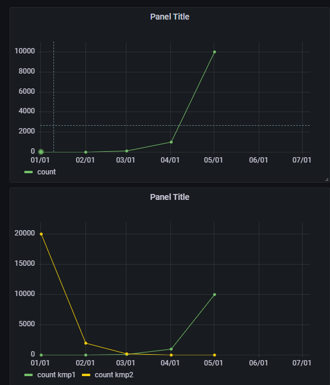

## 2022-07-05-grafana-postgreSQL교육-Timeseries

## 01.timeseries 기본 교육

### 01.1 테이블 설계

```sql
drop table kmp;
create table kmp
(
 study_time timestamp,
 count int
);

drop table kmp1;
create table kmp1
(
 study_time timestamp,
 name text,
 count int
);

```

### 01.2 데이터  추가

```sql
insert into kmp (study_time, count) values
('2022-01-01',1)
,('2022-02-01',10)
,('2022-03-01',100)
,('2022-04-01',1000)
,('2022-05-01',10000);


select * from kmp;

insert into kmp1 (study_time,name, count) values
('2022-01-01','kmp1',1)
,('2022-02-01','kmp1',10)
,('2022-03-01','kmp1',100)
,('2022-04-01','kmp1',1000)
,('2022-05-01','kmp1',10000),
('2022-01-01','kmp2',20000)
,('2022-02-01','kmp2',2000)
,('2022-03-01','kmp2',200)
,('2022-04-01','kmp2',20)
,('2022-05-01','kmp2',2);

select * from kmp1 ;
```

### 01.3 그라파나에 데이터 추가하여 상태 확인



### 01.4 timeseries  option 적용과 이해

-

## 02.timeseries 적용 예시를 통한 이해

- 마일스톤 진척률
- 월별증감률 | 마일스톤 진척률
- 주별증감률 | 마일스톤 진척률
- 마일스톤 건수
- 액션아이템 건수
- 월별 누계 | 오픈 문서 건수
- 월별 누계 | 클로즈 문서 건수
- 주별 누계 | 오픈 문서 건수
- 주별 누계 | 클로즈 문서 건수

## 03.개인대시보드 timeseries 적용하기

- 개인 주제에 timeseries 적용하기

  - 테이블 만들고 데이터 넣고 그래프그리기

  